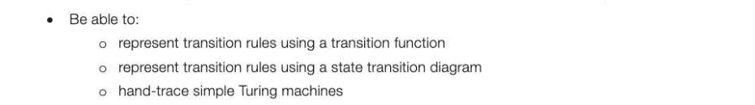
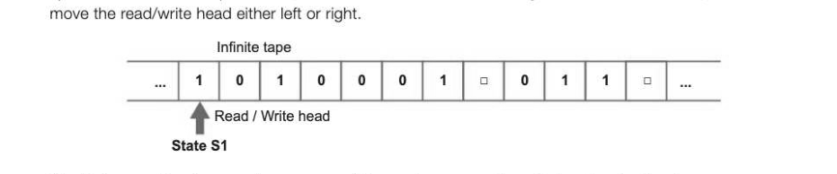
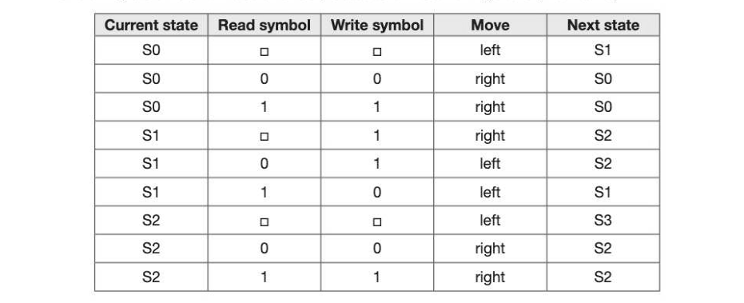
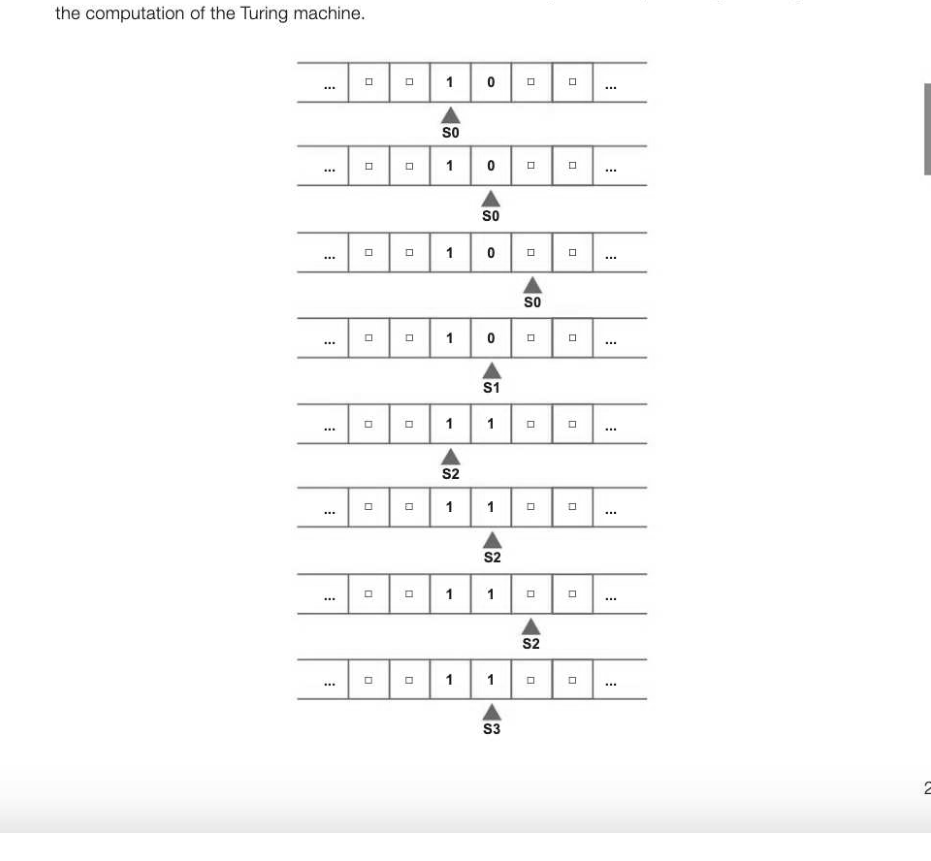
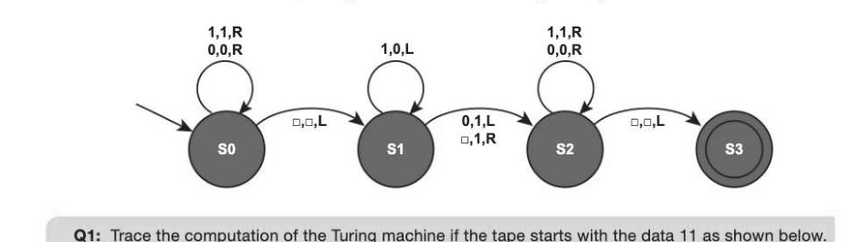
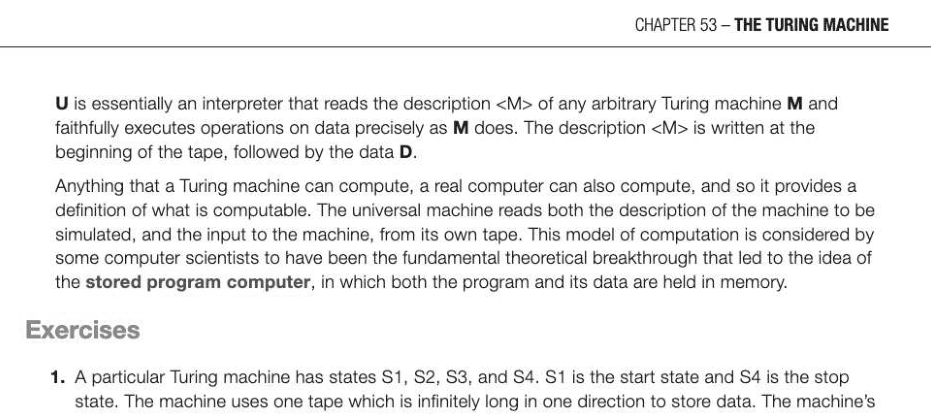
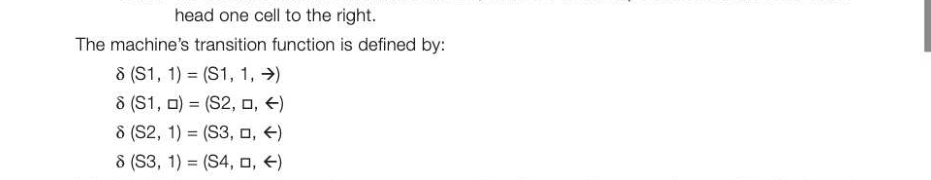

# Chapter 53 — The Turing machine
## Objectives

« Know that a Turing machine can be viewed as a computer with a single fixed program, expressed using

e Understand the equivalence between a transition function and a state transition diagram

explain the importance of Turing machines and the Universal Turing machine to the subject of computation

## Alan Turing

Alan Turing (1912-1954) was a British computer scientist and mathematician, | best known for his work at Bletchley Park during the Second World War. While working there, he devised an early computer for breaking German ciphers, work which probably shortened the war by two or more years and saved countless lives. Turing was interested in the question of computability, and the answer to the question "Is every mathematical task computable?" In 1936 he invented a theoretical machine, which became known as the Turing machine, to answer this question.

## The Turing machine

The Turing machine consists of an infinitely long strip of tape divided into squares. It has a read/write head that can read symbols from the tape and make decisions about what to do based on the contents of the cell and its current state. Essentially, this is a finite state machine with the addition of an infinite memory on tape. The FSM specifies the task to be performed; it can erase or write a different symbol in the current cell, and it can

The Turing machine is an early precursor of the modern computer, with input, output and a program which describes its behaviour. Any alphabet may be defined for the Turing machine; for example a binary alphabet of 0, 1 and o (representing a blank), as shown in the diagram above.

A Turing machine must have at least one state, known as a halting state or stop state that causes it to halt for some inputs.

## Example 1

A Turing machine is designed to find the first blank cell on the tape to the right of the current position of the read/write head. It has three states SO, S1 and S2, where SO is the start state and S2 is the stop state. The machine's alphabet is 0, 1 and o where o represents a blank. The finite state transition diagram representing the machine is shown below. 0,0,L 4k 5,0,L The notation (input, output, movement) is used in this diagram so that for example, (0, 0, R), means "If the input is 0, write a 0 and move right". (0, 1, L) means "If the input is 0, write a 1 and move left." The string 110000 is on the tape, and the read-write head is positioned at the leftmost 1.

The computation of the Turing machine can be traced as follows:

## Example 2

The following state transition table shows a procedure for incrementing a binary number by 1.

The machine starts in state SO with the head at the leftmost digit on the tape holding the string 10. Trace

The finite state machine corresponding to the state transition diagram is given below.

## Transition functions

The transition rules for any Turing machine can be expressed as a transition function 6. The rules are written in the form 5 (Current State, Input symbol) = (Next State, Output symbol, Movement). Thus the rule 6 (S1, 0) = (S2, 1, L) means "IF the machine is currently in state S1 and the input symbol read from the tape is 0, THEN write a 1 to the tape, and move left and change state to S2".

## The universal Turing machine

A Turing machine can theoretically represent any computation. A,B DA+B A,B | DAtB Each machine has a different program to compute the desired operation. However, the obvious problem with this is that a different machine has to be created for each operation, which is clearly impractical. Turing therefore came up with the idea of the Universal Turing machine, which could be used to compute any computable sequence. He wrote: "If this machine U is supplied with the tape on the beginning of which is written the string of quintuples separated by semicolons of some computing machine M, then U will compute the same sequence as M."

---

## Exercises

1. A particular Turing machine has states S1, S2, S3, and S4. S1 is the start state and S4 is the stop state. The machine uses one tape which is infinitely long in one direction to store data. The machine's alphabet is 1, o. The symbol o is used to indicate a blank cell on the tape. The transition rules for this Turing machine can be expressed as a transition function 6. Rules are written in the form 8 (Current State, Input symbol) = (Next State, Output symbol, Movement).

## So, for example, the rule

8 (S1, 1) = (S1, 1, >) means IF the machine is currently in state S1 and the input symbol read from the tape is 1 THEN the machine should remain in state S1, write a 1 to the tape and move the read/write

(a) The Turing machine is carrying out a computation. The machine starts in state S1 with the string 1111 on the tape. All other cells contain the blank symbol a. The read/write head is positioned at the leftmost 1, as indicated by the arrow. LL] fttststst [ [ 4)... Current state: [ $1 | Trace the computation of the Turing machine, using the transition function 5. Show the contents of the tape, the current position of the read/write head and the current state as the input symbols are processed. (3)] (b) Explain what this Turing machine does. (1) (c) Explain what a Universal Turing machine is. [2] AQA Unit 3 Qu 11 June 2011
