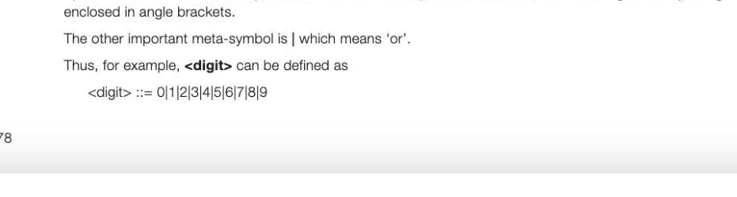
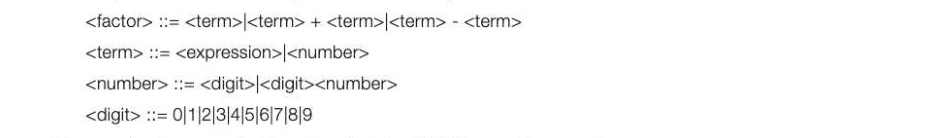
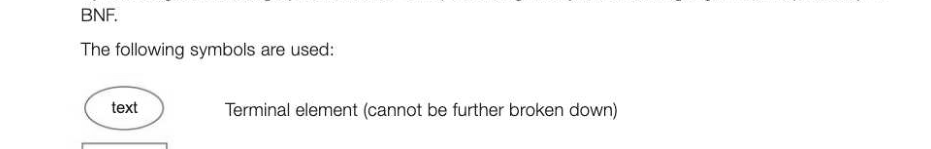
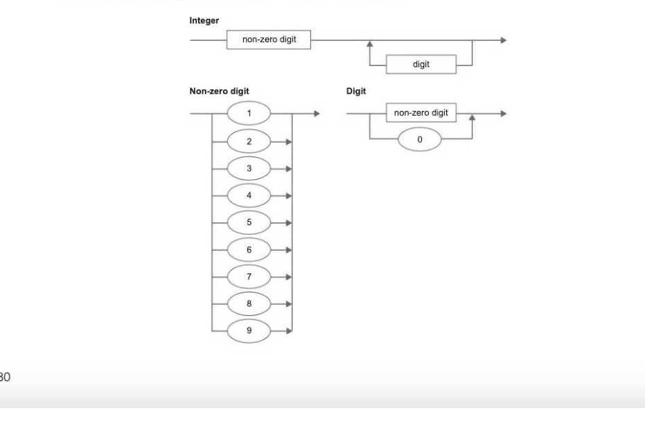
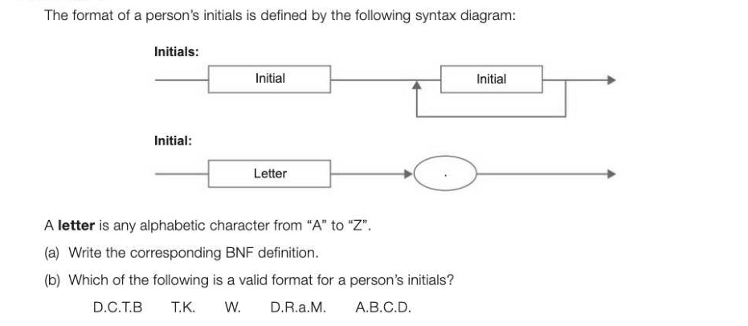
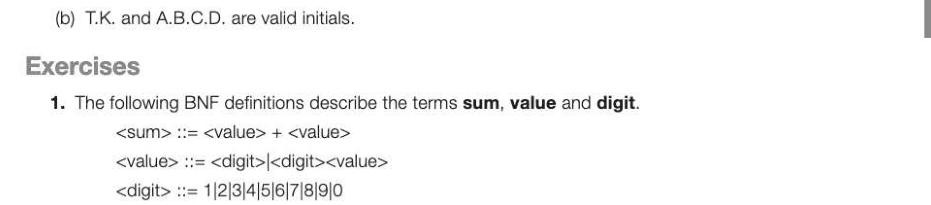

# Chapter 54 — Backus-Naur Form
## Objectives

- Explain why BNF can represent some languages that cannot be represented using regular expressions
- Use Backus-Naur Form (BNF) to represent language syntax and formulate simple production rules
- Draw a syntax diagram to represent a BNF expression

## Meta-languages

In order for a computer language such as Python or Pascal to be translated into machine code, all the rules of the language must be defined unambiguously. Languages such as English, Spanish and Arabic are not at all precise, which is one reason why it is hard to get computers to understand 'natural language'. Not only is English too imprecise to be used as a computer language, it is not even suitable for defining unambiguously the syntax or grammar of a computer language.

## Defining the syntax of a language

In Chapter 52 we saw that regular expressions can be used to describe simple 'languages' and to match patterns in text by specifying sets of strings that satisfy given conditions. In computer science, the syntax of a language is defined as the set of rules that define what constitutes a valid statement. It would be possible, but lengthy and time-consuming, to define a valid identifier in a given programming language using a regular expression. However, some programming language constructs involving, for example, nested brackets, cannot be defined in this way. For this reason, special languages called meta-languages have been devised, and Backus-Naur Form (named after its two originators) is an example of one such meta-language. Many constructs that could be written using a regular expression can be expressed more succinctly using BNF.

## Backus-Naur form (BNF)

The structure of BNF is composed of a list of statements of the form LHS::= RHS where::= is interpreted as 'is defined by'. = is known as a meta-symbol. Example: <point> <point> is called a meta-component, or sometimes a syntactic variable, and is distinguished by being

## Example1

Write the BNF definition of a variable name which, in a certain computer language, may consist of a single letter or a letter followed by a digit. <variable name>::= <letter>|<letter><digit> <letter>::= A|B|C|DIE|F|G|H|l|J|K|LIMIN|O|P|Q\RIS|T|U\VIWIX|Y|Z <digit>::= 0|1|2|3|4|5|6|7|/8|9 Each of these individual rules is known as a production.

## Using recursion in a BNF definition

BNF often makes use of recursion, where a statement is defined in terms of itself. e.g. <variable list>::= <variable>|<variable>, <variable list> Using this definition, is A, B, C a variable list? We can show that it is, using the following reasoning: Cis a <variable>, and is therefore a <variable list>. Bis a <variable>, therefore B,C is <variable>,<variable list>, i.e. a <variable list> A,B,C is <variable>,<variable list> Therefore, A, B, C is a <variable list> The process of ascertaining whether a given statement is valid, given the BNF definition, is called Parsing. The procedure is to work from left to right, replacing meta-variables with more comprehensive meta-variables at each stage.

## Example 2

The following production rules have been used to define the syntax of a valid mathematical expression in a particular programming language. <expression> <factor>

Show, using these production rules, that 4 + 75 * 3 is a valid expression.

## Answer

4isa <digit>, therefore a <number>, therefore a <term> 75 is <digit><number> and is therefore a <number>, therefore a <term> 4 +75 is a <term> + <term> therefore a <factor> 3is a <digit>, therefore a <number>, therefore a <term>, therefore a <factor> 4+75* 3 is a <factor> * <factor> and therefore an <expression>

When a compiler checks a statement written in a high-level language to see if it is syntactically correct, it will parse each statement in a similar manner to that shown above.

## Syntax diagrams

Syntax diagrams are a graphical method of representing the syntax of a language, and map directly to

text Non-terminal element, which will be defined in another syntax diagram text Non-terminal element that may be used more than once

## Example 3

The syntax diagram representing a positive integer is as follows:

## Example 4

## Answers

## (a) <initials> ::= <initial><initial>|<initial><initials>

<initial: letter><dot> <letter>::= A|B|C|DIE|F|G|H|I|J|K|LIMIN|O|P|Q|RIS|T|UVIWIX|¥|Z <dot> i=. (b) T.K. and A.B.C.D. are valid initials.

---

## Exercises

(a) Explain whether each of the following is a sum, a value, a digit or not defined. (i) 4686 (i) 7+8 (ii) 054170 3] (b) Write a BNF definition for hex, a hexadecimal number which consists of at least one digit, one letter or a mixture of digits and letters. Your definition must use digit, letter and hex only. For example, 5, A, 2B8, FFFF are all valid examples of hex. [3]

## () The definition for value is

<value>::= <digit>|<digit><value> Draw a syntax diagram to show the definition of value. You may assume that the correct syntax diagram for digit already exists. [2]

2. A vowel-string in a high-level programming language has its syntax described in BNF as follows: <vowel-string>::= <vowel>|a<vowel>ale<vowel>e|i<vowel>ijo<vowel>olu<vowel>u vowel::= alelijolu (a) State, with reasons, whether each of the following character strings is a valid vowel-string. aea uuu AEA aeae sds oooaeio (b) The word level is palindromic because its letters in reverse order give the same word. Make simple changes to the rules given above so that a vowel-string of any length is valid if and only if it is palindromic. (5] 3. The following BNF definition describes a registration number. <reg-no> <code><space><number> <number>::= <pos digit><digit><digit>|<pos digit><digit><digit><digit> <pos digit>::= 1|2|3|4|5|6|7|8|9 <space> State, with reasons, whether each of the following is a valid or invalid registration number. AC 234 AB 13 AX 099 BB 2345 AX6 (5)
