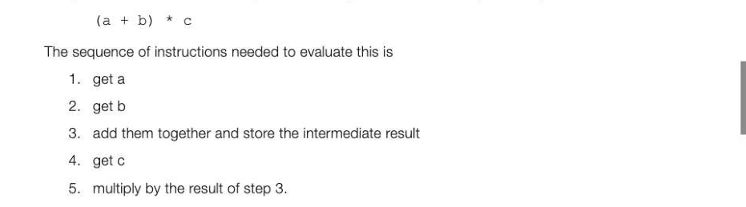
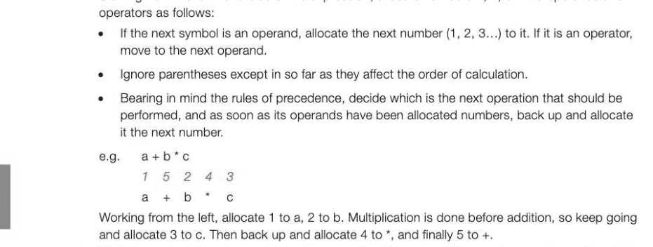
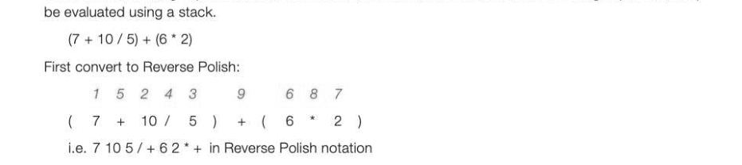
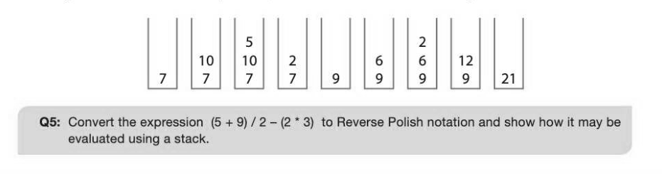
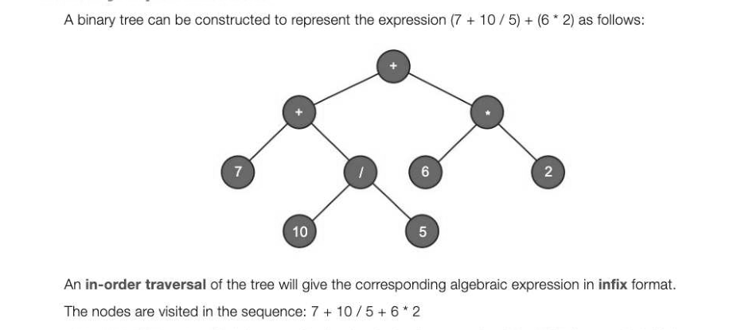
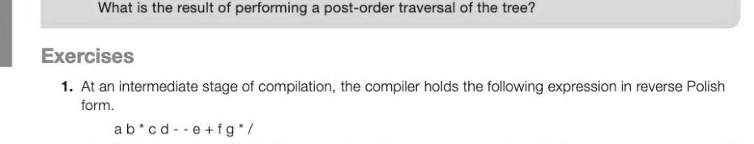

# Chapter 55 — Reverse Polish notation
## Objectives

e Convert simple expressions in infix form to Reverse Polish notation (RPN) and vice versa « Be aware of why and where RPN is used

## Reverse Polish notation

Reverse Polish (also called postfix) notation was developed by a Pole called Jan Lukasiewicz. It is a method of writing arithmetic expressions that is particularly suited to computerised methods of evaluation. It has the following advantages and uses:

- It eliminates the need for brackets in sub-expressions
- It produces expressions in a form suitable for evaluation using a stack
- Itis used in interpreters based on a stack; for example, Postscript and bytecode
The way in which we normally write arithmetic expressions is called infix notation, and it is not easy for a computer to evaluate such an expression directly. Consider for example the expression

In other words, the computer really needs the operands (a, b and c) and operators in the sequence abt+cec* In reverse Polish notation, the operator follows the operands - which is the logical sequence, if you are a computer.

## Precedence rules

In order to translate from infix to Reverse Polish notation, we need to define the order of precedence of operators. This is shown below, in increasing order of precedence. ( +)

- / A (exponentiation, where 342 means 32) ~ (unary minus, as in -3 + 2)

## Infix and postfix expressions

An expression such as (6 * 7) + 4 is known as an infix expression, because the operator is written between the operands. The equivalent Reverse Polish form, 6 7 * 4 + is known as a postfix expression, as the operator follows the operands.

## Translation from infix to Reverse Polish

Accomputer will use a fairly complex algorithm using a stack to translate from infix to reverse Polish notation. However, it is quite simple to do it manually with the benefit of common sense, a knowledge of the rules of precedence and a few simple rules, given below: 1. Starting from the left-hand side of the expression, allocate numbers 1, 2, 3... to operands and

2. Write down the tokens (operators and operands) in the order of the numbers you have allocated. The Reverse Polish Form of the expression is ab c * +

## Example 1

Convert the following expression to Reverse Polish notation: 8 + ((7 + 1)* 2)-6 Following the rules above, taking into account order of precedence and brackets where they affect this: 17 243 6 5 9 8 8+ ((7 + 1) * 2) - 6 Note that taking the brackets into account, 7 + 1 is the first thing to be calculated, and then this is multiplied by 2. Keep backing up every time you have one or two operands which need to be evaluated next. The Reverse Polish Form of the expression is 87 1+2*+6 -

## Translation from Reverse Polish to infix

To translate from RPN to infix, we need to perform this process in reverse.

## Example 2

Convert the following RPN expression to infix notation: 25 16 18 + * 12 - Visually scan the operands, writing them down until you find two operands followed by an operator. The unpaired operand, 25 is written down. Bracket the next two operands with the operator between them and add them to the expression that is building up. We now have 25 (16 + 18) Continue writing down operands until you find the next operator, which will operate on the two preceding operands, in this case * operates on 25 and (16 + 18). This gives us 25 * (16 + 18) The next symbol is an operand, so the following operator will operate on the two operands 25 * (16 + 18) and 12, giving the final result: 25 * (16 + 18) - 12 Evaluation of Reverse Polish notation expressions using a stack Once a compiler has translated an arithmetic expression into reverse Polish notation, each symbol in the expression may be held in a string or array. The expression may then be evaluated using a stack, scanning the elements of the string (or array) from left to right as follows: e = If the next token is an operand, place it on the stack

- If the next token is an operator, remove the required number of operands from the stack, (two except in the case of a unary minus or exponentiation), perform the operation, and put the result on the stack.

## Example 3

Convert the following expression to Reverse Polish notation, and show how the resulting expression may

Using a stack to evaluate the expression, the contents of the stack will change as follows:

## A binary expression tree

A post-order traversal of the tree will give the algebraic expression in postfix (reverse Polish) format. The nodes are visited in the sequence: 7 105/+62* +

---

## Exercises

Write down the original infix expression which was translated into this form. [3] Why is reverse Polish used as an intermediate stage during compilation? [3] The following binary tree represents an algebraic expression. Write down the results of performing (i) an in-order tree traversal [2] (i) a post-order tree traversal [2] What names are given to each of these representations of the expression? [2]

## Section 10

## The Internet

In this section: Chapter 56 Structure of the Internet 288 Chapter 57 Packet switching and routers 292 Chapter 58 Internet security 294 Chapter 59 TCP/IP, standard application layer protocols Chapter 60 IP addresses 307 Chapter 61 Client server model 313
