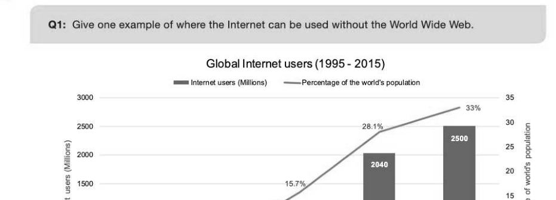
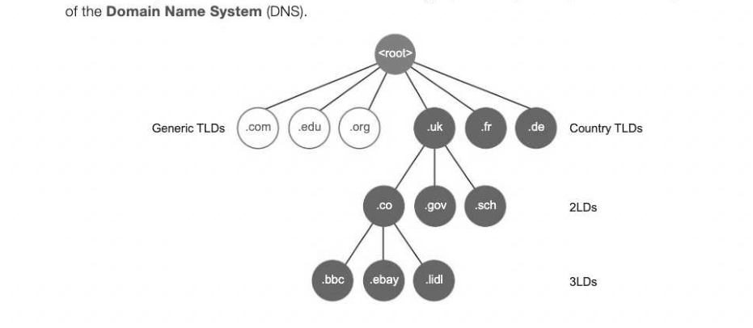
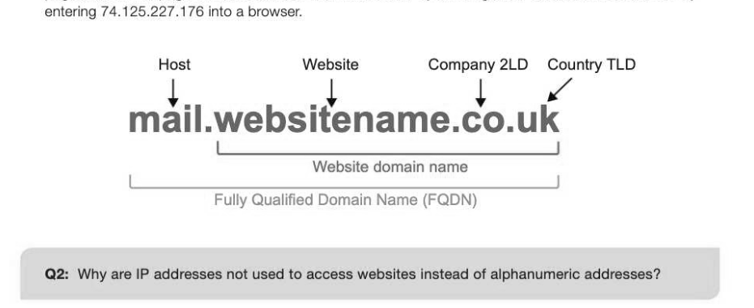

# Chapter 56 — Structure of the Internet
## Objectives

- Understand the structure of the Internet
- Describe the term 'Uniform Resource Locator' in the context of networking
- Explain the terms 'domain name' and 'IP address'
- Describe how domain names are organised
- Understand the purpose and function of the Domain Name Server (DNS) system
- Explain the service provided by Internet registries and why they are needed
A short history of the Internet and the World Wide Web The Internet is a network of networks set up to allow computers to communicate with each other globally. A United States defence project in the 1960s (ARPA) created ARPANET to enable distant departments working on the same project to communicate without the need for physical travel. The project developed, as did their means of communication and the Internet idea was born. In 1995 the Internet became a public hit when the World Wide Web emerged and user numbers began to climb, reaching roughly 2.5 billion users worldwide in 2015 — roughly one third of the world's population. The World Wide Web (WWW) is a collection of web pages that reside on computers connected to the Internet. It uses the Internet as a service to communicate the information contained within these pages. The concept of the WWW and using a browser to search the information contained within it was first developed by Sir Tim 10-56 Berners-Lee, a British scientist working at CERN in Geneva, Switzerland. The World Wide Web is not the same as the Internet and even today, the Internet is frequently used without using the WWW.

Intemet Percentage 1995 2000 2005 2010 2015

## The physical structure of the Internet

Each continent uses backbone cables connected by trans-continental leased lines fed across the sea beds. National Internet Service Providers (ISPs) connect directly to this backbone and distribute the Internet connection to smaller providers who in turn provide access to individual homes and businesses. Trans-continental Internet connections, TeleGeography

## Uniform Resource Locators (URLs)

A Uniform Resource Locator is the full address for an Internet resource. It specifies the location of a resource on the Internet, including the name and usually the file type, so that a browser can go and request it from the website server. Method Host Location Resource http:/Awww.domainname.com/folder/subfolder/webpage.htmli#element L J URL

## Internet registries and registrars

Internet registrars are needed to ensure that a particular domain name is only used by one organisation, and they hold records of all existing website names and the details of those domains that are currently available to purchase. These are companies that act as resellers for domain names and allow people and companies to purchase them. All registrars must be accredited by their governing registry. Internet registries are five global organisations governed by the Internet Corporation for Assigned Names and Numbers (ICANN) with worldwide databases that hold records of all the domain names

currently issued to individuals and companies, and their details. These details include the registrant's name, type (company or individual), registered mailing address, the registrar that sold the domain name and the date of registry. The registries also allocate IP addresses and keep track of which address(es) a domain name is associated with as part of the Domain Name System (DNS). The five global Internet Registries Domain names and the Domain Name System (DNS) A domain name identifies the area or domain that an Internet resource resides in. These are structured into a hierarchy of smaller domains and written as a string separated by full stops as dictated by the rules

Each domain name has one or more equivalent IP addresses. The DNS catalogues all domain names and IP addresses in a series of global directories that domain name servers can access in order to find the correct IP address location for a resource. When a webpage is requested using the URL a user

enters, the browser requests the corresponding IP address from a local DNS. If that DNS does not have the correct IP address, the search is extended up the hierarchy to another larger DNS database. The IP address is located and a data request is sent by the user's computer to that location to find the web page data. A webpage can be accessed within a browser by entering the IP address if it is known. Try

## Fully Qualified Domain Names (FQDN)

A fully qualified domain name is one that includes the host server name, for example www, mail or ftp depending on whether the resource being requested is hosted on a web, mail or ftp server. This rT would be written as www.websitename.co.uk or mail.websitename.co.uk for example. 0-56

## IP addresses

An IP or Internet Protocol address is a unique address that is assigned to a network device. An IP address performs a similar function to a home mailing address. 130.142.37.108 The IP address indicates where a packet of data is to be sent or has been sent from. Routers can use this address to direct the data packet accordingly. If a domain name is associated with a specific IP address, the IP address is the address of the server that the website resides on.

---

## Exercises

1. A Uniform Resource Locator (URL) is the address of a resource on the Internet. For example, http:// www.pgonline.co.uk/courses/alevel/computing_test.html. Explain the different parts of the address. a (a) ww. tl (b) pgonline.co.uk it] /courses/alevel/computing_test-html (c) 2. A village hall committee is considering purchasing a lease on a web domain to set up a new website to advertise their events. They have been advised to contact an Internet registrar. (a) Explain the role of an Internet registrar. [3] (b) What is the primary role of an Internet Service Provider (ISP)? (1)
