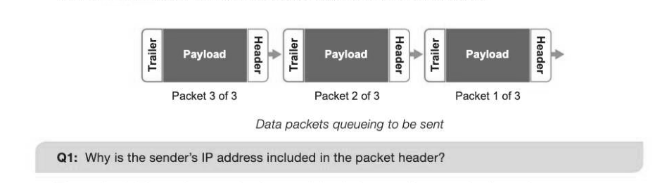

# Chapter 57 — Packet switching and routers
## Objectives

« Understand the role of packet switching and routers

- Know the main components of a packet
- Consider where and why routers and gateways are used
- Explain how routing is achieved across the Internet

## Packet switching

Packet switching is a method of communicating packets of data across a network on which other similar communications are happening simultaneously. The communications cables are shared between many communications to allow efficient use of them, in contrast to the older circuit-switched telephone network which allowed only one two-way communication at a time along a single cable. Website data that you receive arrives as a series of packets and an email will leave you in a series of packets.

## Data packets

Data that is to be transmitted across a network is broken down in more manageable chunks called packets. The size of each packet in a transmission can be fixed or variable, but most are between 500 and 1500 bytes. Each packet contains a header and a payload containing the body of data being sent. Some packets may also use a trailer section with a checksum or Cyclical Redundancy Check (CRC) to detect transmission errors by creating and attaching a hash total calculated from the data contained in the packets. The CRC checksum is recalculated for each packet upon receipt and a match is used to help verify that the payload data has not changed during transmission. If the CRC totals differ, the packet is refused with suspected data corruption and a new copy is requested from the sender. The header (much like the box(es) of a consignment you might send or receive through the post) includes the sender's and the recipient's IP addresses, the protocol being used with this type of packet and the number of the packet in the sequence being sent, e.g. packet 1 of 8. They also include the Time To Live (TTL) or hop limit, after which point the data packet expires and is discarded.

The payload of the packet contains the actual data being sent. Upon receipt, the packets are reassembled in the correct order and the data is extracted.

## Routing packets across the Internet

The success of packet switching relies on the ability of packets to be sent from sender to recipient along entirely separate routes from each other. At the moment that a packet leaves the sender's computer, the fastest or least congested route is taken to the recipient's computer. They can be easily reassembled in

Router / Node ——>

## Routers

Each node in the diagram above represents a router. Routers are used to connect at least two networks, commonly two LANs or WANs, or to connect a LAN and its ISP's network. The act of traversing between one router and the next across a network is referred to as a hop. The job of a router is to read the recipient's IP address in each packet and forward it on to the recipient via the fastest and least congested route to the next router, which will do the same until the packet reaches its destination. Routers use routing tables to store and update the locations of other network devices and the most efficient routes to them. A routing algorithm is used to find the optimum route. The routing algorithm used to decide the best route can become a bottleneck in network traffic since the decision making process can be complicated. A common shortest path algorithm used in routing is Dijkstra's algorithm. (See Chapter 48.) When a router is connected to the Internet, the IP address of the port connecting it must be registered with the Internet registry because this IP address must be unique over the whole Internet.

## Gateways

Routing packets from one network to another requires a router if the networks share the same protocols, for example TCP/IP. Where these protocols differ between networks, a gateway is used rather than a router to translate between them. All of the header data is stripped from the packet leaving only the raw data and new header data is added in the format of the new network before the gateway sends the packet on its way again. Gateways otherwise perform a similar job to routers in moving data packets towards their destination.

---

## Exercises

1. Major parts of the Internet run on a packet switched network that relies on routers and gateways to communicate. (a) What is meant by the term packet switching? [2] (b) A data packet contains a header and a payload. The header contains data that it used to route the packet to its destination. State three data items that might be contained in a data packet's header. [3]
