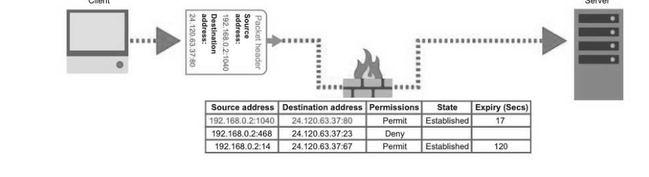
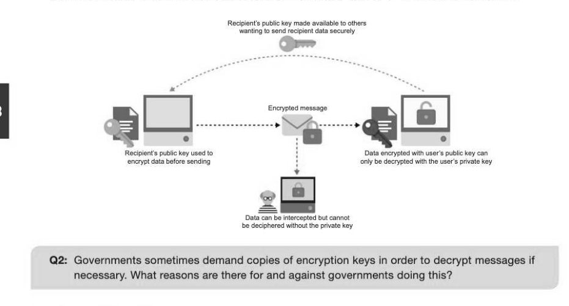
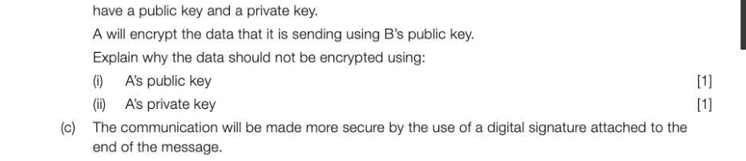
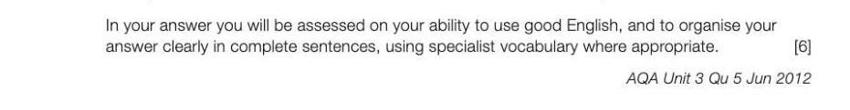
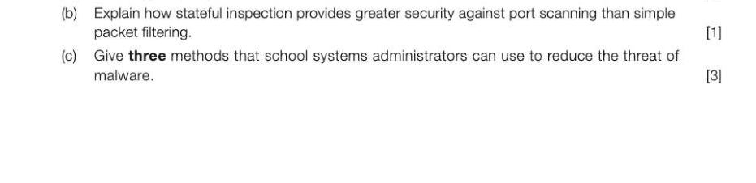

# Chapter 58 — Internet security
## Objectives

- Understand how a firewall works
- Explain symmetric and asymmetric encryption and key exchange
- Explain how digital signatures and certificates are obtained and used
- Discuss worms, Trojans and viruses and the vulnerabilities that they exploit
- Discuss how improved code quality, monitoring and protection can be used against such threats

## Firewalls

A firewall is a security checkpoint designed to prevent unauthorised access between two networks, usually an internal trusted network and an external, deemed untrusted, network; often the Internet. Firewalls can be implemented in both hardware and/or software. A router may contain a firewall. A typical firewall consists of a separate computer containing two Network Interface Cards (NICs), with one connected to the internal network, and the other connected to the external network. Using special firewall software, each data packet that attempts to pass between the two NICs is analysed against preconfigured rules (packet filters), then accepted or rejected. A firewall may also act as a proxy server.

## Packet filtering

Packet filtering, also referred to as static filtering, controls network access according to network administrator rules and policies by examining the source and destination IP addresses in packet headers. If the IP addresses match those recorded on the administrator's 'permitted' list, they are accepted. Static filtering can also block packets based on the protocols being used and the port numbers they are trying to access. A port is similar to an airport gate, where an incoming aircraft reaches the correct airport (the computer or network at a particular IP address) and is directed to a particular gate to allow passengers into the airport, or in this case to download the packet's payload data to the computer. mes Client Server

Certain protocols use particular ports. Telnet, for example, is used to remotely access computers and uses port 23. If Telnet is disallowed by a network administrator, any packets attempting to connect through port 23 will be dropped or rejected to deny access. A dropped packet is quietly removed, whereas a rejected packet will cause a rejection notice to be sent back to the sender.

## Stateful inspection

Rather than relying on the IP addresses, protocols and port numbers to govern a packet's safe passage, stateful inspection or dynamic filtering can also examine the payload contents of a data packet to better assess it for safety. It can also create temporary contextual rules based on the passage of previous packets in a 'conversation'. This is to ensure that incoming responses (to your outgoing packets) arriving through the same port numbers, and with the same IP addresses, can be temporarily allowed during that communication stream. Routers usually keep the 'conversation' data in a Connection Table which is dynamically updated and referred to in conjunction with rules created by administrators of the network. An example of this would be when a browser makes a request to a specific web server for a web page. The packets containing the web page data returning from the web server would be allowed since the dynamic filter knows that these are in response to the recent request. This provides an added security measure against port scanning for covert access to a computer, since ports are closed off until connection to the specific port is requested by a computer on the protected side of the firewall.

## Proxy servers

A proxy server intercepts all packets entering and leaving a network, hiding the true network addresses of the source from the recipient. This enables privacy and anonymous surfing. A proxy can also maintain a cache of websites commonly visited and return the web page data to the user immediately without the need to reconnect to the Internet and re-request the page from the website server. This speeds up user access to web page data and reduces web traffic. If a web page is not in the cache, then the proxy will make a request of its own on behalf of the user to the web server using its own IP address and forward the returned data to the user, adding the page to its cache for other users going through the same proxy server to access. A proxy server may serve hundreds, if not thousands of users. IP Address: 210.43.137.40 Proxy servers are often used to filter requests providing administrative control over the content that users may demand. A common example is a schoo! web-proxy that filters undesirable or potentially unsafe online content in accordance with their school usage policies. Such proxies may also log user data with their requests.

## Encryption

Encryption is the process of scrambling data so that it becomes very difficult to unscramble and interpret without the correct key. Encrypted data is known as ciphertext, and the original interpretable data is known as plaintext. The process of encryption is carried out using a cryptographic algorithm and a key.

## Symmetric (Private key) encryption

Symmetric encryption, also known as private key encryption, uses the same key to encrypt and decrypt data. This means that the key must also be transferred (known as key exchange) to the same destination as the ciphertext which causes obvious security problems. The key can be intercepted as easily as the ciphertext message to decrypt the data. For this reason asymmetric encryption can be used instead.

## Asymmetric (Public key) encryption

Asymmetric encryption uses two separate, but related keys. One key, known as the public key, is made public so that others wishing to send you data can use this to encrypt the data. This public key cannot decrypt data. Another private key is known only by you and only this can be used to decrypt the data. It is virtually impossible to deduce the private key from the public key. It is possible that a message could be encrypted using your own public key and sent to you by a malicious third party impersonating a trusted individual. To prevent this, a message can be digitally 'signed' to authenticate the sender.

## Digital signatures

A digital signature is the equivalent of a handwritten signature or security stamp, but offers even greater security. First of all, a mathematical value is calculated from the unencrypted message data. This value is also referred to as a hash total, checksum or digest. Since the hash total is generated from the entire message, even the slightest change in the message will produce a different total. The sender of the message uses their own private key to encrypt the hash total. The encrypted total becomes the digital signature since only the holder of the private key could have encrypted it. The signature is attached to the message to be sent and the whole message including the digital signature is encrypted using the recipient's public key before being sent. The recipient then decrypts the message using their private key, and decrypts the digital signature using the sender's public key. The hash total is then reproduced based on the message data and if this matches the total in the digital signature, it is certain that the message

To ensure that the message could not be copied and resent at a later date, the time and date can be included in the original message, which if altered, would cause a different hash total to be generated. Digital signatures can be used with any kind of message regardless of whether encryption has also been used. They can be used with most email clients or browsers making it easy to sign outgoing communication and validate signed incoming messages. If set up to use digital signatures, your browser should warn you if you download something that does not have a digital signature. This would also mean that anything sent by you including online commercial and banking transactions can be verified as your own. Hoax digital signatures could be created using a bogus private key claiming to be that of a trusted individual. In order to mitigate against this, a digital certificate verifies that a sender's public key is formally registered to that particular sender.

## Digital certificates

While digital signatures verify the trustworthiness of message content, a digital certificate is issued by Official Certificate Authorities (CAs) such as Symantec or Verisign and verifies the trustworthiness of a message sender or website. This certificate allows the holder to use the Public Key Infrastructure or PKI. The certificate contains the certificate's serial number, the expiry date, the name of the holder, a copy of their public key, and the digital signature of the CA so that the recipient can authenticate the certificate as real. Digital certificates operate within the Transport layer of the TCP/IP protocol stack using TLS (Transport Layer Security), which is beginning to supersede SSL (Secure Sockets Layer) security. TCP/IP is covered in more detail in the following chapter. 10-58

## Worms, Trojans and viruses

Worms, Trojans and viruses are all types of malware or malicious software. They are all designed to cause inconvenience, loss or damage to programs, data or computer systems.

## Viruses and worm subclasses

Viruses and worms have the ability to self-replicate by spreading copies of themselves. A worm is a sub-class of virus, but the difference between the two is that viruses rely on other host files (usually executable programs) to be opened in order to spread themselves, whereas worms do not. A worm is standalone software that can replicate itself without any user intervention. Viruses come in various types but most become memory resident when their host file is executed. Once the virus is in memory, any other uninfected file that runs becomes infected when it is copied into memory. Other common viruses reside in macro files usually attached to word processing and spreadsheet data files. When the data file is opened, the virus spreads to infect the template and subsequently other files that you create. Macro viruses are usually less harmful than other viruses but can still be very annoying. The Cascade virus caused text characters to fall from the top of the screen

A worm does not generally hide itself inside another file, but will usually enter the computer through a vulnerability or by tricking the user into opening a file; often an attachment in an email. Rather than simply infecting other files like a virus on your own machine, a worm can replicate itself and send copies to other users from your computer; commonly by emailing others in your electronic address book. Owing to the ability of a worm to copy itself, worms are often responsible for using up bandwidth, system memory or network resources, causing computers to slow and servers to stop responding.

## Trojans

A Trojan is so called after the story of the great horse of Troy, according to which soldiers hid inside a large wooden horse offered as a gift to an opposition castle. The castle guards wheeled the wooden horse inside their castle walls, and the enemy soldiers jumped out from inside the horse to attack. A Trojan is every bit as cunning and frequently manifests itself inside a seemingly useful file, game or utility that you want to install on your computer. When installed, the payload is released, often without any obvious irritation. A common use for a Trojan is to open a back door to your computer system that the Trojan creator can exploit. This can be in order to harvest your personal information, or to use your computer power and network bandwidth to send thousands of spam emails to others. Groups of Internet-enabled computers used like this are called botnets. Unlike viruses and worms, Trojans cannot self-replicate. The Procession of the Trojan Horse in Troy - Giovanni Domenico Tiepolo, c.1760

## System vulnerabi

Malware exploits vulnerabilities in our systems, be they human error or software bugs. People may switch off their firewalls or fail to renew virus protection which will create obvious weaknesses in their systems. Administrative rights can also fail to prevent access to certain file areas which may otherwise be breached by viral threats. Otherwise cracks in software where data is passed from one function, module or application to another (which is often deemed to have been checked and trusted somehow by the source) may open opportunities for attackers.

## Protection against viral threats

Code quality is a primary vulnerability of systems. Many malware attacks exploit a phenomenon called 'buffer overflow' which normally occurs when a program accidentally writes values to memory locations too small to handle them, and inadvertently overwrites the values in neighbouring locations that it is not supposed to have access to. As a result of a buffer overflow attack, overflow data is often interpreted as instructions. The virus could be written to take advantage of this by forcing the program to write something to memory which may consequently alter its behaviour in a way that benefits the attacker. Social engineering, including phishing, is a confidence trick used to persuade individuals to open files, Internet links and emails containing malware. Spam filtering and education in the use of caution is the most effective method against this sort of vulnerability. Regular operating system and antivirus software updates will also help to reduce the risk of attack. Virus checkers usually scan for all other malware types and not just viruses, and since new variants are created all the time to exploit vulnerabilities in systems software, it is vital that your system has the latest protection. In the worst cases, a lack of monitoring and protection within a company can make national headlines.

---

## Exercises

1. Software is being developed to allow secure transmission of data over the Internet. The two computers involved in a communication will be known as A and B. (a) What is encryption? (1) (b) The data being transmitted will be encrypted using public and private keys. A and B will each

- State the purpose of a digital signature
- Explain how it will be created and used in the data transmissions process from A to B.

2. Malicious attacks on systems are frequently identified and blocked by various systems. (a) How might a proxy server reduce the risks of malware attacks on a network? (1)

