# Chapter 59 — TCP/IP, standard application layer protocols
protocols

## Objectives

Describe the roles of the four layers in the TCP/IP protocol stack Describe the role of sockets in the TCP/IP stack

- Be familiar with MAC addresses
- Explain and differentiate between the common protocols and the well-known ports they use
- Be familiar with transferring files using FTP as an anonymous and non-anonymous user
- Know how Secure Shell (SSH) is used for remote management including the use of application level protocols for sending and retrieving email
- Explain the role of an email server in sending and retrieving email
- Explain the role of a web server in serving up web pages in text form
- Understand the role of a web browser in retrieving web pages and web page resources and rendering these accordingly

## The TCP/IP protocol stack

The Transmission Control Protocol / Internet Protocol (TCP/IP) protocol stack is set of networking 10-59 protocols that work together as four connected layers, passing incoming and outgoing data packets up and down the layers during network communication. The four layers are the:

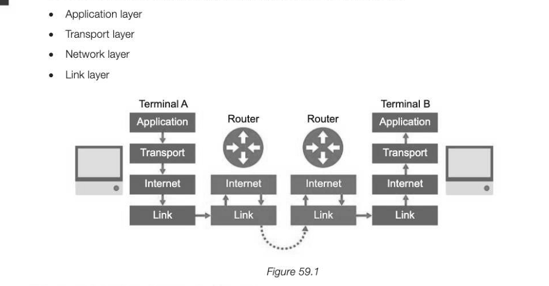

*Figure 59.1*

## The role of the four layers in the stack

Various protocols operate at each layer of the stack, each with different roles. In each layer, the data to be sent is wrapped, or encapsulated in an envelope containing new packet data as it descends the layers and is

## The application layer

The application layer sits at the top of the stack and uses protocols relating to the application being used to transmit data over a network, usually the Internet. If this application is a browser, for example, it would select an appropriate higher-level protocol for the communication such as HTTP, POPS or FTP. Imagine the following text data is to be sent via a browser using the Hypertext Transfer Protocol (HTTP): "Only two things are ty, and I'm not sure about the forme! Albert Einstei

## The transport layer

The transport layer uses the Transmission Control Protocol (TCP) to establish an end-to-end connection with the recipient computer. The data is then split into packets and labelled with the packet number, the total number of packets and the port number through which the packet should route. This ensures it is handled by the correct application on the recipient computer. In the example below, port 80 is used as this is a common port used by the HTTP protocol, called upon by the destination browser. If any packets go astray during the connection, the transport layer requests retransmission of lost

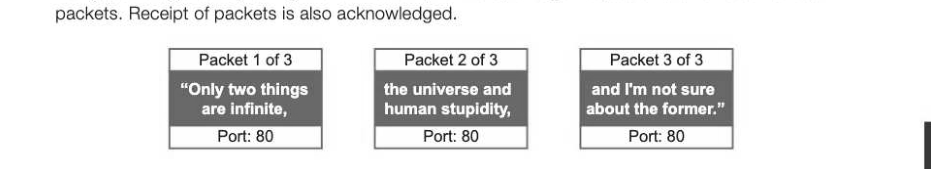

## The network layer

The network layer, sometimes referred to as the IP layer or Internet layer, adds the source and destination IP addresses. Routers operate on the network layer and will use these IP addresses to forward the packets on to the destination. The addition of an IP address to the port number forms a socket, e.g. 42.205.110.140:80, in the same way that the addition of a person's name is added to a street address on an envelope in order to direct the letter to the correct person within a building. A socket specifies which device the packet must be sent to and the application being used on that device.

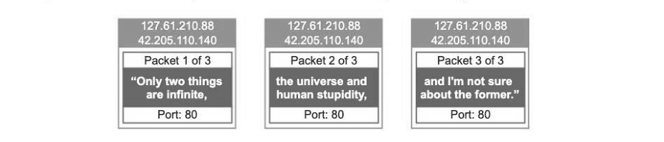

## The link layer

The link layer is the physical connection between network nodes and adds the unique Media Access Control (MAC) addresses identifying the Network Interface Cards (NICs) of the source and destination devices. These means that once the packet finds the correct network using the IP address, it can then locate the correct piece of hardware. MAC addresses are changed at each hop, the source MAC address being the address of the device sending the packet for that specific hop and the destination MAC address that of the device receiving the packet for that particular hop. Unless the two computers are on the same network, the destination MAC address will initially be the MAC address of the first router that the packet is sent to.

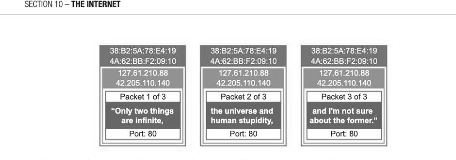

At the receiving end, the MAC address is stripped off by the link layer, which passes the packets on to the network layer. The IP addresses are then removed by the network layer which passes them on to the transport layer. The transport layer uses the port number to determine which application to pass the data to in the application layer, then removes the port numbers and reassembles the packets in the correct order. The resulting data is then passed to the application which presents the data for the user. Since routers operate on the network layer, source and destination MAC addresses are changed at each router node. Packets, therefore, move up and down the lower layers in the stack as they pass through each router or switch between the client and the server as shown in Figure 59.1.

## 10-59 Media Access Control (MAC) addresses

AMAC address is a unique 12-digit hexadecimal code that is hardcoded on every Network Interface Card (NIC) during manufacture. This uniquely identifies a particular printer, mobile phone, computer or router, wireless or wired, anywhere in the world so that data packets can be routed directly to them. MMT A @0-71-SB-A9-38-4A Well-known server ports and standard application level protocols A port determines which application may deal with a data packet as it enters your computer. Several common application level protocols use standard ports on the server.

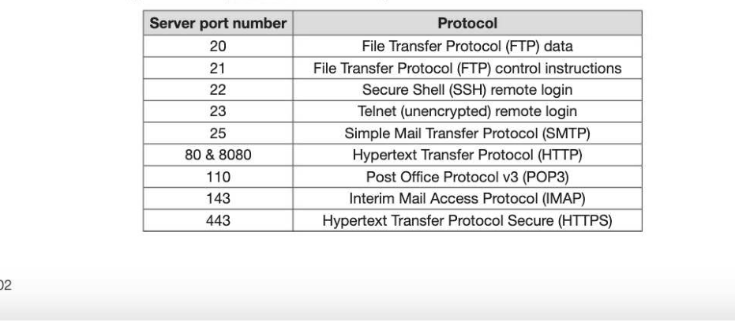

The client port that a server request is returned to is usually a temporary and arbitrary port number. This is a security measure to ensure that hackers do not know which ports are open on a client machine.

## Transferring files with FTP

File Transfer Protocol (FTP) is a very efficient method used to transfer data across a network, often the Internet. FTP works as a high level protocol in the Application layer using a set of FTP commands. Using an FTP software client sat on top of the protocol, user actions can generate the FTP commands automatically as shown in the figure below. The user is presented with a file management screen showing the file and folder structure in both the local computer and the remote website. Files are transferred simply by dragging them from one area to the other. FTP sites may also be used by software companies offering large updates, or by press photographers to upload their latest photographs to a remote newspaper headquarters, for example. Most FTP sites require a username and password to authenticate the user, but some sites could be configured to allow anonymous use without the need for any login

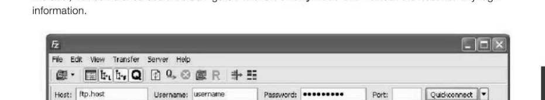

| Hest: { fepshose | Username: 10-59

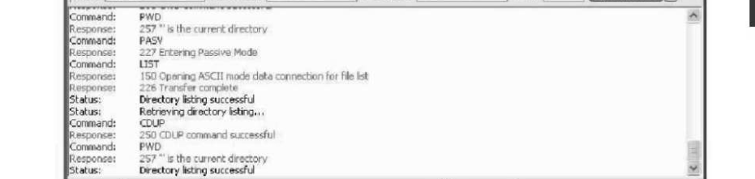

Local ste: | C:\ WordPress [Remote ste: /

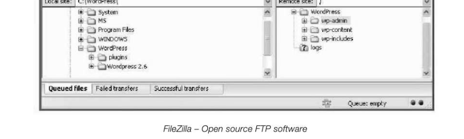

Common FTP Commands as shown in the figure above: PWD Print working directory CDUP Change to parent directory LIST Return file or directory information PASV Enter passive mode

## Remote management using Secure Shell (SSH)

Secure Shell (SSH) is used for remotely accessing and managing a computer. It is a modern, and secure replacement of an older Telnet protocol which used no encryption at all. SSH uses public key encryption, requiring a digital certificate to authenticate the user. It is commonly used by network administrators to remotely manage their business servers. The commands used to control the server remotely are similar to the original MS-DOS commands used to control a PC before the Windows interface was developed.

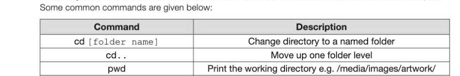

cp logo.png images/logo.png Copy a file (logo.png) to a new location (/images) cat index.html Display the contents of a file Is *.png List all files with the extension.png

## Using application level protocols with SSH

Using SSH with other application level protocols means that you can create a 'tunnel' through port 22 (for SSH) through which HTTP, POP3 or SMTP requests can operate. This means that an HTTP 'GET' request for example (used to request data from a specified resource), can not only be sent securely using secure shell encryption, but can also bypass any network restrictions that may have been placed on other ports that might usually be associated with these services. The role of a mail server in retrieving and sending email A mail server acts as a virtual post office for all incoming and outgoing emails. These servers route mail according to its database of local network user's email addresses as it comes and goes, and store it until it can be retrieved. Post Office Protocol (v3) (POP3) is responsible for retrieving emails from a mail server that temporarily stores your incoming mail. When emails are retrieved, they are transferred to your local computer, be it a desktop or mobile phone, and deleted from the server. As a result, if you are using different devices to access email via POPS, you will find that they don't synchronise the same emails on each device. Internet Message Access Protocol (IMAP) is another email protocol that is designed to keep emails on the server, thus maintaining synchronicity between devices. Simple Mail Transfer Protocol (SMTP) is used to transfer outgoing emails from one server to another or from an email client to the server when sending an email.

## Web servers

A web server typically hosts a website and handles client requests, typically using HTTP, to send content to users wanting to view pages of the site. The web pages are stored as text files, usually written in HTML, CSS and/or JavaScript and sent to a browser to render them accordingly.

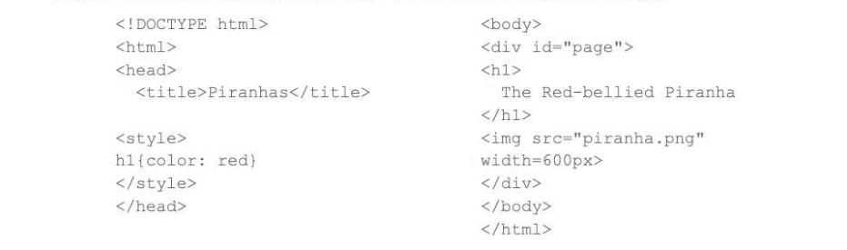

HTML code is stored in text form using <tags> to help browsers render the pages correctly The server also handles traffic to and from the site and may load balance requests across several servers hosting the same website to ensure that visitors to the site all get a smooth experience without delay during times of particularly high traffic.

## The role of a browser in rendering web pages

When a browser receives an HTTP response from a web server, the text document, containing the HTML (for content), CSS (for styling) and/or JavaScript (to run client-side code) for a page is parsed to break it 10-59

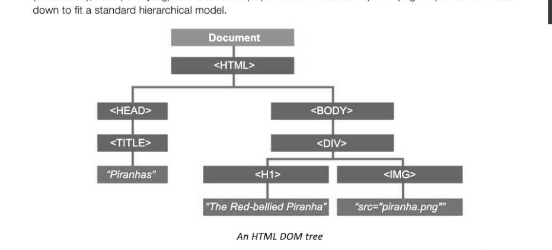

The HTML is first broken down into a hierarchy of tags called a Document Object Model (DOM) tree in order for the browser to structure the code. The styles from the CSS form their own CSSOM (CSS. Object Model) and are related to their corresponding HTML tags. Lastly, any JavaScript is parsed and executed. Further HTTP requests are made to download other resources such as additional images or a style sheet from the server to the local machine. The browser then renders or 'paints' the page on the screen as the designer intended when the code was written.

---

## Exercises

1. All Internet communications use the TCP/IP protocol stack, which is considered to have four layers — the application, transport, network and link layers. Describe the roles of each layer when two devices are communicating over the Internet. In your answer you will also be assessed on your ability to use good English, and to organise your answer Clearly in complete sentences, using specialist vocabulary where appropriate. [8]

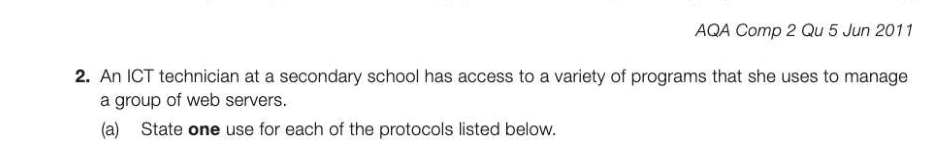

(i) Telnet 1] (i) FTP (1] (ii) "POPS (1) (b) Whilst remotely connecting to one of the servers the technician executes a command that displays the current network connections. Figure 1 shows these network connections. Active Internet Connections Proto Recv-Q vi-Q Local Address Foreign Address (state) tept 0 ) 192.168.3.205:80 74.125.4.148:58539 ESTABLISHED teed 0 ° 192.168.3,205:80 208.43,202.29:57458 ESTABLISHED rept 37 o 192.168.3.205125 200.43,202.29157459 —CLOSE_WAIT

*Figure 1*

() IP address (1) (ii) Port (1] (il) Socket (1) () State two reasons why the technician uses remote management software from her computer rather than going to the actual servers. [2] AQA Comp 2 Qu 3 Jun 2012
