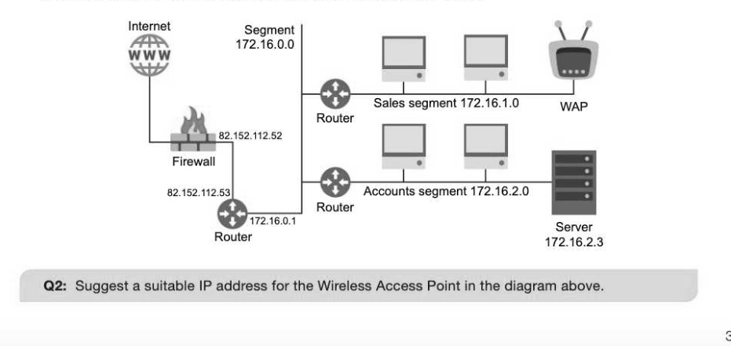
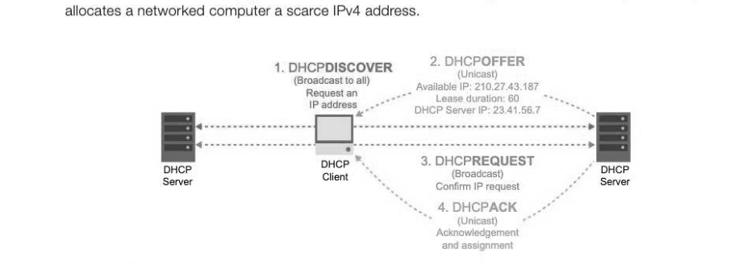
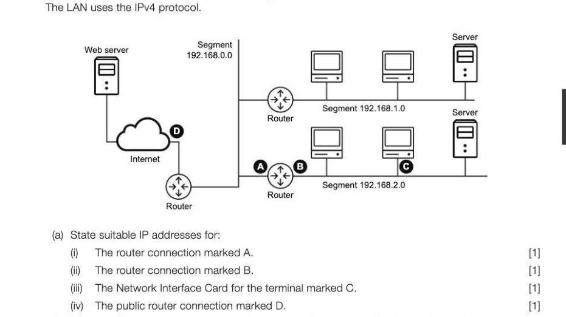
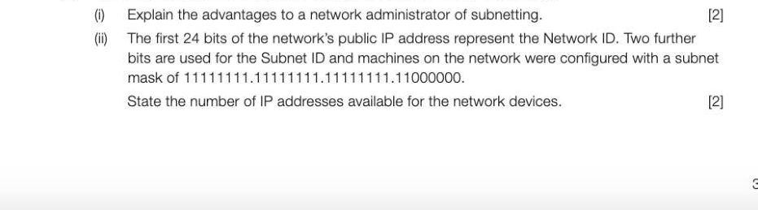

# Chapter 60 — IP addresses
## Objectives

- Know that an IP address is split into a network identifier and a host identifier part Know how a subnet mask is used to identify the network identifier part of the IP address Know that there are currently two standards of IP address, (v4 and v6) and why v6 was introduced
- Distinguish between routable and non-routable IP addresses
« Understand the purpose and function of the Dynamic Host Configuration Protocol (DHCP) system

- Explain the basic concepts of Network Address Translation (NAT) and port forwarding and why they are used

## The IP address structure

An Internet Protocol address or IP address is a unique numerical address used to identify a host computer or network node trying to communicate over IP on the Internet.

## IP standards

There are two standards of IP addressing currently in use. IPv4 and IPv6. The IPv4 system was first deployed in 1983 providing 4 billion possible address combinations. It was inconceivable then that the world would need any more, but we are fast running out of unique addresses. In 1999, IPv6 was introduced using 128 bits expressed as a hexadecimal string rather than binary (for example, 3dfb:1730:4935:0007:0340:fe2f:fb7 1:48af). |Pv6 now offers 340 trillion, trillion, trillion unique addresses. That ought to be enough! It is thought that by 2020, (largely driven by the Internet of Things), |Pv6 will become the new global standard but the inevitable changeover from |Pv4 is not an entirely straightforward exercise as the two systems are incompatible with each other. This means that every IPv4 device or software application operating on the Internet will need to be upgraded or replaced.

## IPv4

An |Pv4 address consists of a 32-bit number written in a dotted-decimal notation. Each part represents an 8-bit binary pattern giving a range of 0-255 for each decimal number.

## Reserved IP addresses

Some IP addresses cannot be used for an individual network or host. e 127.x.x.x are private, non-routable addresses used for diagnostics within local networks only. ° x.x.x.0 is the network identifier e x.x.x.255 is reserved as the broadcast address on that subnet where data is sent simultaneously to all subnetwork hosts x.x.x.1 is conventionally the default router address

## Network and host identifiers

An |Pv4 address contains two parts to identify both the individual network and the host computer within that network. The network part of the address uses the first bits in the 32-bit address and therefore the size of this network ID determines the number of bits remaining in the address for the host ID.

## Classful addressing

Historically, a systems of classes was used to define the size or proportion of the network and host identifiers within a 32-bit IP address. Class A networks had very few network identifiers (7 bits = 128 network identifiers, less all-O and all-1 addresses = 126 networks), each with millions of host addresses, suitable for the world's largest organisations. Conversely Class C had millions of networks with few hosts. If classful addressing is used, then the division of an IP address between host ID and network ID always happens in a small number of fixed positions. For classless addressing, the split between host ID and network ID can be made anywhere within an IP address.

## Classless addressing

The more modern classless system specifies the number of bits in the subnet mask as in this example: 103.27.104.92/24 where the '/24' indicates that the first 24 bits of the IP address are the network ID and the remaining 8 are the host ID. This has the significant advantage over the classful system of allowing the split between network ID and host ID being possible anywhere within the 32 bits, e.g. 22 bits for network ID, 10 bits for host ID. This is a far more flexible arrangement which is intended to overcome the limitations of there being a very limited number of IP blocks in the classful system.

## Subnet masking

A subnet mask is used in conjunction with an IP address to identify the two unique parts of the address. A subnet mask of 255.255.255.0 indicates that 24 bits have been used for the network ID, corresponding to a suffix of '/24' in a classless IP address. This would leave 254 (1-254) unique addresses (excluding O and 255 which are reserved as generic and broadcast addresses) remaining for the host computers. on this network. The IP address of 140.24.112.0 may be the network address, and 140.24.112.57 may identify the host computer on that network where 57 is the host ID. An organisation likely to require more than 254 unique addresses should use a subnet mask with a smaller network ID. A subnet mask is 'ANDed' with the IP address using the bitwise logical AND operator to separate out the network ID from the full IP address. Note that the mask is applied independently to the IP addresses of both the source and destination computers.

A computer sending data across a network will use a subnet mask and the destination IP address to determine from the network ID whether or not the destination computer is on the same subnetwork. This is done by performing the same AND operation between the computer's own IP address and the subnet mask; if the two network IDs produced are the same then the computers are on the same network so data can be sent directly between them. Otherwise the sending computer must send the data to a router for forwarding to the network that the destination computer is on. 140 24 112 57 IP Address: |1 (0 /0 /0 |.|0 |0 [0 |1 |1 [0 |0 (0 [0 [0 |0 (0 |.!0 0 |1 |1 11 |0 |0 11 Subnet mask: |1 (1/1/11 /1 /10 (1 |.)1 111 4 1 /1 | 1/1/71 [0 [0 /0 0 |0 [0 0 [0 jo

## Subnetting

Anetwork administrator of a large organisation using an IP address with a 16-bit network ID may wish to create subnetwork segments within their own larger IP network in order to ease management and improve efficiency by routing data through one segment only. Using a bus network, this would allow two computers in subnetwork A to communicate at the same time as two computers in subnetwork B avoiding any collisions. Subnetting reduces the size of the broadcast domain which can improve security, speed and reliability. A subnet ID is created by using the most significant bits from the host ID section of the IP addresses. In the example below, the eight most significant bits of the 16-bit host ID have been used as a subnet ID leaving 8 bits or 254 (28 = 254-2 to exclude all-zero and all-one) unique host addresses in each of 256 (28) new subnetworks. The term Subnet ID is often used to cover the Network ID and Subnet ID together. 10-60 For example, if you configure a computer or home router no distinction is made between the two. IP 'Subnet Address: mask:: [0 [0 [0 [0 [0 [0 [0 [0 | pegoeeot eerie. A network diagram showing subnetwork segments might look like this:

## Public and private IP addresses

A public (or routable) IP address must be globally unique and can be addressed directly by any other computer in the world. A company's web server, or home Internet router for example, would require a public IP address. Within the local network, addresses can be private (or non-routable) and the web server or router can forward the data going through it to the correct internal device. All devices on the internal network will also have an IP address but this will be private and would not require registration with an Internet registry. As such, private IP addresses do not need to be globally unique; they must just be unique within their local network. The common IP blocks for a Class C private network are 192.168.0.0 to 192.168.255.255. Assigning private addresses to internally networked devices conserves the number of unique IPv4 addresses available for Internet-facing devices. A home network printer, for example would be allocated a private IP address to prevent others outside your network from being able to print to it. To allow external access to a privately addressed computer, a Network Address Translator (NAT) is required.

## Dynamic Host Configuration Protocol

A Dynamic Host Configuration Protocol (DHCP) server is used to automatically assign a dynamic IP address from a pool of available addresses to a computer attempting to operate on a public network such as an Internet hotspot. Since IP addresses are in short supply, this system of dynamic addressing enables active computers to request an IP address for the duration they are online and release the address back to the pool for another computer when it is not in use. DHCP also provides the subnet mask and other automatic configuration details alongside the IP address, solving problems with manual configuration and centrally handling frequent changes of IP address such as those used with mobile devices moving from one area to another. DHCP is also used on private networks to allocate internal IP addresses to machines (e.g. 192.168.1.x). Static IP addressing is uncommon as it permanently

## Network Address Translation

Network Address Translation (NAT) is used to convert IP addresses as they pass between a public address space (via a router for example) using a public IP address and a LAN with a private address space. NAT is required to translate private IP addresses since they are not routable and therefore cannot be used for routing packets on the Internet. Private addresses are also not unique so external servers cannot send packets directly back to a unique private address. An outgoing server request made by a computer on a private network contains its own IP address and port number. The router logs these as an entry in a translation table and swaps the packet IP address and port number for its own external

IP address and a unique port number. An incoming response, identified by the port number, is then rebadged with the original workstation's internal IP address and port number from the translation table. NAT provides a solution to the lack of public address in |Pv4 while we undergo the transition to IPv6 which will afford everyone a unique address. It also offers an additional layer of security by automatically creating a firewall between the internal and external networks.

## Port forwarding

Port forwarding is commonly a product of Network Address Translation when a public computer is trying to communicate with a server operating within a private network. Since there is no direct connection to the server, the NAT needs to forward all incoming requests to a particular IP address and port (for example web requests on port 80) to port 80 of an internal web server using a private IP address. Requests to access the internal server would be sent to the IP address of the external router, which can be programmed to filter out packets destined for certain computers or applications.

---

## Exercises

1. The diagram below shows the physical topology of a Local Area Network connected to the Internet.

(b) The combined router and switch device has two IP addresses. One is a public address and the other is a private address. Explain the difference between public and private IP addresses. [2] (c) The network has been segmented using a technique called 'subnetting'.

(a) Computers on the network use the Dynamic Host Configuration Protocol (DHCP) to obtain a public IP address before communicating over the Internet. (i) Give one advantage of using DHCP. (1) (ii) Why are dynamic IP addresses preferred, rather than using static IP addresses? [2] An FTP server inside a company network contains files that employees can access outside of the office network. Briefly explain how port forwarding is used to access internal files. (2)
