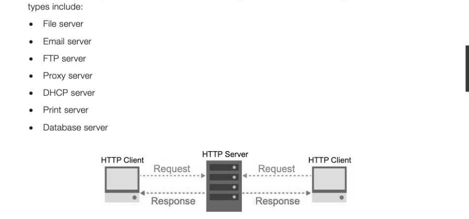
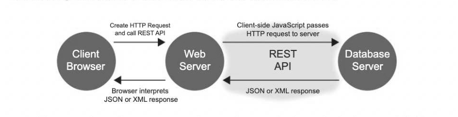
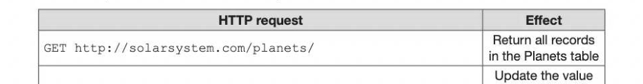
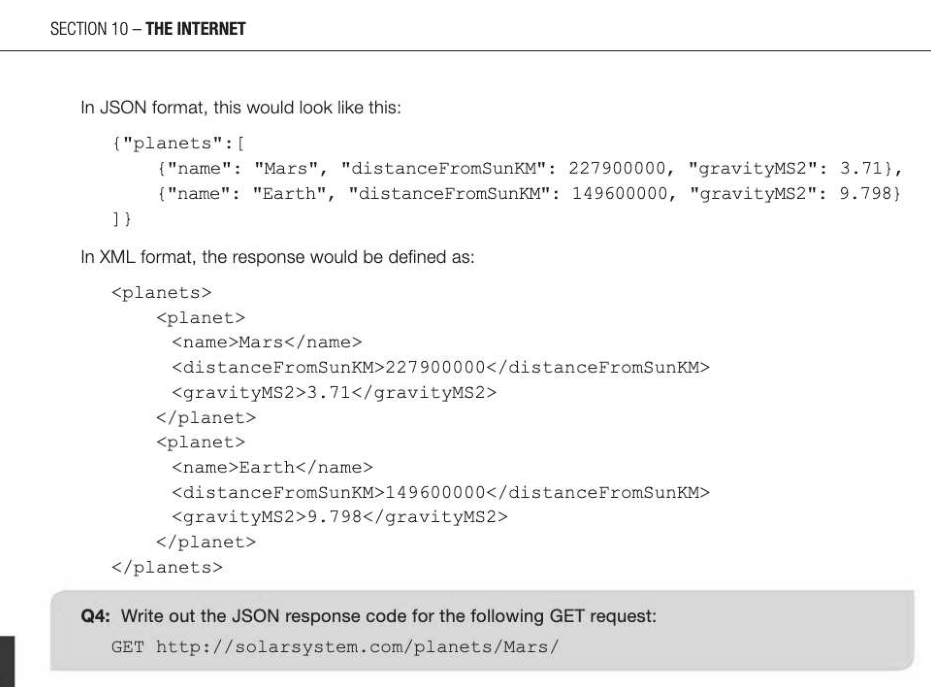
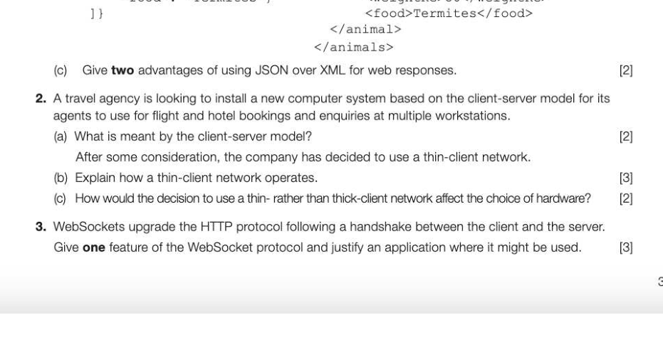

# Chapter 61 — Client server model
## Objectives

- Be familiar with the client-server model
- Be familiar with the WebSocket protocol and know why and where it is used Understand the principles of Web CRUD applications and Representational State Transfer (REST)
- Compare JSON (JavaScript Object Notation) with XML
- Compare and contrast thin-client computing with thick-client computing

## The client-server model

In the client-server model, a client will send a request message to a server which should respond with the data requested or a suitable message otherwise. This is commonly seen when a client browser sends an HTTP request to a web server for web page data or a web resource. The page data is sent back from the HTTP server by way of response and the browser renders the web page on the client's computer. Servers are usually given specific roles based on the data they hold and the service they provide. Common server



## API (Application Programming Interface)

An AP is a set of protocols that governs how two applications should interact with one another. An API sets out the format of requests and responses between a client and a server and enables one application to make use of the services of another. An organisation may use the Twitter API to enable relevant tweets to be regularly fed through to a display window within their own website. Price comparison websites may also use an API to gather data from individual company websites in order to display a list of each of them for the consumer.

## WebSocket protocol

The WebSocket specification is another example of an API. WebSocket is a modern application layer protocol that facilitates a persistent bi-directional communication channel between the client and the server (usually a web server) over a single line. This is known as full-duplex communication. WebSocket packets are also greatly reduced in size since they use a fraction of the usual header information. All packets communicating via a WebSocket are automatically accepted at either end without the usual need for security checks. Being able to keep a connection open whilst sending much smaller packets back and forth enables super-fast, real-time and interactive communication commonly used, for example, with online gaming, instant messaging or remote collaborative document editing. The overheads on the HTTP servers running the communication are usually reduced to such a point that fewer web servers are required, therefore saving time in transmission, saving bandwidth and the cost and space of additional unnecessary servers traditionally used with older methods. Reducing data usage is particularly important with mobile data.

## Web CRUD applications

CRUD is an acronym for Create, Retrieve, Update and Delete. These are the four fundamental operations of a database or content management system. The world has developed a growing desire for online access to database systems using web queries for anything from a shared family calendar on a mobile phone to a full-scale airline seat booking system. Relational databases use four primary SQL (Structured Query Language) statements that can be mapped directly to CRUD.

```
 (©) Create POST INSERT
(A) Retrieve GET SELECT
(U) Update PUT UPDATE
```


*Figure 61.1: Mapping of CRUD operations to HTTP request methods and SQL statements*

## HTTP request methods

HTTP uses a common standard of verbs or actions such as GET, POST, PUT and DELETE when working with online database servers. Most of the time a browser using the HTTP protocol will perform GET and POST requests only; GET me this web page, GET the images on the page and GET a list of available tickets for the cup final or POST new data to a database. HTTP can also use PUT and DELETE request methods, but less commonly since GET and POST can both be used to perform these functions too.

## Representational State Transfer (REST)

REST is a style of systems design that prescribes the use of HTTP request methods to interact with online databases via a web server. The client computer requires no knowledge of how the server is likely to fulfil the request, how the data is stored or where it will gather the data. This separation allows any client or server to be updated and developed independently of each other without any loss of function. A

Connecting a database to a browser with HTTP request methods



1. A browser makes a client server request from a web server to load a standard web page and all of its resources. 2. The web page HTML file contains some JavaScript which is executed on the client-side. 3. The browser JavaScript calls the RESTful API which enables communication with the server-side database using HTTP requests. 4. The database server responds to the client's HTTP requests with the data in JSON or XML format. 5. The browser renders the JSON or XML data in its own user interface.

## Using HTTP methods for RESTful services

Consider the following data stored in a table named planets on an online database server:


An HTTP request treats all of the data as objects and references it in standard URL notation.



PUT http://solarsystem.com/planets/Jupiter/gravity/24.79 | for Jupiter's gravity to 24.79 Remove the record DELETE http://solarsystem.com/planets/Jupiter for Jupiter Comparing JSON (JavaScript Object Notation) with XML (EXtensible

## Markup Language)

JSON and XML are the two standard methods for transferring data between the server and the web application. Assuming the HTTP requests in the table above had been made upon the data objects on the server, a GET request of GET http: //solarsystem.com/planets/ would now return the values for Mars and Earth. (Jupiter has been deleted.)



## Advantages of JSON over XML code format

Whilst XML is still very widely used, having its own advantages over JSON, it is widely agreed that JSON provides a neater solution to data-interchange for the reasons outlined in the table below: Easier for a human to read JSON code is tidier and easier for a human to read in the data oriented format: {"object": "value"} More compact Shorter code with fewer characters. Quicker to transmit. XML fieldnames need to be written out twice Easier to create Simpler syntax and structure. Can also use arrays Easier for computers to parse_| Can be parsed by a standard JavaScript function. Numeric values and therefore quicker to parse | (1) are easier to differentiate from alphanumeric strings ("1") Despite many advantages of JSON over XML, XML is more flexible that JSON in terms of the structure and the data types that it can be used with.

## Thin- versus thick-client computing

The 'thickness' of a client computer refers to the level of processing and storage that it does compared with the server it is connected to. The more processing and storage that a server does, the 'thinner' the client becomes. If all the processing and storage is done by the server, then all that is required for the thinnest-client computer is a very basic machine with very little processor power and no storage. This is often known as a dumb terminal. The decision to go 'thick' or 'thin' rather depends on your specific requirements and each option comes with its own advantages and disadvantages.

Easy to set up, maintain and add Reliant on the server, so if the server terminals to a network with little goes down, the terminals lose installation required locally functionality Software and updates can be installed Requires a very powerful, and reliable on the server and automatically server which is expensive distributed to each client terminal Server demand and bandwidth increased More secure since data is all kept Maintaining network connections for centrally in one place portable devices consumes more battery power than local data processing Robust and reliable, providing greater More expensive, higher specification up-time client computers required Can operate without a continuous Installation of software required on connection to the server each terminal separately and network administration time is increased Generally better for running more powerful software applications Integrity issues with distributed data


---

## Exercises

1. The following SQL statement returns the Type, Weight and Habitat data for an Aardvark. (a) How could this request be written as a URL using CRUD and REST principles? [2]

## SELECT Type, WeightKG, Food

## FROM Animal

WHERE Type='Aardvark'; (b) Which of the following responses to the request is written in JSON format? (1)

## Response A Response B

{"animals" <animals> {"type": "Aardvark", <animal>

## "weightKG": 50, <type>Aardvaak</type>

"food": "Termites"} <weightKG>50</weightKG>



## Section 11

Databases and software development In this section: Chapter 62 Entity relationship modelling 319 Chapter 63 Relational databases and normalisation 323 Chapter 64 Introduction to SQL 330 Chapter 65 Defining and updating tables using SQL 336 Chapter 66 Systematic approach to problem solving 342
