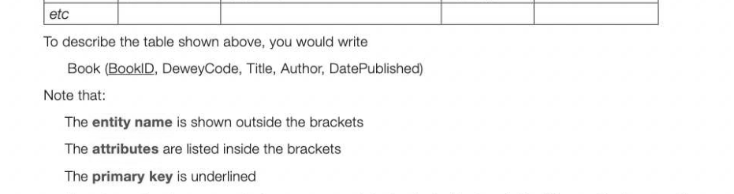
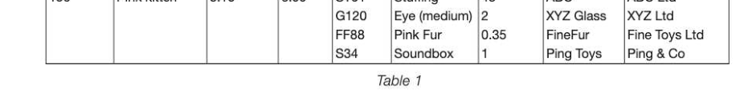
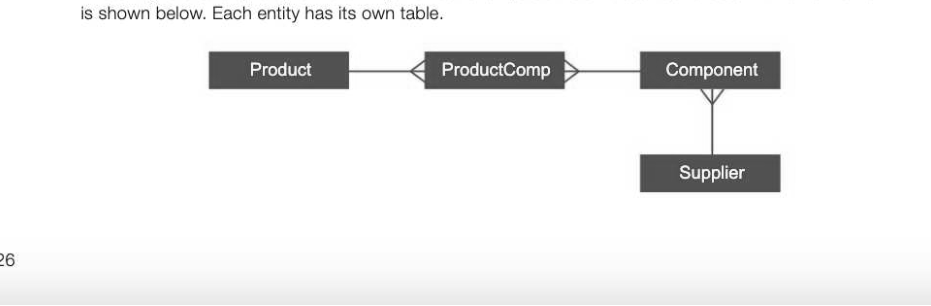
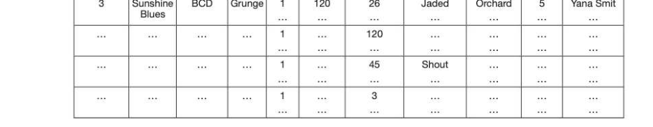
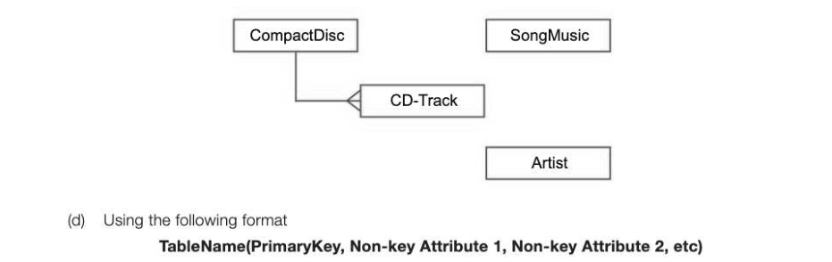

# Chapter 63 — Relational databases and normalisation
normalisation

## Objectives

- Explain the concept of a relational database
- Normalise relations to third normal form Understand why databases are normalised

## Relational database design

In a relational database, data is held in tables (also called relations) and the tables are linked by means of common attributes. Arelational database is a collection of tables in which relationships are modelled by shared attributes. Conceptually then, one row of a table holds one record. Each column in the table represents one attribute. e.g. A table holding data about an entity Book may have the following rows and columns: Book BookID | DeweyCode | Title Author DatePublished 88 121.9 Mary Berry Cooks the Perfect | Berry, M 2014 123 345.440 The Paying Guests Waters, S 2014 300 345.440 Fragile Lies Elliot, L 2015 657 200.00 Learn French with stories Bibard, F 2014 777 001.602 GCSE ICT Barber, A 2010

The primary key is composed of one or more attributes that will uniquely identify a particular record in the table. (When describing an entity this is called an entity identifier.) In order that a record with a particular primary key can be quickly located in a database, an index of primary keys will be automatically maintained by the database software, giving the position of each record according to its primary key.

## Linking database tables

Tables may be linked through the use of a common attribute. This attribute must be a primary key of one of the tables, and is known as a foreign key in the second table. We saw in the last chapter that there are three possible types of relationship between entities: one-to- one, one-to-many and many-to-many.

## Normalisation

Normalisation is a process used to come up with the best possible design for a relational database. Tables should be organised in such a way that:

- no data is unnecessarily duplicated (i.e. the same data item held in more than one table)
- data is consistent throughout the database (e.g. a customer is not recorded as having different addresses in different tables of the database). Consistency should be an automatic consequence of not holding any duplicated data. This means that anomalies will not arise when data is inserted, amended or deleted.
- the structure of each table is flexible enough to allow you to enter as many or as few items (for example, components making up a product) as required
- the structure should enable a user to make all kinds of complex queries relating data from different tables
There are three basic stages of normalisation known as first, second and third normal form.

## First normal form

A table is in first normal form (1NF) if it contains no repeating attribute or groups of attributes.

## Example 1

Accompany manufacturing soft toys buys the component parts (fake fur, glass eyes, stuffing, growl etc.) from different suppliers. Each component may be used in the manufacture of several different toys (teddy bear, dog, duck etc.) Each component comes from a sole supplier. Sample data to be held in the database is shown in the table: ProductiD|ProductName CostPrice Price 123 'Small monkey |2.50 5.95 'STO1 Stuffing 30 ABC ABC Ltd G56 Eye (small) |2 BHGlass_ | Brown &Hill FF77 Brown Fur 0.3 FineFur Fine Toys Ltd 156 Pink kitten 3.10 6.00 'STO1 Stuffing 45 ABC ABC Ltd

*Table 1*

As the first stage in normalization, we need to note that there are repeating groups of attributes in this table; for example, ProductID 123 has three components with IDs STO1, G56 and FF77. We need to split the data into two tables to get rid of the repeating groups. Note that a table in a relational database may be referred to as a relation.

Two entities, Product and Component, can be identified. These have the following relationship: Product = has < Componer These two entities could be represented in standard notation: Product (ProductID, ProductName, CostPrice, SellingPrice) Component (Comp!D, CompName, SupplierlD, SupplierName) We have not yet put CompQty (the amount or number of each component that is needed to make a particular product) in either table, but we will come to that. The two tables need to be linked by means of a common attribute, but the problem is that because this is a many-to-many relationship, whichever table we put the link attribute into, there needs to be more than one attribute. e.g. Product (ProductID, ProductName, CostPrice, SellingPrice, CompQty, ComponentID) is no good because each toy has several components, so which one would be mentioned? Similarly, Component (CompiID, CompName, SupplierlD, SupplierDetails, ProductID) is no good either because each component is used in a number of different products. One obvious solution (and unfortunately a bad one) springs to mind. How about allowing space for four components in the record for each product? Product (ProductID, ProductName, CostPrice, SellingPrice, CompID1, CompQty1, ComplD2, CompQty2, CompiD3, CompQty3, CompiD4, CompQty4) 11-63 This table contains repeating attributes, which are not allowed in first normal form. The attributes ComponentID and CompQty are repeated four times. The table is therefore NOT in first normal form. It would be represented in standard notation with a line over the repeating attributes: Product (ProductID, ProductName, CostPrice, SellingPrice, CompID, CompQty) To put the data into first normal form, the repeating attributes must be removed.

## Introducing the link table

At this stage it becomes clear why we need a third table to link the two tables Product and Component. Product < ProductComp = Compo! The three tables now have attributes as follows: Product (ProductID, ProductName, CostPrice, SellingPrice) ProductComp (ProductID, CompID, CompQty) Component (Comp!ID, CompName, SupplierID, SupplierName) The design is now in 1NF because it contains no repeating attribute or groups of attributes.

## Dealing with a Many-to-Many relationship

As you get more practice in database design, you will notice that whenever two entities have a many-to-many relationship, you will always need a link table 'in the middle'. Thus: will become:

## Second normal form - Partial key dependence test

A table is in second normal form (2NF) if it is in first normal form and contains no partial dependencies. A partial dependency would mean that one or more of the attributes depends on only part of the primary key, which can only occur if the primary key is a composite key. The only table in which this could arise is ProductComp as this is the only table with a composite primary key. However, the only attribute in this table apart from the primary key is CompQty, which depends both on both parts of the primary key — which product and which particular component in that product. The tables are therefore now in second normal form. (To demonstrate tables which are not in second normal form, we'll look at Example 2 shortly.)

## Third normal form - Non-key dependence test

A table is in third normal form (3NF) if it is in second normal form and contains no 'non-key dependencies'. A non-key dependency is one where the value of an attribute is determined by the value of another attribute which is not part of the key. 3NF means that: All attributes are dependent on the key, the whole key, and nothing but the key. Looking at the Component table, the SupplierName attribute is dependent on ComplD and not on the SupplierlD. It therefore needs to be removed from this relation and a new relation created. The database, now in third normal form, consists of the following tables: Product (ProductID, ProductName, CostPrice, SellingPrice)

The entity relationship diagram showing the relationships between these four tables in third normal form

## Example 2

Aschool plans to keep records of Sports Day events for different years in a database. The data that needs to be held for each event in a particular year is illustrated in the following table: EventID | Year | EventName Winner TimeOrDistance GA100 | 2015 | Girls Under 14 100m | Claire Gordon 16.1 BJ100 2015 | Junior Boys 100m Marc Harris 13.1 The entity description is: Event (EventID, Year, EventName, Winner, TimeOrDistance) The composite primary key is composed of EventID and Year. Winner and TimeOrDistance depend on the whole key. However, EventName depends only on EventID, not on Year, so this is a partial dependency. This table is therefore not normalised. It does not satisfy the requirement of a table in second normal form, namely that there are no partial dependencies.

## The importance of normalisation

Anormalised database has major advantages over an un-normalised one.

## Maintaining and modifying the database

It is easier to maintain and change a normalised database. Data integrity is maintained since there is no unnecessary duplication of data. For example, a customer with a particular customer ID will have their personal details stored only once. If the customer changes address, the update needs only to be made to a single table, so there is no possibility of inconsistencies arising with different addresses for the customer being held on different files. It will also be impossible to insert transactions such as details of an order, for a customer who is not recorded in the database.

## Faster sorting and searching

Normalisation will produce smaller tables with fewer fields. This results in faster searching, sorting and indexing operations as there is less data involved. A further advantage is that holding data only once saves storage space.

## Deleting records

Anormalised database with correctly defined relationships between tables will not allow records in a table on the 'one' side of a one-to-many relationship to be deleted accidentally. For example, a customer who still has unresolved transactions on file cannot be deleted. This will prevent accidental deletion of a customer who has an unpaid invoice recorded, for example.

---

## Exercises

1. A collector of popular music compact discs (CDs) wishes to store details of the collection in a database in a way that will allow information about the CDs to be extracted. The data requirements are defined as follows.

- Each compact disc is assigned a catalogue number (unique) and labelled with a title, record company and type of popular music. Each compact disc contains one or more tracks.
- Atrack stores a recording.
« The recording may be a song or some other piece of music.

- Aparticular track recording features just one named artist.
- The name of each artist to be recorded together with a unique identifier, ArtistID.
- Each song and piece of music may be recorded on different CDs and by different artists.
- Aparticular CD will never have more than one recording of a particular song or piece of music but may contain tracks featuring the same artist or different artists.
- The title of every song and piece of music in the collection is to be recorded together with the name of the composer of the music and a unique identifier, SongMusicID.
« Each track on a particular CD is assigned a different number with the first always numbered one, the next two and so on.

- The duration of a track recording is recorded.
Asingle table, CDTable, was constructed initially in a relational database. The figure below shows the structure of this table and a few entries. Catalogue| Title | Record | Music |Track| Track |SongMusic| SongMusic |Composer|ArtistID| Artist Name No Company) Type | No |Duration) ID Title Name 1 Quiet | ABC [Grunge] 1 | 120 5 Action Man | Smith 1 Erie Ant

2 Running] ABC | Rock | 1 | 150 8 Dedicated | Williams Rick Bana

3 [Sunshine] BCD |Grunge| 1 26 Jaded | Orchard | 5 | Yana Smit

(a) Which of the column headings in CDTable would be suitable as a primary key? [2] (b) CDTable is not in first normal form. Explain. [2]

After normalisation the database contains the four tables based on the entities: CompactDisc, CD-Track, SongMusic, Artist (c) Using a copy of the partially complete entity relationship diagram below as an aid, show the degree of four more relationships which exist between the given entities.

Describe tables, stating all attributes, for the following entities underlining the primary key in each case. (i) CompactDisc (2) (ii) SongMusic (2] (i) Artist (2] (iv) CD-Track (4) (e) Using the SQL commands SELECT, FROM, WHERE, write an SQL statement to query the 11-63 database tables for the track numbers, SongMusiclDs and ArtistIDs for a given CD catalogue number, 15438.[3] (Leave part (e) until you have completed the next chapter.) AQA Computing Paper 3 Qu 13 Summer 2001 2. A college department wishes to create a database to hold information about students and the courses they take. The relationship between students and courses is shown in the following entity relationship diagram.

Sample data held on the database is shown in the table below. Student | Student | DateOfBirth | Gender | Course | CourseName TeacherID | Teacher Name Number | Name Number 1111 Bell, K | 14-01-1998 | M COMP23 | Java 8563 Davey,A 2222 Cope, F | 12-08-1997 | F COMP23 | Java 8563 Davey,A COMP%6 | Intro to OOP 2299 Ross,M G101 Animation 1567 Day,S 3333 Behr,K | 31-07-1996 |M Comp16 | Intro to OOP 2299 Ross,M Comp34 | Database Design | 3370 Blaine, N (a) Show how the data may be rearranged into relations which are in third normal form. [6] (b) State two properties that the tables in a fully normalised database must have. [2]
