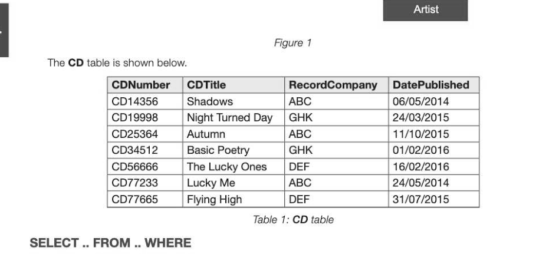
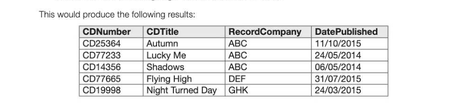
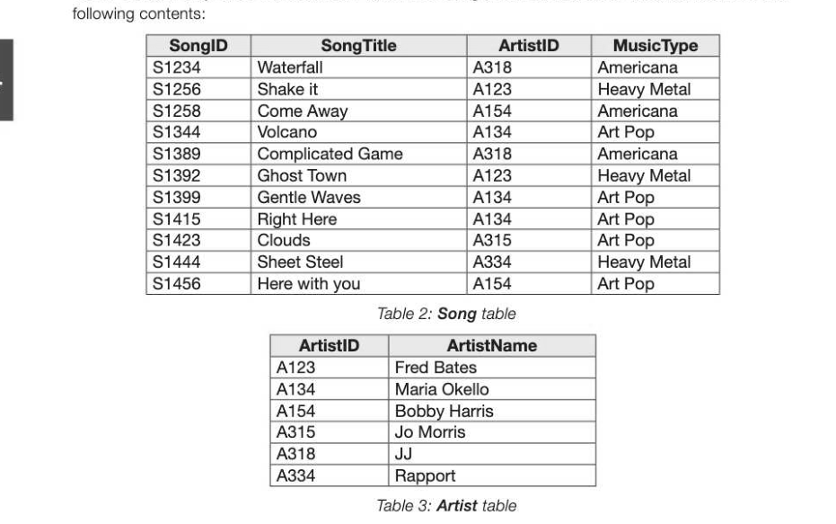
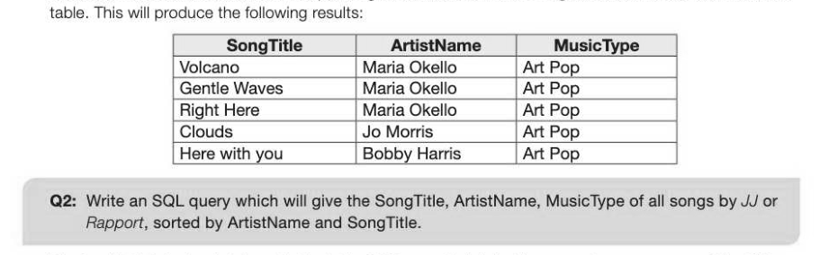
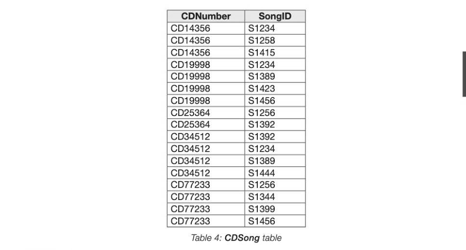
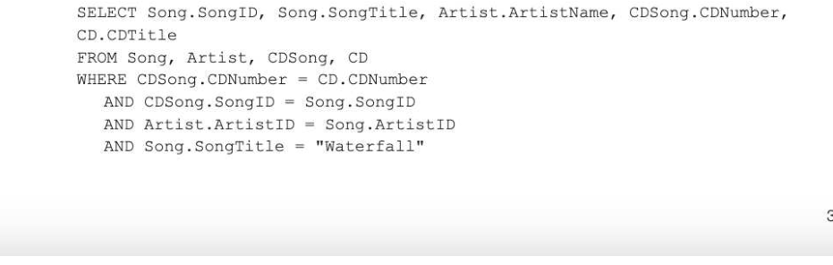
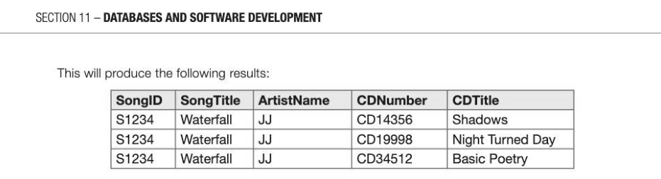
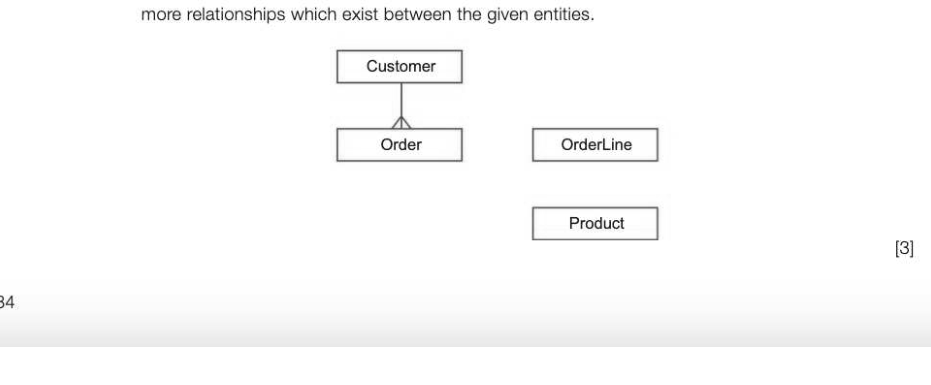
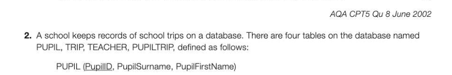

# Chapter 64 — Introduction to SQL
## Objectives

- Be able to use SQL to retrieve data from multiple tables of a relational database

## SQL

SQL, or Structured Query Language (pronounced either as S-Q-L or Sequel) is a declarative language used for querying and updating tables in a relational database. It can also be used to create tables. In this chapter, we will look at SQL statements used in querying a database. The tables shown in Tables 1, 2 and 3 below will be used to demonstrate some SQL statements. The tables are part of a database used by a retailer to store details of CDs in a database that will allow information about the CDs to be extracted. This is a simplified version of the database described in Exercise 1 in the previous chapter. The four entities CD, CDSong, Song and Artist are connected by the following relationships:

*Table 1: CD table*

The SELECT statement is used to extract a collection of fields from a given table. The basic syntax of this statement is SELECT list of fields to be displayed FROM list the table or tables the data will come from WHERE list of search criteria ORDER BY _list the fields that the results are to be sorted on (default is Ascending order)

## Example 1

SELECT CDTitle, RecordCompany, DatePublished FROM CD WHERE DatePublished BETWEEN #01/01/2015# AND #31/12/2015#

## Conditions

Conditions in SQL are constructed from the following operators: Equal to Different implementations use single or double quotes > Greater than DatePublished > #01/01/2015# The date is enclosed in quote marks or, in Access, # symbols < Less than DatePublished < #01/01/2015# ° Not equal to RecordCompany <> "ABC" >= Greater than or equal to _| DatePublished >= #01/01/2015# <= Less than or equal to DatePublished <= #01/01/2015# IN Equal to a value within a | RecordCompany IN ("ABC", "DEF") 11-64 set of values UKE Similar to CDTitle LIKE Finds Shadows (wildcard operator varies and can be %) BETWEEN...AND | Within a range, including | DatePublished BETWEEN the two values which +#01/01/2015# AND #31/12/2015# define the limits 1S NULL Field does not contain a | RecordCompany IS NULL value

## 'AND Both expressions must | DatePublished > #01/01/2015# AND

be true for the entire RecordCompany = "ABC" expression to be judged true OR If either or both of the RecordCompany = "ABC" OR Equivalent to expressions are true, RecordCompany = "DEF" RecordCompany IN ("ABC", the entire expression is, "DEF") judged true NOT Inverts truth RecordCompany NOT IN (""ABC", "DEF")

## Specifying a sort order

ORDER BY gives you control over the order in which records appear in the Answer table. If for example you want the records to be displayed in ascending order of RecordCompany and within that, descending

ORDER BY RecordCompany, DatePublished Desc

## Extracting data from several tables

So far we have only taken data from one table. The Song and Artist tables in the database have the

*Table 2: Song table*

Using SQL you can combine data from two or more tables, by specifying which table the data is held in. For example, suppose you wanted SongTitle, ArtistName and MusicType for all Art Pop music. When more than one table is involved, SQL uses the syntax tablename.fieldname. (The table name is optional unless the field name appears in more than one table.)

SELECT Song.SongTitle, Artist.ArtistName, Song.MusicType FROM Song, Artist WHERE (Song.ArtistID = Artist.ArtistID) AND (Song.MusicType = "Art Pop") The condition Song.ArtistID = Artist.ArtistID provides the link between the Song and Artist tables so that the artist's name corresponding to the ArtistID in the Song table can be found in the Artist

The fourth table in the database is the table CDSong which links the songs to one or more of the CDs.

*Table 4: CDSong table*

## Example 2

We can make a search to find the CDNumbers and titles of all the CDs containing the song Waterfall, sung by JJ. SELECT Song.SongID, Song.SongTitle, Artist.ArtistName,

Note that in the SELECT statement, it does not matter whether you specify Song. SongID or CDSong.SongID since they are connected. The same is true of CDSong.CDNumber and CD.CDNumber. The three Boolean conditions CDSong.CDNumber = CD.CDNumber, CDSong. SongID = Song.SongIDandArtist.ArtistID = Song.ArtistID are required to specify the relationships between the data tables. See the Entity Relationship Diagram in Figure 1 above.

---

## Exercises

1. Customers placing orders with ABC Ltd for ABC's products have their orders recorded by ABC ina database. The data requirements for the database system are defined as follows: e Each product is assigned a unique product code, Productld and has a product description. The quantity in stock of a particular product is recorded. Each customer is assigned a unique customer code, Customerld and has their name, address and telephone number recorded. e An order placed by a customer will be for one or more products. « ABC Ltd assigns a unique code to each customer order, ABCOrderNo. « Acustomer placing an order must supply a code, CustomerOrderNo, which the customer uses to identify the particular order. Accustomer may place one or more orders. Each new order from a particular customer will have a different customer order code but two different customers may use, independently, the same values of customer order code. Whether an order has been despatched or not will be recorded.

- Aparticular order will contain one or more lines.
- Each line is numbered, the first is one, the second is two, and so on. « Each line will reference a specific product and specify the quantity ordered. A specific product reference will appear only once in any particular order placed with ABC Ltd. After normalisation the database contains four tables based on the entities: Customer, Product, Order, OrderLine (a) The figure below is a partially complete entity relationship diagram. Show the degree of three

(b) Using the following format: TableName (Primary Key, Non-key Attribute1, Non-key Attribute2, etc) describe tables, stating all attributes, for the following entities underlining the primary key in each case. (i) Product (2) (ii) Customer (2) (iil) Order (3] (iv) OrderLine [4] Using the SQL commands SELECT, FROM, WHERE, ORDER BY, write an SQL statement to query the database tables for all customer names where the orders have been despatched. The result of the query is to be ordered in ascending order of ABCOrderNo. [6]

TRIP (IripID, Description, StartDate, EndDate, Destination, NumberOfStudents, Teacher|D) TEACHER (TeacherlD, Title, FirstName, Surname) PUPILTRIP (PupillD, TripID) (a) Draw an entity relationship diagram showing the relationship between the entities. [4] (b) Write SQL statements for each of the following operations: (i) find the first name and surname of all pupils who went on a trip with TripID 14. [4] (ii) _ find all the trips for which the teacher with surname "Black" has been in charge, giving teacher's title and surname, trip description and start date, sorted in descending order of start date. [4] (iii) find the firstnames and surnames of all the pupils who went on any trip with "Year 7" in the description (e.g. "Year 7 Geography field trip" in May 2015, showing the firstname and surname of the teacher in charge. [6]
