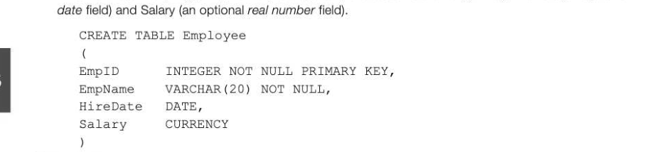
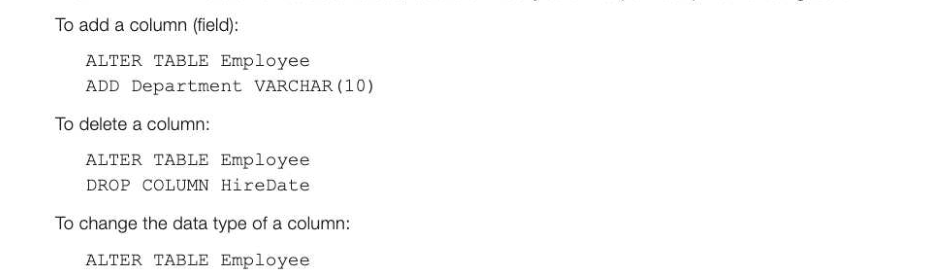
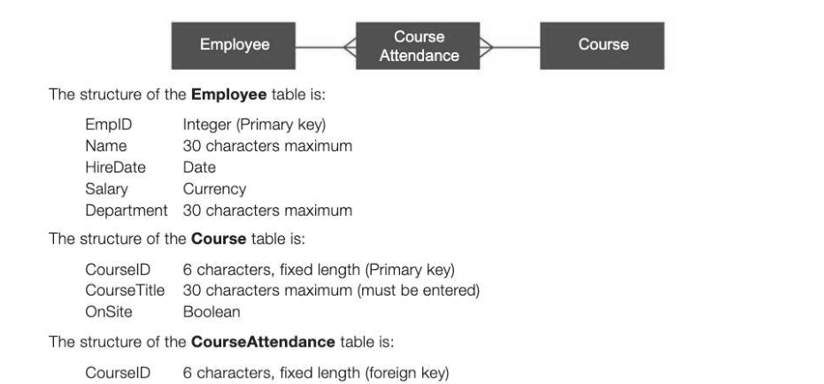
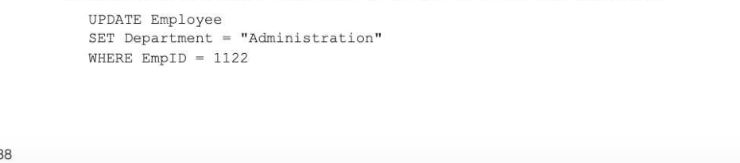
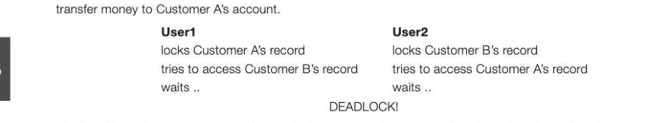

# Chapter 65 — Defining and updating tables using SQL
using SQL

## Objectives

° Be able to use SQL to define a database table

- Be able to use SQL to update, insert and delete data from multiple tables of a relational database
- Know that a client server database system provides simultaneous access to the database for multiple clients
- Know how concurrent access can be controlled to preserve the integrity of the database

## Defining a database table

The following example shows how to create a new database table.

## Example 1

Use SQL to create a table named Employee, which has four columns: EmpIiD (a compulsory int field which is the primary key), EmpName (a compulsory character field of length 20), HireDate (an optional



## Data types

Some of the most commonly used data types are described in the table below. (The data types vary depending on the specific implementation.) Data type Description Example CHAR(n) Character string of fixed length n ProductCode CHAR(6) VARCHAR(n) Character string variable length, max. n | Surname VARCHAR(25) BOOLEAN TRUE or FALSE ReviewComplete BOOLEAN INTEGER, INT _| Integer Quantity INTEGER FLOAT Number with a floating decimal point Length FLOAT (10,2) (maximum


DATE Stores Day, Month, Year values HireDate DATE TIME Stores Hour, Minute, Second values RaceTime TIME CURRENCY Formats numbers in the currency used | EntryFee CURRENCY in your region

## Altering a table structure

The ALTER TABLE statement is used to add, delete or modify columns (i.e. fields) in an existing table.



MODIFY COLUMN EmpName VARCHAR(30) NOT NULL Defining linked tables 11-65 If you set up several tables, you can link tables by creating foreign keys.

## Example 2

Suppose that an extra table is to be added to the Employee database which lists the training courses offered by the company. A third table shows which date an employee attended a particular course.



EmpiD Integer (foreign key) Course ID and EmplD form a composite primary key CourseDate Date (note that the same course may be run several times on different dates)

The CourseAttendance table is created using the SQL statements:


FOREIGN KEY CourseID REFERENCES Course (CourseID), FOREIGN KEY EmpID REFERENCES Employee (EmpID), PRIMARY KEY (CourseID, EmpID) )

## Inserting, updating, and deleting data using SQL

## The SQL INSERT INTO statement

This statement is used to insert a new record in a database table. The syntax is: INSERT INTO tableName (column1, columnd2,...) VALUES (value, valued,...) Example: add a record for employee number 1122, Bloggs, who was hired on 1/1/2001 for the technical department at a salary of £18000. INSERT INTO Employee (EmpID, Name, HireDate, Salary, Department) VALUES (1122, "Bloggs", #1/1/2001#, 18000, "Technical") Note that if all the fields are being added in the correct order you would not need the field names in the brackets above to be specified. INSERT INTO Employee would be sufficient Example: add a record for employee number 1125, Cully, who was hired on 1/1/2001. Salary and Department are not known. INSERT INTO Employee (EmpID, Name, HireDate) VALUES (1125, "Cully", #1/1/2001#)

## The SQL Update statement

This statement is used to update a record in a database table. The syntax is:


Example: increase all salaries of members of the Technical department by 10%


Example: Update the record for the employee with ID 1122, who has moved to Administration.



## The SQL Delete statement

This statement is used to delete a record from a database table. The syntax is: DELETE FROM tableName WHERE columnX = value Example: Delete the record for Bloggs, Employee ID 1122. DELETE FROM Employee WHERE EmpID = 1122

## Client-Server databases

Many modern database management systems provide an option for client-server operation. Using a client-server Database Management System (DBMS), DBMS server software runs on the network server, and DBMS client software runs on individual workstations. The server software processes requests for 11-65 data searches and reports that originate from individual workstations running DBMS client software. For example, a car dealer might want to search the manufacturer's database to find out whether there are any cars of a particular specification available. The DBMS client refers this request to the DBMS server, which searches for the information and sends it back to the client workstation. Once the information is at the workstation, the dealer can sort the list and produce a customised report. If the DBMS did not have client-server capability, the entire database would be copied to the workstation and software held on the workstation would search for the requested data — involving a large amount of time being spent on transmitting irrelevant data and probably a longer search using a less powerful machine. The advantages of a client-server database are, therefore: e the consistency of the database is maintained because only one copy of the data is held (on the server) rather than a copy at each workstation

- an expensive resource (powerful computer and large database) can be made available to a large number of users
- Access rights and security can be managed and controlled centrally
- Backup and recovery can be managed centrally

## Potential problems with client-server databases

Allowing multiple users to simultaneously update a database table may cause one of the updates to be lost unless measures are taken to prevent this. When an item is updated, the entire record (indeed the whole block in which the record is physically held) will be copied into the user's own local memory area at the workstation. When the record is saved, the block is rewritten to the file server. Imagine the following situation:

User A accesses a customer record, thereby causing it to be copied into the memory at his/her workstation, and starts to type in a new address for the customer. User B accesses the same customer record, and alters the credit limit and then saves the record and calls up the next record that needs updating. User A completes the address change, and saves the record. There are several methods which may be employed to avoid updates being lost.

## Record locks

Record locking is the technique of preventing simultaneous access to objects in a database in order to prevent updates being lost or inconsistencies in the data arising. In its simplest form, a record is locked whenever a user retrieves it for editing or updating. Anyone else attempting to retrieve the same record is denied access until the transaction is completed or cancelled. Problems with record locking If two users are attempting to update two records, a situation can arise in which neither can proceed, known as deadlock. Suppose a bank clerk is updating Customer A's record with a transfer to Customer B's account. Meanwhile a second bank clerk is trying to update Customer B's record, as he needs to



The DBMS must recognise when this situation has occurred and take action. Serialisation, timestamp ordering or commitment ordering may be used.

## Serialisation

This is a technique which ensures that transactions do not overlap in time and therefore cannot interfere with each other or lead to updates being lost. A transaction cannot start until the previous one has finished. It can be implemented using timestamp ordering.

## Timestamp ordering

Whenever a transaction starts, it is given a timestamp, so that if two transactions affect the same object (for example record or table), the transaction with the earlier timestamp should be applied first. In order to ensure that transactions are not lost, every object in the database has a read timestamp and a write timestamp, which are updated whenever an object in a database is read or written. When a transaction starts, it reads the data from a record causing the read timestamp to be set. Before it writes the updated data back to the record it will check the read timestamp. If this is not the same as the value that was saved when this transaction started, it will know that another transaction is also taking place on the record. A range of potential problems can thus be identified and avoided.

## Commitment ordering

This is another serialisation technique used to ensure that transactions are not lost when two or more users are simultaneously trying to access the same database object. Transactions are ordered in terms of their dependencies on each other as well as the time they were initiated. It can be used to prevent


---

## Exercises

1. Acompany sells furniture to customers of its store. The store does not keep furniture in stock. Instead, a customer places an order at the store and the company then orders the furniture required from its suppliers. When the ordered furniture arrives at the store a member of staff telephones or emails the customer to inform them that it is ready for collection. Customers often order more than one type of furniture on the same order, for example a sofa and two chairs. Details of the furniture, customers and orders are to be stored in a relational database using the following four relations: Furniture (FurniturelD, FurnitureName, Category, Price, SupplierName) CustomerOrder (OrderID, CustomerID, Date) CustomerOrderLine (OrderlD, FurniturelD, Quantity) Customer (CustomerlD, CustomerName, EmailAddress, TelephoneNumber) (a) These relations are in Third Normal Form (3NF). (i) | What does this mean? (2) (ii) | Why is it important that the relations in a relational database are in Third Normal Form? (2) (b) On the incomplete Entity Relationship diagram below show the degree of any three relationships that exist between the entities. [3] Furniture CustomerOrder Customer CustomerOrderLine (c) Complete the following Data Definition Language (DDL) statement to create the Furniture relation, including the key field.

```
CREATE TABLE Furniture ( {3]
```

(d) A fault has been identified with the product that has FurniturelID number 10765. The manager needs a list of the names and telephone numbers of all the customers who have purchased this item of furniture so that they can be contacted. This list should contain no additional details and must be presented in alphabetical order of the names of the customers. Write an SQL query that will produce this list. [6] AQA Unit 3 Qu 9 June 20 2. (a) Explain how, in a client-server database with multiple users, an update made by one user may not be recorded if the DBMS does not have measures in place to ensure the integrity of the database. 3] (b) Explain what is meant by deadlock and how this can arise. [2] (c) Name and describe briefly a method of preventing this from happening. [2]
