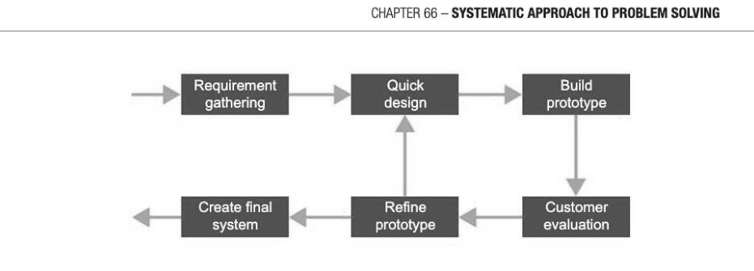

# Chapter 66 — Systematic approach to problem solving
solving

## Objectives

- Describe aspects of software development
- Explain the prototyping/agile approach that may be used in the analysis, design and implementation of asystem
- Understand what is meant by data modelling
- Know the criteria for evaluating a computer system

## Aspects of software development

There is an infinite variety of different types of problem that can be solved using a computer. Whether you are developing a website for a new company selling goods or services, designing a simulation of a physics experiment, building a control system using a microprocessor or something else, all software projects have certain aspects in common.

## Analysis

Before a problem can be solved, it must be defined. The requirements of the system that solves the problem must be established. In the case of a data processing system, or for example the construction of a website, this could cover:

- the data — its origin, uses, volumes and characteristics
- the procedures — what is done, where, when and how, and how errors and exceptions are handled
- the future —- development plans and expected growth rates
- problems with any existing system
In the case of a different type of problem such as a simulation or game, the requirements will still need to cover a similar set of considerations.

## Agile modelling

At all the stages of analysis, design and implementation, an agile approach may be adopted, as the stages of software development may not be completed in a linear sequence. It might be that some analysis is done and then some parts of a system are designed and implemented while other parts are still being analysed and then, for example, implementation and testing may be intermixed. The developer may then go back to design another aspect of the system. Throughout the process, feedback will be obtained from the user; this is an iterative process during which changes made are incremental as the next part of the system is built. Typically the software developers do just enough modelling at the start of the project to make sure that the system is clearly understood by both themselves and the users.

At each stage, a prototype is built with user participation to ensure that the system is being developed in line with what the user wants. The success of the software development depends on

- keeping the model simple, and not trying to incorporate features which may come in useful at a later date
- rapid feedback from the user understanding that user requirements may change during development as they are forced to consider their needs in detail
- being prepared to make incremental changes as the model develops

## Design

Depending on the type of project, the systems designer may consider some or all of the following: © processing: the algorithms and appropriate modular structure for the solution, specifying modules with clear documented interfaces e data structures: how data will be held and how it will be accessed - for example in a dynamic data structure such as a queue or tree, or in a file or database © output: content, format, sequence, frequency, medium (e.g. screen or hard copy) etc.

- input: volume, frequency, documents used, input methods;
user interface: screens and dialogues, menus, special-purpose requirements.

- security: how the data is to be kept secure from accidental corruption or deliberate tampering or hacking
e hardware: selection of an appropriate configuration

## Modelling data requirements

What exactly is "an abstract representation of a problem"? We cannot easily represent the world as it "really is", but we can make abstractions and simplifications so that we can structure and manipulate relevant data to help us achieve a particular goal. Whatever the proposed data structures are, modelling will involve deciding what data needs to be held and how the data items are related to each other.

In addition to modelling data requirements, a prototype of the user interface may be built so that the user can get a clear idea of how they will interact with the system, how data will be input and how arduous this task might be under the proposed system. Once again user involvement is crucial, and at this stage changes to the prototype should be straightforward.

## Implementation

Once the design has been agreed, the programs can be coded. A clear focus needs to be maintained on the ultimate goal of the project, without users or programmers being sidetracked into creating extra features which might be useful, or possible future requirements. "Solve the critical path first!" Programmers will need to be flexible in accepting user feedback and making changes to their programs as problems or design flaws are detected. In even a moderately complex system it is hard to envision how everything will work together, so iterative changes at every stage are a normal part of a prototyping/ agile approach.

## Testing

Testing is carried out at each stage of the development process. Testing the implementation is covered in Chapter 10. Once all the programs have been tested with normal, boundary and erroneous data, unit testing, module testing and system testing will also be carried out. The system then needs to be tested by the user to ensure that it meets the specification. This is known as acceptance testing. It involves testing with data supplied by the end user rather than data designed especially for testing purposes. It has the following objectives:

- to confirm that the system delivered meets the original customer specifications
- to find out whether any major changes in operating procedures will be needed
- to test the system in the environment in which it will run, with realistic volumes of data
Testing is an iterative process, with each stage in the test process being repeated when modifications have to be made owing to errors coming to light at a subsequent stage. Unit Module Sub-system System Acceptance testing testing testing testing testing

## Evaluation

The evaluation may include a post-implementation review, which is a critical examination of the system three to six months after it has been put into operation. This waiting period allows users and technical staff to learn how to use the system, get used to new ways of working and understand the new procedures required. It allows management a chance to evaluate the usefulness of the reports and on-line queries that they can make, and go through several 'month-end' periods when various routine reports will be produced. Shortcomings of the system, if there are any, will be becoming apparent at all levels of the organisation, and users will want a chance to air their views and discuss improvements. The solution should be evaluated on the basis of effectiveness, usability and maintainability.

The post-implementation review will focus on the following:

- acomparison of the system's actual performance with the anticipated performance objectives
- an assessment of each aspect of the system against preset criteria
- errors which were made during system development
- unexpected benefits and problems

---

## Exercises

1. (a) Explain what is meant by the prototyping/agile approach to system analysis and design. [4] (b) What are the advantages of this approach? [4] 2. A systems analyst/developer is planning a system for the administration of student courses to be used in an office in a college. (a) Other than data modelling, describe three tasks that may be carried out by the analyst to establish the requirements of the system. [6] (b) A database will be used in the implementation of the system. Describe the steps involved in creating a data model. [3]

## Section 12

OOP and functional programming In this section: Chapter 67 Basic concepts of object-oriented programming 347 Chapter 68 Object-oriented design principles 353 Chapter 69 Functional programming 360 Chapter 70 Function application 367 Chapter 71 Lists in functional programming 371 Chapter 72 Big Data 374
