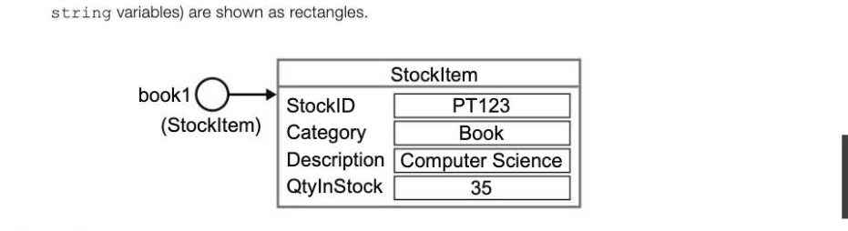
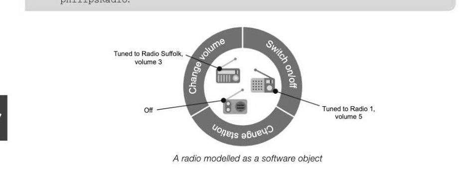
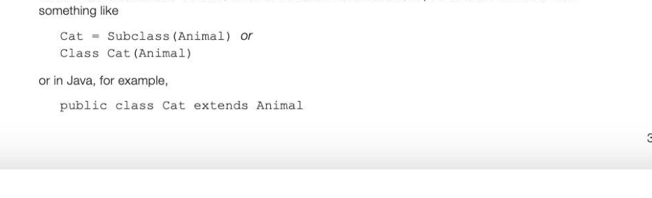

# Chapter 67 — Basic concepts of object-oriented programming
## Objectives

- Be familiar with the basic concepts of object-oriented programming, such as class, object, instantiation and encapsulation

## Procedural programming

Programming languages have been evolving ever since the development of assembly languages. High level languages such as Basic and Pascal are known as procedural languages, and a program written in one of these languages is written using a series of step-by-step instructions on how to solve the problem. This is usually broken down into a number of smaller modules, and the program then consists of a series of calls to procedures or functions, each of which may in turn call other procedures or functions. In this method of programming, the data is held in separate primitive variables such as integer or char, or in data structures such as array or list. The data may be accessible by all procedures in the program (global variables) or local to a particular subroutine. Changes made to global data may affect other parts of the program, either intentionally or unintentionally, and may mean other subroutines have to be modified.

## Object-oriented programming

In object-oriented programming, the world is viewed as a collection of objects. An object might be a person, animal, place, concept or event, for example. It could be something more abstract like a bank account or a data structure such as a stack or queue that the programmer wishes to implement. An object-oriented program is composed of a number of interacting objects, each of which is responsible for its own data and the operations on that data. Program code in an object-oriented program creates the objects and allows the objects to communicate with each other by sending messages and receiving answers. All the processing that is carried out in the program is done by objects.

## Object attributes and behaviours

Each object will have its own attributes. The attributes of a car might include its make, engine size, colour, etc. The attributes of a person could include first name, last name, date of birth. An object has a state. A radio, for example, may be on or off, tuned to a particular station, set toa certain volume. A bank account may have a particular balance, say £54.20 and a credit limit of £300. An object has behaviours. These are the actions that can be performed by an object; for example, a cat can walk, pounce, catch mice, purr, miaow and so on.

## Classes

Acclass is a blueprint or template for an object, and it defines the attributes and behaviours (known as methods) of objects in that class. An attribute is data that is associated with the class, and a method is a functionality of the class — something that it can do, or that can be done with it. For example, a stock control system might be used by a bookshop for recording the items that it receives into stock from suppliers and sells to customers. The only information that the stock class will hold in this simplified system is the stock ID number, stock category (books, stationery, etc.), description, and quantity in stock. Part of a sample definition of a class named StockItem is defined below. Program coding will vary according to the language used.

- Stock class used to model a simple stock control system,
- allowing stock to be added and sold. StockItem = Class
- A function may take one or more parameters. It returns a value
- A procedure may take one or more parameters. It does not return a value


- instance variables (properties/attributes)


In this part of the class definition, each of the attributes is given a variable type — here the first three attributes are of type String and QtyInStock is Integer. As a general rule, instance variables or attributes are declared private and most methods public, so that other classes may use methods belonging to another class but may not see or change their attributes. This principle of information hiding, where other classes cannot directly access the attributes of another class when they are declared private, is an important feature of object-oriented programming. A constructor is used to create objects in a class. In the above example the constructor is called StockItem; in many programming languages the constructor must have the same name as the class. In the pseudocode used here, methods are defined as either procedures, which are "setter" methods, or functions, which are "getter" methods. (See below "Sending messages")

## Instantiation (creating an object)

Once the class and its constructor have been defined, and each of the methods coded, we can start creating and naming actual objects. The creation of a new object (an instance of a class) is known as instantiation. Multiple instances of a class can be created which each share identical methods and attributes, but the values of those attributes will be unique to each instance.

This means that multiple enemy objects (zombies, for example) can be created in a computer game by programming just one zombie class, with health, position and speed attributes; but each individual zombie could operate independently with different attribute values. Suppose we want to create a new stock item called book1. The type of variable to assign to book1 has to be stated. This will be the class name, StockI tem. The word new is typically used (e.g. in Java) to instantiate (create) a new object in the class. bookl = new StockItem("PT123", "Book", "Computer Science", 35) book] is called a reference type variable, or simply a reference variable. Note that this is a different type of variable from stockID or qtyInStock, which are String or Integer variables. Like primitive variables of type integer, double, char (and the special case St ring), reference variables are named memory locations in which you can store information. However, a reference variable does not hold the object — it holds a pointer or reference to where the object itself is stored. A variable reference diagram shows in graphical form the new StockItem object referenced by the variable book1. In the diagram, reference variables are shown as circles and primitive data types (and



## Sending messages

Messages can be categorised as either "getter" or "setter" messages. In some languages, "getter" messages are written as functions which return an answer, and "setter" messages as procedures which change the state of an object. This is reflected in the pseudocode used in this book. The state of an object can be examined or changed by sending it a message, for example to get or increase the quantity in stock. To get the quantity in stock of book1, for example, you could write:

```
quantity ← bookl.GetQtyInStock
```

To record the sale of 3 book1 objects, you could write book1.Se1l1Stock (3)



Each object belongs to a class, and all the objects in the same class have the same structure and methods but they each have their own data. Objects created from a class are called instances of the class.

## Encapsulation

An object encapsulates both its state (the values of its instance variables) and its behaviours or methods. All the data and methods of each object are wrapped up into a single entity so that the attributes and behaviours of one object cannot affect the way in which another object functions. For example, setting the volume of the philipsRadio object to 5 has no effect on any other radio object. Encapsulation is a fundamental principle of object-oriented programming and is very powerful. It means, for example, that in a large project different programmers can work on different classes and not have to worry about how other parts of the system may affect any code they write. They can also use methods from other classes without having to know how they work. Related to encapsulation is the concept of information hiding, whereby details of an object's instance variables are hidden so that other objects must use messages to interact with that object's state. To invoke the method ReceiveStock, for example, we might write:

This would have the effect of updating the quantity in stock of book1 by 50. A programmer using the method does not need to know how this is achieved. The documentation of each method will specify the number and variable type of any arguments that need to be passed to the method, and what value, if any, is returned by the method.

## Inheritance

Classes can inherit data and behaviour from a parent class in much the same way that children can inherit characteristics from their parents. A "child" class in object-oriented program is referred to as a subclass, and a "parent" class as a superclass. For example, we could draw an inheritance hierarchy for animals that feature in a computer game. Note that the inheritance relationship in the corresponding inheritance diagram is shown by an unfilled arrow at the "parent" end of the relationship. Class diagram involving inheritance All the animals in the superclass Animal share common attributes such as colour and position. Animals may also have common procedures (methods), such as moveLeft, moveRight. A Cat may have an extra attribute hungry, and an extra method pounce. A Rodent may have an extra method gnaw. A Beaver has an extra method, makeDam.

## When to use inheritance

There is a simple rule to determine whether inheritance is appropriate in a program, called the "is a" rule, which requires an object to have a relationship to another object before it can inherit from the object. This rule asks, in effect, "Is object A an object B"? For example, "Is a Cat an Animal?" "Is aMouse a Rodent?" Technically, there is nothing to stop you coding a program in which a man inherits the attributes and methods of a mouse, but this is going to cause confusion for users!

## Coding inherited classes

Common behaviour can be defined in a superclass and inherited into a subclass. To code the class header for Cat, which is a subclass of Animal, in pseudocode we could write




---

## Exercises

1. Asports club keeps details of its members. Each member has a unique membership number, first name, surname and telephone number recorded. Three classes have been identified: Member JuniorMember SeniorMember The classes JuniorMember and SeniorMember are related, by single inheritance, to the class Member. (a) Draw an inheritance diagram for the given classes. (2) (b) Programs that use objects of the class Member need to add a new member's details, delete a member's details, and show a member's details. No other form of access is to be allowed.


(c) In object-oriented programming, what is meant by encapsulation? (1) 2. (a) In an object-oriented computer game there is a class called Crawlers. Two sub-classes of Crawlers are Spiders and Bugs. Draw an inheritance diagram for this. [2] (b) For the sub-class Spiders suggest: () one property; (i) one method. [2]
