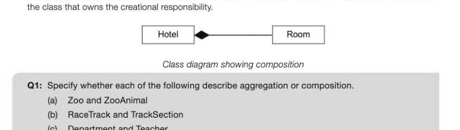
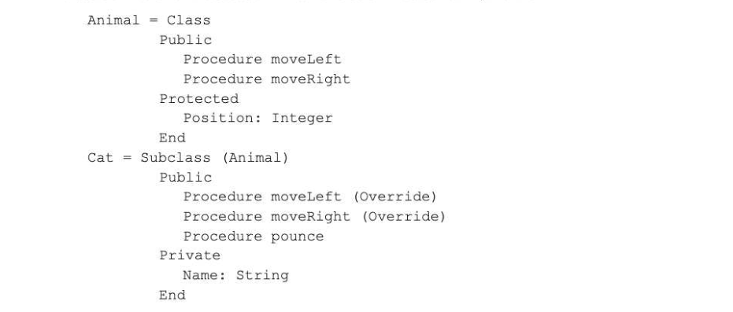
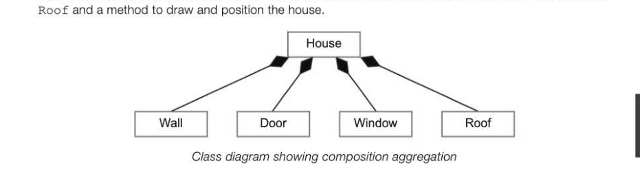
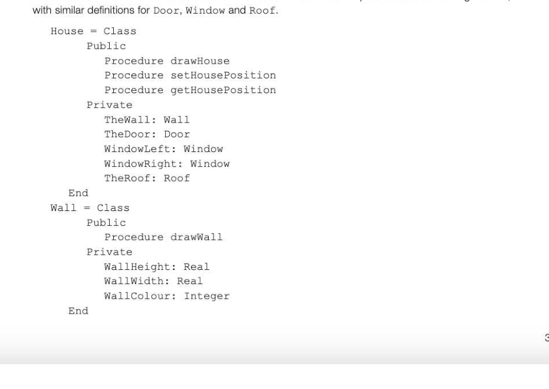
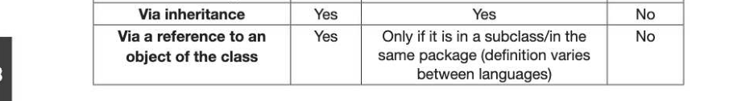
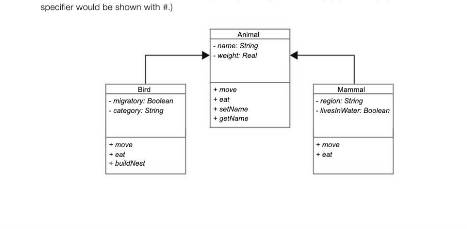
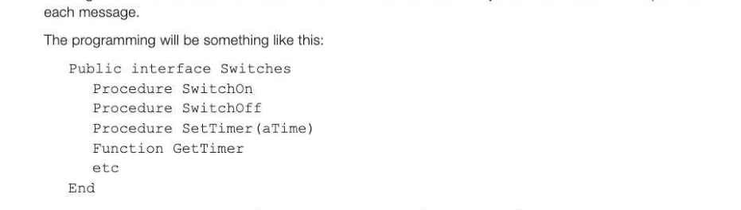
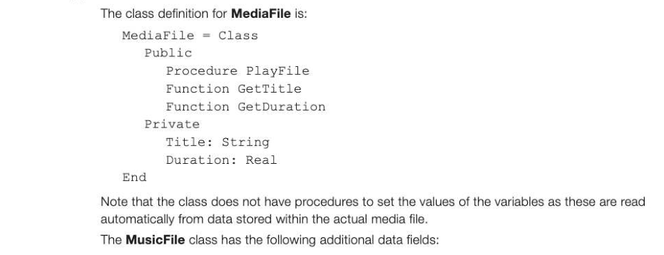
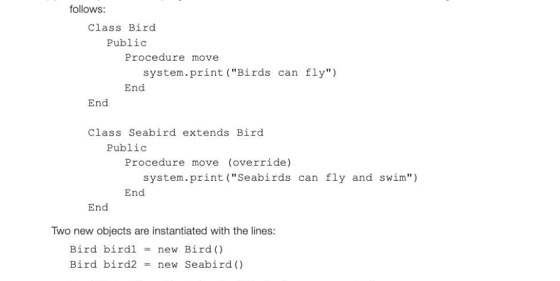

# Chapter 68 — Object-oriented design principles
## Objectives

- Understand concepts of association, composition and aggregation Understand the use of polymorphism and overriding
- Be aware of object-oriented design principles:

- Be able to draw and interpret class diagrams

## Association, aggregation and composition

Recall that inheritance is based on an "is a" relationship between two classes. For example, a cat "is a(n)" animal, a car "is a" vehicle. In a similar fashion, association may be loosely described as a "has a" relationship between classes. Thus a railway company may be associated with the engines and carriages it owns, or the track that it maintains. A teacher may be associated with a form bi-directionally -a teacher "has a" student, and a student "has a" teacher. However, there is no ownership between objects and each has their own lifecycle, and can be created and deleted independently. Aggregation is a special type of more specific association. It can occur when a class is a collection or container of other classes, but the contained classes do not have a strong lifecycle dependency on the container. For example, a player who is part of a team does not cease to exist if the team is disbanded. 12-68 Aggregation may be shown in class diagrams using a hollow diamond shape between the two classes. Team K—————, Player Class diagram showing aggregation Composition is a stronger form of association. If the container is destroyed, every instance of the contained class is also destroyed. For example if a hotel is destroyed, every room in the hotel is destroyed. Composition may be shown in class diagrams using a filled diamond shape. The diamond is at the end of

## Polymorphism

Polymorphism refers to a programming language's ability to process objects differently depending on their class. For example, in the last chapter we looked at an application that had a superclass Animal, and subclasses Cat and Rodent. All objects in subclasses of Animal can execute the methods moveLeft, moveRight, which will cause the animal to move one space left or right.

We might decide that a cat should move three spaces when a moveLeft or moveRight message is received, and a Rodent should move two spaces. We can define different methods within each of the classes to implement these moves, but keep the same method name for each class. Defining a method with the same name and formal argument types as a method inherited from a superclass is called overriding. In the example above, the moveLeft method in each of the Cat and Rodent classes overrides the method in the superclass Animal.

## Class definition including override

Class definitions for the classes Animal and Cat will be something like this:

Note: The 'Protected' access modifier is described on page 356.

## "Favour composition over inheritance"

Composition is generally considered preferable to inheritance for implementing the desired functionality of a system. The main reason for this is that it allows greater flexibility, because composition is a less rigid relationship between two objects than that between two objects with an inheritance relationship. Also, in some cases, an object may be composed of several other objects but cannot be said in a real-world sense to "inherit" their characteristics. For example, suppose a class house has walls, windows and a door. We can define classes for House, Wall, Door, Window and Roof. Each of these classes will need attributes of height, width and colour. The House class will need attributes Wall, Door, Window,

The class definition for the House and Wa11 classes will be written in pseudocode something like this,

Public, private and protected access modifiers (specifiers) Related to encapsulation is the concept of information hiding, meaning that an object's instance variables (e.g. wall, door, etc. in the above example) are hidden so that other objects must use messages (..e. invoke a procedure or function) to interact with that object's state. (Compare this with the use of local variables in subroutines in a procedural language.) The access modifiers public, private and protected are included in a class definition to implement data hiding.

- If amethod or instance variable is declared private, only code within the class itself can access it.
© If amethod or instance variable is declared public, code within any class can access it. Most commonly, instance variables are declared private and methods public, so that other classes cannot change the values of variables in another class but they can use their methods. There is a third specifier, protected, the definition of which varies between languages. In some languages this restricts access to members of a subclass, in others to members in the same package or library of classes. For example, the classes Rectangle, Triangle, Circle etc. may all be part of a Shapes package. The table below summarises the three types of access modifier. Member is accessible... | Public Protected Private Within the defining class Yes Yes Yes

## Class diagram with access specifiers

## Example 1

Animal is an abstract class, with methods that are overridden in the Bird and Mammal classes. It is not possible to create an Animal object. The class diagram below shows inheritance, with private (-) and public (+) specifiers. (A protected

## Programming to an interface

In many situations, a number of different classes of object all need to understand a particular set of messages even though there is no relationship between them. A simple set of messages switchOn and setTimer could be sent to a wide variety of objects such as microwave, lamp, oven, watch etc. How each object responds to the message will vary depending on their class. In this context, an interface is a collection of abstract methods that a group of unrelated classes may implement. Although the methods are specified in the interface, they will only be implemented by a class that implements the interface, and not in the interface itself. The programmer constructing the list of messages or methods does not need to know how the instances of objects in each class will respond to

A programmer who wants class Microwave to implement the Switches interface then includes the name of the interface in the class header: Class Microwave implements Switches The objects in class microwave must be able to receive messages SwitchOn, SetTimer, etc. Objects in a class implementing an interface must be able to receive all the messages corresponding to the methods listed in the interface. One advantage of using such an interface is that new classes can be added which use the interface without in any way affecting existing classes.

## Encapsulate what varies

The strategy of encapsulating what varies is used in order to reduce maintenance and testing effort. It means that when something changes in a program, (such as different specifications for reserving library books or calculating customer discounts in an online store) if the concept in question is encapsulated in a single module, only that module will need to change. At the design stage, consideration should be given to requirements that are most likely to change in the future. It is these aspects of the system that are most important to encapsulate so that if they are changed in the future, the overall amount of code that needs to be modified is minimised. Furthermore, if a module for calculating customer discounts, for example, contains code for checking a customer's credit status, all that code could itself be encapsulated in a separate module. Using an interface class encapsulating the varying concept is one way of implementing this concept, since the interface is implemented differently by different classes and code that relies on the interface can handle any class implementing the interface. Thus for example if a different type of electronic gadget is introduced which uses a different procedure to switch on and off, a new module can be introduced and no other module needs to change.

## Advantages of the object-oriented paradigm

Building code into objects has a number of advantages, including:

- The object-oriented methodology forces designers to go through an extensive planning phase, which makes for better designs with fewer weaknesses.
- Encapsulation: the source code for an object can be written, tested and maintained independently of the code for other objects
- Once an object is created, knowledge of how its methods are implemented is not necessary in order for a programmer to use it.
- New objects can easily be created with small differences to existing ones
- Re-usability: objects that are already defined, coded and tested may be used in many different programs. OOP provides a good framework for code libraries with a range of software components that can easily be adapted by a programmer.
- Software maintenance: an object oriented program is much easier to maintain than one written in a procedural language because of its rigidly enforced modular structure.

---

## Exercises

1. An object-oriented program is being written to store details of and play digital media files that are stored on a computer. A class MediaFile has been created and two subclasses, VideoFile and MusicFile are to be developed. The classes VideoFile and MusicFile are related to MediaFile by single inheritance. (a) Explain what is meant by inheritance. (1) (b) Draw an inheritance diagram for the three classes. [2] (c) One important feature of an object-oriented programming language is the facility to override methods (functions and procedures). Explain what is meant by overriding when writing programs that involve inheritance. [2] (d) The MediaFile class has data fields Title and Duration.

- Artist: Stores the name of the band or singer that recorded the music.
- SampleRate: Stores the rate at which the music has been sampled BitDepth: Stores the number of bits in which each sampled value is represented. Write the class definition for MusicFile. [4]
2. (a) In object-oriented programming, what is meant by polymorphism? (2 (b) An object-oriented program stores details of a class Bird and a subclass Seagu11, defined as

(i) | What will be printed when the following lines are executed? birdl.move bird2.move 2] 12-68 (ii) Explain your answer. [2] 3. (a) In object-oriented programming, what is meant by aggregation? (1) (b) An object-oriented program has been written for a company selling garden furniture. The furniture includes tables, chairs and sets of furniture which include a table and several chairs. Draw a class diagram for the classes Table, Chair, GardenSet. [2] () Some instance variables (fields) required for the GardenSet class are

The instance variables are declared as Private, and the method Public. Explain the effect of the access modifiers Private and Public. Why is it common to make instance variables Private and methods Public? [3]
