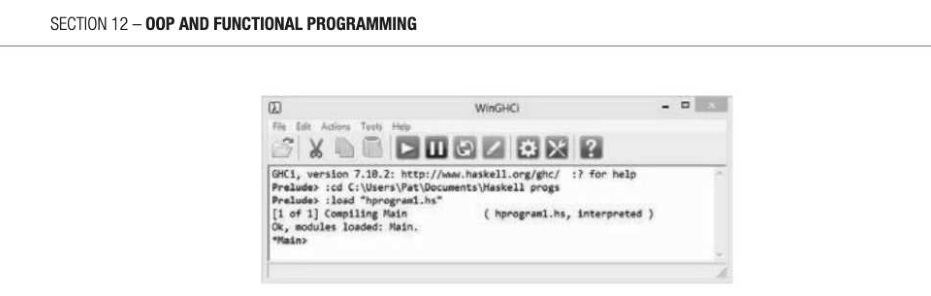
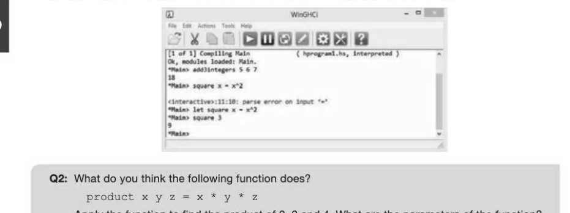
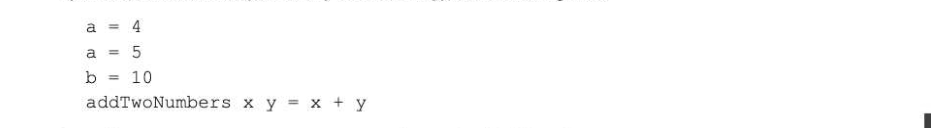
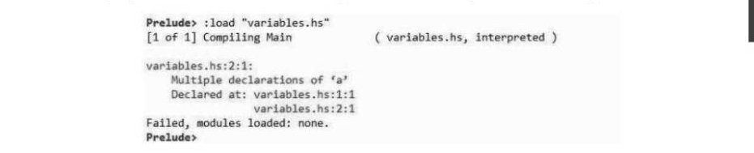
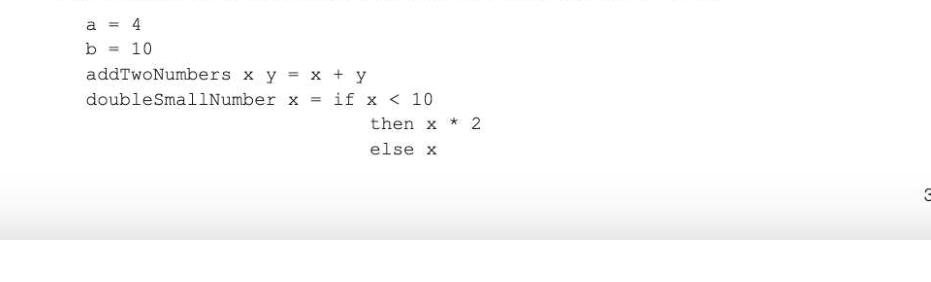
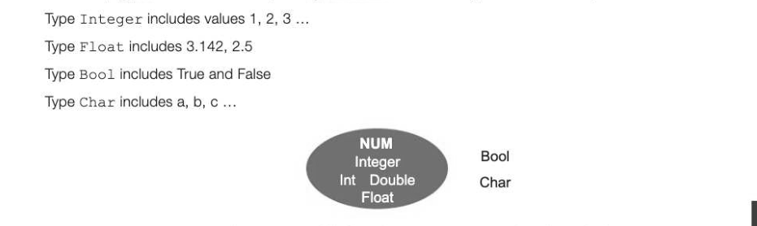
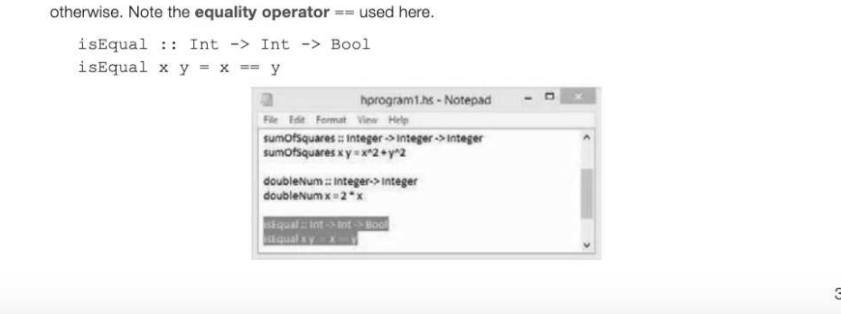
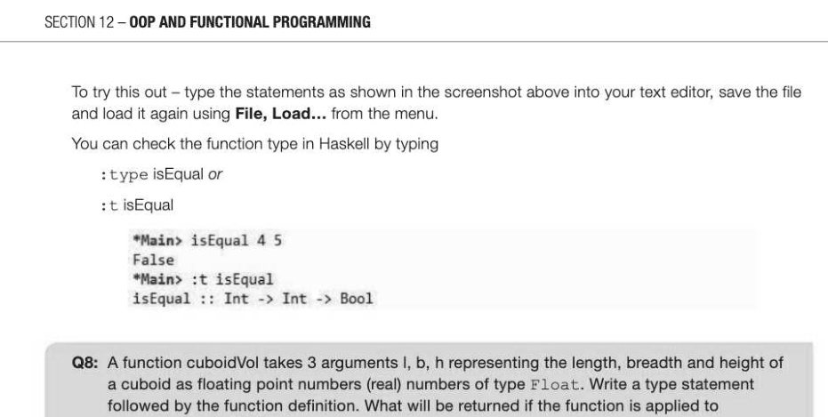
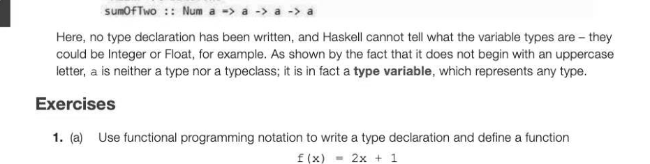

# Chapter 69 — Functional programming
## Objectives

## Understand what is meant by a programming paradigm

## Define function type, domain and co-domain

Understand what is meant by a first-class object and how such an object may be used

## Be able to evaluate simple functions

## Use functional composition to combine two functions

## Programming paradigms

A programming paradigm is a style of computer programming. Different programming languages support tackling problems in different ways, and there are four major programming paradigms each supported by a number of diffferent languages: Procedural programming is supported by languages such as Python or Pascal, which have a series of instructions that tell the computer what to do with the input in order to solve the problem. They are widely used in educational environments, being relatively easy to learn and applicable to a wide variety of problems. Structured programming is a type of procedural programming which uses the programming constructs of sequence, selection, iteration and recursion. It uses modular techniques to split large programs into manageable chunks. 12-69. Object-oriented programming is supported by languages such as Java, Python and Delphi. OOP was developed to make it possible to abstract details of implementation away from the user, make code reusable and programs easy to maintain. It is to a great extent taking over from procedural programming. Declarative programming is supported by languages such as SQL, where you write statements that describe the problem to be solved, and the language implementation decides the best way of solving it. SQL (covered in more detail in Chapter 18) is used to query databases. Functional programming is supported by languages such as Haskell, as well as languages such as Python, C# and Java. Functions, not objects or procedures, are used as the fundamental building blocks of a program. Statements are written as a series of functions which accept input data as arguments and return an output. Functional programming is not covered in this course.

## What is a function?

A function is a mapping from a set of inputs, called the domain, to a set of possible outputs, known as.

The function machine illustrated above could be defined in more mathematical terms as: f: A > B where f(x) = x2 That is to say that the input in domain A produces output in co-domain B.

The domain and co-domain are always subsets of objects in some data type. In the above function, we could define the domain A as the set of integers, for example. The co-domain B is then the set of all positive integers that are greater than or equal to zero. A function does not have to be an algebraic formula. For example, we could map names to ID numbers using a function: f: {Ben, Anna, Michael, 26, 74, 12} Ben maps to 34, Anna to 26 and so on. Notice that the domain and co-domain are of different data types.

## Functional programming in Haskell

Haskell is a functional programming language which will be useful for gaining some practical experience in functional programming. If you want to do some practical work in Haskell to accompany the theory in the next three chapters, you will need access to a text editor such as Notepad for writing programs, and the Haskell platform which uses GHC (Glasgow Haskell Compiler) for compiling your programs. This is available free from https://www.haskell.org/platform. Once Haskell is installed, you can compile and run a program which you have saved, or use the interactive mode which allows you to type in a function and apply it directly by passing it appropriate parameters or arguments. Note that the terms parameter and argument are often used interchangeably, though the distinction can be made that an argument is a value or expression passed to a function, and a parameter is a reference declared in a function declaration. Haskell notation is used in these chapters, and instructions for running each program from a script or in interactive mode are given as each new statement is introduced. If you are not using Haskell, you will still be able to grasp the general principles of functional programming.

## Starting Haskell

We will use a text editor to write a simple program consisting of one function.

- Open Notepad or any other text editor and type the following lines:

Notice that the function name, add3 integers, is followed by its three parameters x y z separated by spaces. No parentheses or commas are used in Haskell, unlike in, for example, Python or Visual Basic.

- Save this program as hprogram1 .hs in a convenient folder.
- Now load Haskell (the program name is WinGCHi.exe)
- In the Haskell window, use the file menu to navigate to your folder and load the file hprogram1.hs
- The prompt changes from Prelude> to *Main>

## Function application

The process of giving particular inputs to a function is known as function application. We can apply or call the function add3integers to find the sum of three integers 5, 6 and 7 by writing add3integers 5 6 7 The function name is followed by the parameters, separated by spaces. The result, 18, will be displayed. The type of the function is f: integer x integer > integer where integer x integer is the Cartesian product of the set integer with itself. (Spoken integer cross integer maps to integer - See Chapter 51.) Instead of typing function definitions into a text document, saving and loading the program, we can type function definitions directly in the Haskell window in interactive mode. The function definition must be preceded by the word let in interactive mode or Haskell will give an error message.

## First-class objects

In a functional programming language, a first-class object is an object which may:

- appear in expressions
- be assigned to a variable
- be assigned as an argument
- be returned in a function call
For example, integers, floating point values, characters and strings are first-class objects. Functions are also first-class objects so may themselves be passed as arguments. What's special about functional programming languages? There are some major differences between procedural and functional programming languages. The importance and significance of these features will become apparent when you reach the chapter on Big Data. Here are some of these features listed and explained.

## Statelessness

When you execute a procedural program such as Python or Pascal, the computer's memory changes state as it goes along. You could execute the following statements, for example: x=5 x=xti1 In a functional programming language, the value of a variable cannot change. Variables are said to be immutable, and the program is said to be stateless. Try this out now. In Notepad or any text editor, type the following lines:

Save this program as variables.hs, and try to load it. You will get an error message:

Remove the second assignment statement a = 5 from the program, save and reload. This time it should load with no problem. Now try typing addTwoNumbers a b.

## No side effects

The only thing a function can do is calculate something and return a result, and it is said to have no side effects. Acconsequence of not being able to change the value of an object is that a function that is called twice with the same parameters will always return the same result. This is called referential transparency and makes it relatively easy for programmers to write correct, bug-free programs. A simple function can be proved to be correct, and then more complex functions can be built using these functions. Try this out by adding some more lines to your program variables.hs as shown:

Save and load the program. Notice that we have used an IF statement in the function doubleSmal1Number. An IF statement in Haskell must include an ELSE clause. Try out the functions in Haskell: Prelude>:load "variables.hs" [1 of 1] Compiling Main ( variables.hs, interpreted ) Ok, modules loaded: Main.

- Main> addTwollumbers a b
- Main> doubleSmallNumber a

You can even use a function in the definition of a new function. Add the following function to your program variables.hs in the text editor, save and load. addAndDoub1le x y = addTwoNumbers (doubleSmallNumber x) y

## Composition of functions

Since a function may be used as an argument, we can combine two functions to get a new function. This

the function g 0 f (called the composition of f and g) is a function whose domain is A and co-domain is C.

## Example 1

Consider the two functions f(x) = x + 3 and g(x) = 2x2 g 0 f could be written as g(f(x)) = g(x+3) = 2 (x+3) 2 fis applied first and then g is applied to the result returned by f.

Applying the function g(f(x)) or g o f with argument 4, in Haskell we write (g.) 4 which will return the value 98, since f(4) = 7, g(7) = 2°49 = 98 (f.g) 4 will return the value 35, since g(4) = 32, (32) = 32 + 3 = 35)

## Types and typeclasses

In Haskell, types are sets of values, and typeclasses are sets of types. So for example:

Integer, Int, Double and Float are all in Typeclass Num. Integer is unbounded to represent 12-69 really big numbers. Int is restricted to minimum and maximum value. Note that Type and Typeclass names always start with uppercase letters. Functions also have types. It is considered good practice to always give functions explicit type declarations. These take the form shown in the example below (colour coded to show the relationship between the declaration and the function arguments): sumOfSquares:: Integer -> Integer -> Integer sumOfSquares x y = x2 + yA2 The types of the two arguments x and y are both declared as integer, and the result is also an integer. The three types are written one after the other separated by ->. The value returned by a function does not necessarily have the same type as the arguments. For example, the function isEqual x y x y will return True if x and y are equal, false

## Type variables

Using interactive mode in Haskell, you may see something like the following: "Main> let sum0flwo x y = x+y

- Main> sumOfTwo 2 3

## 12-69 sum0fTwo

---

## Exercises

1. (a) Use functional programming notation to write a type declaration and define a function f(x) = 2x +1 Assume all values are integers, and name the function doublePlusOne. [4] (b) Write a second function named square which returns the value of g(x) = x2. [2] (c) Combine the two functions in (a) and (b) to write a function h (x) which returns the value of h(x) = g(x) + £(x) Name the function squarexP1us f. What will be returned when this function is applied to the parameter 3? [3] 2. (a) Explain what is meant by the following statements: (i) "In a functional programming language, variables are immutable." (1) (i) "Functional programming is stateless, and has no side effects." [2] (b) Explain why these features help programmers to create programs that do not contain hard-to-find bugs. [3]
