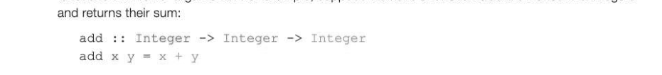
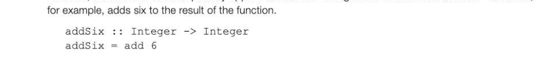
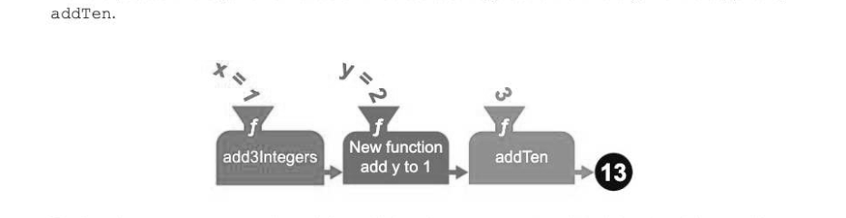
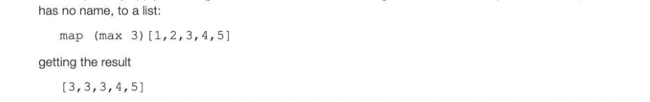
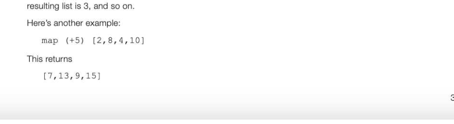
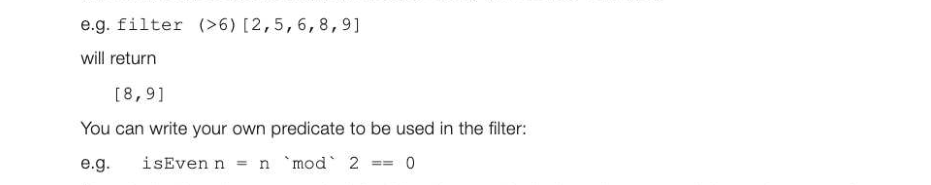
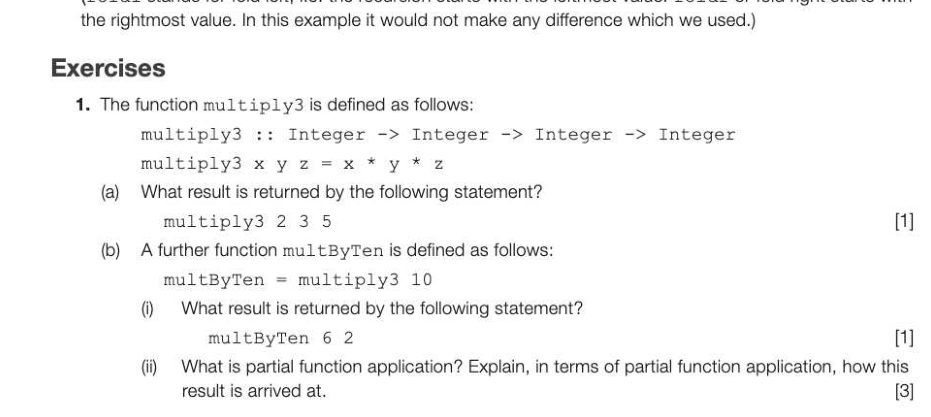

# Chapter 70 — Function application
## Objectives

Understand what is meant by partial function application

- Know that a function takes only one argument which may itself be a function Define and use higher-order functions, including map, filter and fold

## Higher-order functions

A higher-order function is one which either takes a function as an argument or returns a function as a result, or both. Later in this chapter we will be looking at the higher-order functions map, filter and fold, in which the first argument is a function and the second argument is a list on which the function operates, returning a list as a result. Every function in Haskell takes only one argument. This may seem like a contradiction because we have seen many functions, such as the one below which adds three integers, add3Integers x yz=x+yt+z which appear to take several arguments. So how can this be true?

## Any function takes only one parameter at a time

Taken at face value and assuming the function takes three integer parameters and returns an integer result, the type declaration for this function would normally be written add3Integers integer -> integer -> integer -> integer It could also be written add3Integers:: integer -> (integer -> (integer -> integer) )

## How the function is evaluated

What happens when you write add3Integers 2 4 5? The function add3 Integers is applied to the arguments. It takes the first argument 2 and produces a new function (shown in blue above) which will add 2 to its arguments, 4 and 5. New function New function add3integers add y to 2 add z to 6 This function (shown in blue) produces a new function (shown in green) that takes the argument 5 and adds it to 6, returning the result, 11. Our function add3 Integers takes an integer argument (2) and returns a function of type (integer -> (integer -> integer) )

This function takes an integer argument (4) and returns a function of type (integer -> integer) This function takes an integer argument (5) and returns an integer (11).

## Partial function application

Partial function application takes advantage of this by decomposing multi-argument functions into smaller functions with fewer arguments. For example, suppose we have a function add that takes two integers

Remember that add 3 4 actually means (add 3) 4. If we write add 3 we will get an error message from Haskell saying it doesn't know how to print the resulting value, which is a function of type Integer -> Integer. However, we can now use this partially applied function as an argument of a different function - addSix,

We can now use this function, and it adds 6 to the n that replaces add in the calling statement. "Main> addSix 10 We have a function add that takes more than one argument, and we pass it fewer arguments than it wants. It returns a new function that will take the remaining argument and return the result, as demonstrated with the addSix function. Partial application means fixing/binding the values of some inputs to a function to produce another more specific function. Now consider the following code snippet which uses the function add3integers that we defined earlier. This function takes three arguments.

- Main> let addTen = add3Integers 10
- Main> addTen 1 2
- Main> addTen 7 8
Once again we have created a brand new function "on the fly" by using partial function application. We have passed two arguments instead of three to add3integers and the third argument is supplied by

The function add3 Integers is partially applied to the arguments 1 and 2, giving 3, and the resulting function is applied to 10.

## Map

Map is a higher-order function that takes a list and the function to be applied to the elements in the list as inputs, and returns a list made by applying the function to each element of the old list. Lists will be covered in detail in the next chapter, but for now it is enough to know that a list is a collection of elements which can be written in square brackets, e.g. [3, 7, 5, 9]. The empty list is written {]. The function max x y is a built-in library function which returns the maximum of two numbers: eg. max 8 3 willreturn 8. We can partially apply max to get the maximum of 3 and its argument. We then map that function, which

Here, max has been applied to each element of the list in turn. The maximum of 3 and 1 is 3, so the first element of the resulting list is 3. Likewise, the maximum of 2 and 3 is 3, so the second element of the

## Filter

Filter is another higher-order function which takes a predicate (to define a Boolean condition) and a list. This returns the elements within the list that satisfy the Boolean condition.

(Use the backward quotes on the left of the 1 key on the keyboard to surround the mod operator. ) filter (isEven) [1,2,3,4,5,6] will return [2, 4, 6]

## Fold (reduce) function

A fold function reduces a list to a single value, using recursion. For example, to find the sum of all the elements of a list, we write: foldl (+) 0 [2, 3, 4, 5] this will return the value 14. The initial value 0 is combined with the first element of the list, which is then recursively combined with the first element of the remaining list, and so on. This could be parenthesised

## 12-70 as

(((0 + 2) + 3) + 4) +5 (f£01d1 stands for fold left, i.e. the recursion starts with the leftmost value. foldr or fold right starts with the rightmost value. In this example it would not make any difference which we used.)

---

## Exercises

2. (a) Explain what the map function does in a functional programming language such as Haskell. [2] (b) Use map to write a function that trebles each element of the list [1, 2,3, 4,5] [2] 3. Write statements that will return a list containing only the odd numbers from the list. [3]
