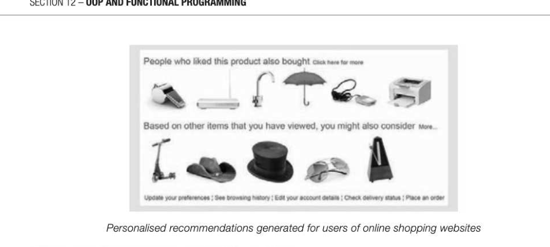
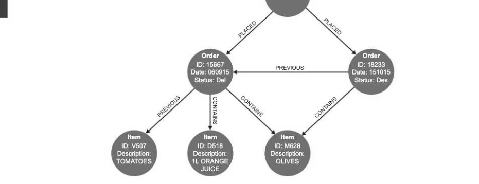

# Chapter 72 — Big Data
## Objectives

- Understand that Big Data is a term used to describe data whose volume is too large to fit on a single server and is generally unstructured
- Describe examples of Big Data
- Describe features of functional programming which make it suitable for analysing Big Data
© Be familiar with the fact-based model for representing data

- Be familiar with graph schema for capturing the structure of the dataset

## What is Big Data?

Big Data analysis is quite probably going to be the most exciting, interesting and useful field of study in the computing world over the next decade or two. We are just at the beginning of exploring its massive benefits in healthcare and medicine, business, communication, speech recognition, banking, and many other fields. Here are some questions it can answer:

- Does cellphone use increase the likelihood of cancer? With six billion cellphones in the world, there is plenty of data to analyse. (The answer turned out to be "No"!)
- How can you improve voice-translation software? By scoring the probability that a given digitised snippet of voice corresponds to a specific word. Google has made use of this data in its speech recognition software.
- How does the Bank of England find out whether house prices are rising or falling? By analysing search queries related to property.
- How can online education programmers use data collection to improve the courses offered? By studying data on the percentage of thousands of students registered who rewatched a segment of the course, suggesting it was not clear, or collecting data on wrong answers to assignments.
The term "Big Data" was first coined in the early 2000s by scientists working in fields such as astronomy and human genome projects, where the amount of data they were collecting was so massive that traditional methods of organising and analysing data, such as relational databases, could no longer be used. Initially, "Big Data" meant that the volume of data was so large that it could not fit into the memory of the computers that were used for processing it, so new tools were needed for analysing it. Computer scientists and mathematicians soon realised that the most difficult aspect of Big Data was its lack of structure. The data cannot be neatly organised into the rows and columns of a relational database, and it is impossible to use standard query tools such as SQL. Frequently, it is essential to be able to analyse the data in seconds or milliseconds to produce a response. These three aspects of Big Data can be summarised in terms of:

- volume - too big to fit on a single server
- velocity — milliseconds or seconds to respond, particularly with streamed data
- variety — the data may be in many forms such as structured, unstructured, text or multimedia
Essentially, Big Data collection and processing enables us to detect and analyse relationships within and among individual pieces of information that previously we were unable to grasp.

## Examples of Big Data

## Healthcare

Doctors and other medical professionals generally use two sets of data when diagnosing ailments and recommending treatments: retrospective data collected from the medical records not only of the patient but from thousands or millions of other people, and real-time clinical data such as blood pressure, temperature, etc. If for example a diabetic patient complains of numbness in their toes, the doctor can measure their blood flow, oxygen levels and so on, and from data gathered on a multitude of other patients with a similar problem, determine if this is a potentially serious situation and what treatment should be offered. Recently, however, medical science has gone further and in many circumstances can take gene sequencing into account. Gene sequencing is already used to determine the best course of treatment for cancer patients, and as costs fall, it may become a routine part of a patient's medical record. In the case of an infectious disease outbreak, hours and even minutes matter in determining the best course of treatment for an individual patient. But how much data is involved in sequencing one human genome? It depends on exactly what data is being collected for analysis, but assuming around three billion base pairs for a human genome, one estimate is around 200GB. Another estimate is that the human body contains about 150 trillion gigabytes of information... so there are undoubtedly challenges in analysing this type of data for an entire population!

## Google

Google processes more than 24 petabytes of data per day - that's 24 x 10'® bytes of data. They receive more than three billion search queries every day and save every single one. The company can use this 12-72 data in thousands of different ways. For example, between 2003 and 2008, Google computer scientists identified areas in the US affected by seasonal flu by what people searched for on the Internet. They did this by taking the 50 million most common search terms that Americans type and comparing them with the spread of seasonal flu between 2003 and 2008 and they found 45 search terms that when used together in a mathematical model, produced a strong correlation between their prediction and the official figures nationwide. When a new flu virus called H1N1 struck in 2009, Google was able to identify its spread far more quickly than government statistics could, and thus arm public health officials with valuable information to contain the outbreak.

## Amazon

The online bookseller Amazon uses the huge amounts of customer data that it collects to recommend specific books to its customers. In the early days of the company, they processed their data in a conventional way, by looking at topics and authors that the reader had purchased and recommending more of the same. This was generally more annoying than helpful to customers — if you have bought one book on Python programming, you don't necessarily need a recommendation for five more books on Python every time you log on. What they then did was to apply Big Data techniques, simply finding associations among the products themselves, regardless of what a particular customer had bought. If huge numbers of customers who bought a book by Dan Brown also purchased a book by lan McEwan, a customer who bought a book by one of those authors would be recommended a book by the other, even if they had never bought one before.

## Functional programming and Big Data

Functional programming has features which make it useful for working with data distributed across several servers.

## Writing correct code

Functional languages have no side effects. A function is said to have a side effect if it modifies the state of the calling program in some way. For example, in a procedural language a particular function might modify a global variable, write to or delete data from a file. Functional languages support statelessness, meaning that the program's behaviour does not depend on how often a function is called or in what order different functions are called. This makes it easier to write correct code, and to understand and predict the behaviour of a program. Functional programming languages support higher order functions. A higher-order function is

The map function is an example of a higher-order function. It takes as parameters a function f and a list of elements, and as the result, returns a new list with f applied to each element from the list. Map and reduce operations can be easily parallelised, meaning that many processors can work simultaneously on part of a dataset without changing or affecting other parts of the data. Higher order functions are therefore a very powerful way of solving problems involving massive amounts of data. Functional programming languages forbid assignment. In a functional programming language

This property is known as immutability. An immutable object is one whose state cannot be modified after it is created. Why is this important for processing across many servers? The answer is that it makes parallel processing extremely easy, because the same function always returns the same result. Given two functions f(x), g(x) in sequence, they can be executed in any order without any possibility that g(x) changes the value of x in a way that changes the result of f(x).

## Fact-based model

The fact-based model is an alternative to the relational data model in which immutable facts are recorded with timestamps. This means that data is never deleted and the data set just continues to grow. Because of the timestamps, it is always possible to determine what is current from what is past, i.e. if a fact such as a person's surname changes, the current name can be distinguished from previous names. The fact-based model is particularly suitable for big data because it is very simple and database updates are quick. A graph schema shows how data are represented in the fact-based model, but often (as is the case in this book) the time stamps are omitted for clarity, and only the most recent version of facts are shown, even through all historical versions of them are stored.

## Graph schema

The enormous volume of data collected by companies such as Google and Facebook, business enterprises and healthcare organisations typically consist of highly connected entities which are not easily modelled using traditional relational database methods. Instead, graph data structures can be used to represent connected data and to perform analyses on very large datasets. In a graph database, data is stored as nodes and relationships, and both nodes and relationships have properties. Instead of capturing relationships between entities in a join table as in a relational database, a graph database captures the relationships themselves and their properties directly within the stored data. — = Relationships

## Example 1

A social network is a good example of a densely connected network. Facebook, which was founded in 2004, had 968 million daily active users in June 2015. Worldwide, they had 1.49 billion monthly active users, approximately 38% of the global population. The flexibility of the graph model allows new nodes and new relationships to be added without compromising the existing data. FRIEND OF If the data on people and their friends was stored in a relational database, in order to find the answer to

entries that contained Charlie. With a small dataset, that is straightforward. But now recall the Big O notation, a shorthand way of describing how the performance of the algorithm changes with the size of the dataset. When the dataset doubles, the number of searches doubles - so the algorithm is O(n). In a graph database, the size of the dataset makes very little difference; we simply have to locate Charlie in the index and follow the links to his friends. Finding friends-of-friends, or friends-of-friends-of-friends, would be impractical in a relational database, but traversing a graph by following paths makes this task relatively straightforward. Who would know if there is any truth behind the theory of six degrees of separation between any two individuals on earth? Microsoft proved this in 2008 by studying records of 30 billion electronic conversations in 2006, and calculating the chain lengths between 180 billion pairs of users. Any individual user was on average 6.6 hops from another. Agraph database will be able to find in a fraction of a second, all friends-of-friends to a depth of say five, whereas a relational database reliant on looking up indexes will take an unacceptably long time.

## Example 2

The purchase history of a user can be modelled using a connected graph. In the graph, the user is linked to her orders, and the orders are linked to provide a purchase history.

Using the graph, we can see all the orders that a customer has placed, and find what items each order contains. Orders are linked so that order history is easily viewable. The graph opens up all sorts of useful possibilities. For example, if we find that many users who buy spaghetti also buy coffee beans, we can make a recommendation for coffee beans to purchasers of spaghetti and vice versa. We can add further dimensions to the graph, for example where a customer lives, so that we can find out whether people living in a certain area buy certain products, and then recommend these products to others living in the same area. Note that there are different ways of drawing these graphs. An alternative way, with the properties written in separate boxes connected to the nodes by dashed lines, is shown in Exercise 4.

---

## Exercises

1. Describe two features of functional programming languages which make it easy to write correct and efficient distributed code. [4] 2. List three features of a dataset that indicate that a graph schema would be preferable to a relational database for holding the data. In each case, give a reason why this would be the case. [6] 3. "At its core, big data is about predictions." Using two different examples, justify this statement. [6] 4. Big Data can be represented using a graph schema. Data has been collected on families and their occupations. Part of the graph schema is shown below. Complete the graph to show the following facts: (a) Bob is the father of Mark (ID 102) and Emma (ID 103). (2) (b) Mark is an actor, and Emma is a doctor. [2] (c) Gina has a brother Pete (ID 408) who is married to Emma. Pete is a singer. [3]

## References

Mayer-Schonberger, Viktor and Cukier, Kenneth, "Big Data: A Revolution that will transform how we live, Work and Think", Houghton Mifflin Harcourt Publishing Company, New York, 2013 Miller, Bradley and Ranum, David "Problem solving with algorithms and data structures using Python",

## Franklin, Beedle and Associates Inc., USA 2011

Robinson, lan, Webber, Jim and Eifrem, Emil, "Graph databases, 2nd edition" O'Reilly Media Inc., USA

## 2015

Big data: http://blog.softwareabstractions.com/the_software_abstractions/2013/06/big-data-and-graph- databases.html
