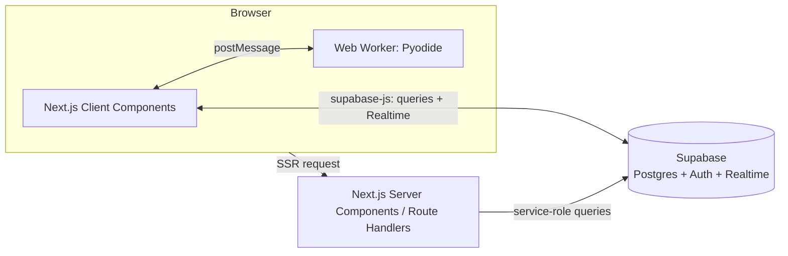
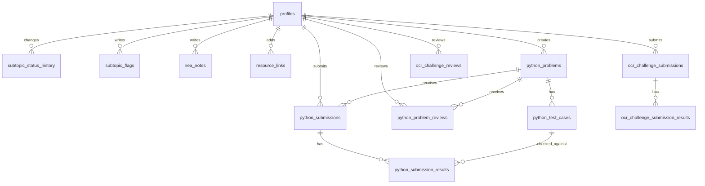

# Design

Translates `requirements.md` into a concrete technical shape: data model,
permissions, sync/state approach, routes, and per-feature architecture on
top of the stack in `tech-stack.md` (Next.js + TypeScript + Supabase) and
the conventions in `conventions.md`. **Design only — nothing here is
implemented yet.** Section numbers below are cross-referenced to
`requirements.md` §N throughout.

A running theme: content that's fixed and code-reviewed (spec topics,
NEA section names/marks, exercise definitions) stays in `/lib/spec` and
`/lib/exercises` as TypeScript data, per `conventions.md`. The database
only ever stores *mutable state about that content* (a status, a note, a
submission) keyed by the code-defined id. No table exists in Postgres for
"topics" or "NEA sections" as content — only for progress against them.

---

## 1. Architecture overview



- Server components handle first-load data fetching (fast initial paint,
  no loading spinner for the dashboard/topic pages).
- Client components take over for anything interactive (status toggles,
  the Python editor, exercise checkers) and subscribe to Supabase
  Realtime so the other account's changes appear live, replacing the
  prototype's `onSnapshot` pattern.
- The Pyodide Web Worker is entirely local to the browser tab — it never
  talks to Supabase directly; the client component that owns it persists
  results after the worker reports them.

## 2. Data model

### 2.1 Entity-relationship overview



### 2.2 Tables

```sql
-- One row per account. role is set once at account creation, not
-- self-selected — see §3.1.
profiles (
  id           uuid primary key references auth.users(id),
  role         text not null check (role in ('student','supporter')),
  display_name text not null,
  created_at   timestamptz not null default now()
)

-- Current status per subtopic. subtopic_id is a code-defined slug
-- (e.g. 'programming__3') from /lib/spec — not a foreign key, since the
-- content it refers to isn't in the database. Referential integrity is
-- enforced instead by a Vitest test asserting every id ever written
-- matches the canonical list in /lib/spec (see §8).
subtopic_status (
  subtopic_id  text primary key,
  status       text not null default 'not-started'
                 check (status in ('not-started','learning','practising','confident')),
  updated_at   timestamptz not null default now(),
  updated_by   uuid not null references profiles(id)
)

-- Append-only. One row per change, ever. Powers "last touched" and the
-- activity trail (§6/§9).
subtopic_status_history (
  id           bigserial primary key,
  subtopic_id  text not null,
  status       text not null,
  changed_at   timestamptz not null default now(),
  changed_by   uuid not null references profiles(id)
)

-- Supporter comments on a subtopic. Append-only, no edit/delete for now
-- (requirements.md §10 leaves "resolved" state as an open item — adding
-- a `resolved boolean` column later is a additive migration, not a
-- redesign, so it's deliberately left out until actually needed).
subtopic_flags (
  id           bigserial primary key,
  subtopic_id  text not null,
  body         text not null,
  created_by   uuid not null references profiles(id),
  created_at   timestamptz not null default now()
)

-- Current status + target date per NEA section. section_id is one of
-- the six fixed ids from /lib/spec (analysis, design, tech-complete,
-- tech-technique, testing, evaluation) — marks values live in code
-- alongside the section names, not duplicated here.
nea_state (
  section_id   text primary key,
  status       text not null default 'not-started'
                 check (status in ('not-started','in-progress','drafted','complete')),
  target_date  date,
  updated_at   timestamptz not null default now(),
  updated_by   uuid not null references profiles(id)
)

-- Running log of notes per section (§4) — append-only, never overwritten.
nea_notes (
  id           bigserial primary key,
  section_id   text not null,
  body         text not null,
  created_by   uuid not null references profiles(id),
  created_at   timestamptz not null default now()
)

-- Shared personal resource links (§3), separate from the code-maintained
-- curated list.
resource_links (
  id           bigserial primary key,
  topic_id     text not null,
  url          text not null,
  label        text not null,
  created_by   uuid not null references profiles(id),
  created_at   timestamptz not null default now()
)

-- Glossary spaced-resurfacing state (§5.3), one row per term slug
-- defined in /lib/exercises.
glossary_progress (
  term_id          text primary key,
  mastered         boolean not null default false,
  last_shown_at    timestamptz,
  next_eligible_at timestamptz,
  updated_at       timestamptz not null default now()
)

-- Parent-authored problems (§8.1). Only a supporter may insert/update.
python_problems (
  id                  bigserial primary key,
  title               text not null,
  description         text not null,
  starter_code        text,
  due_date            date,
  created_by          uuid not null references profiles(id),
  created_at          timestamptz not null default now(),
  submitted_for_review_at timestamptz  -- set by the student, see §7.6
)

python_test_cases (
  id           bigserial primary key,
  problem_id   bigint not null references python_problems(id) on delete cascade,
  position     int not null,
  input        text not null default '',
  expected_output text not null
)

-- Every run is stored, never overwritten (§8.5). Only a student may insert.
python_submissions (
  id             bigserial primary key,
  problem_id     bigint not null references python_problems(id) on delete cascade,
  submitted_by   uuid not null references profiles(id),
  code           text not null,
  overall_result text not null check (overall_result in ('pass','fail','timeout','error')),
  error_message  text,
  best_practice_findings text[] not null default '{}',  -- added for §6.7/§6.8's code-quality check, applies regardless of problem source
  created_at     timestamptz not null default now()
)

python_submission_results (
  id             bigserial primary key,
  submission_id  bigint not null references python_submissions(id) on delete cascade,
  test_case_id   bigint not null references python_test_cases(id) on delete cascade,
  passed         boolean not null,
  actual_output  text not null
)

-- Parent feedback (§8.6). Presence of a row is what makes a problem
-- "reviewed" — see §7.6's derived-status logic.
python_problem_reviews (
  id           bigserial primary key,
  problem_id   bigint not null references python_problems(id) on delete cascade,
  body         text,
  created_by   uuid not null references profiles(id),
  created_at   timestamptz not null default now()
)

-- Mutable state for the fixed OCR challenge set (§6.8, requirements.md
-- §8.8). challenge_id is a code-defined slug from
-- /lib/exercises/ocr-challenges.ts, not a foreign key - the challenge
-- content itself isn't in the database, the same pattern as
-- subtopic_status's subtopic_id. Otherwise mirrors
-- python_submissions/python_submission_results exactly.
ocr_challenge_submissions (
  id             bigserial primary key,
  challenge_id   text not null,
  submitted_by   uuid not null references profiles(id),
  code           text not null,
  overall_result text not null check (overall_result in ('pass','fail','timeout','error')),
  error_message  text,
  best_practice_findings text[] not null default '{}',
  created_at     timestamptz not null default now()
)

ocr_challenge_submission_results (
  id                 bigserial primary key,
  submission_id      bigint not null references ocr_challenge_submissions(id) on delete cascade,
  test_case_position int not null,  -- indexes into the challenge's code-defined test case array, not a database row
  passed             boolean not null,
  actual_output      text not null
)

-- Only column besides the key is submitted_for_review_at, and it's
-- entirely student-owned - unlike python_problems there's no
-- supporter-owned content column on this same row (title/description
-- are code-defined, not stored), so this needs a single student-only
-- policy and no column-scoping trigger (contrast with §3.2).
ocr_challenge_review_state (
  challenge_id            text primary key,
  submitted_for_review_at timestamptz,
  updated_by              uuid not null references profiles(id)
)

-- Parent feedback (§8.6/§8.8) - same shape and role split as
-- python_problem_reviews; see the updated §2.3 for why this is a fourth
-- small table rather than a merge.
ocr_challenge_reviews (
  id           bigserial primary key,
  challenge_id text not null,
  body         text,
  created_by   uuid not null references profiles(id),
  created_at   timestamptz not null default now()
)

-- Activity trail (§6). Populated by application code alongside each
-- mutation above (see §7.7), not by database triggers.
activity_events (
  id           bigserial primary key,
  actor_id     uuid not null references profiles(id),
  event_type   text not null,
  summary      text not null,
  target_ref   text,
  created_at   timestamptz not null default now()
)
```

### 2.3 Why four small comment-shaped tables, not one generic one

`subtopic_flags`, `nea_notes`, `python_problem_reviews`, and (§6.8)
`ocr_challenge_reviews` all have the same shape (body + author +
timestamp). A single polymorphic `comments` table (with a
`target_type`/`target_id` pair) would remove that repetition — but it
would also mean every RLS policy on it has to branch on `target_type` to
decide who's allowed to write, and every query needs a runtime cast
instead of a typed foreign key. Four small tables keep each RLS policy a
one-line role check and each TypeScript query fully typed. This is the
same "three similar lines beats a premature abstraction" call as
`CLAUDE.md`'s general guidance — worth naming explicitly since the
repetition is easy to spot and "fix" later, and worth re-confirming each
time a new table joins the pattern rather than assuming it still holds.

## 3. Auth & permissions

### 3.1 Account setup

There is no public sign-up flow (product.md: not a public product). The
two accounts are created once, out-of-band, via Supabase's dashboard or a
one-time seed script — each new `auth.users` row gets a matching
`profiles` row with `role` set explicitly by whoever runs the setup, not
chosen by the account holder. This avoids the failure mode of both
accounts accidentally becoming `student` (or neither).

### 3.2 Enforcing roles at the database layer

Row-Level Security policies do the enforcement — not just UI hiding —
so a student account can't write a subtopic-confident status even by
calling the API directly. Representative policies:

```sql
-- Only the student may write their own confidence status.
create policy "student writes subtopic_status"
  on subtopic_status for insert, update
  using (exists (
    select 1 from profiles where id = auth.uid() and role = 'student'
  ));

-- Only the supporter may leave a flag.
create policy "supporter writes subtopic_flags"
  on subtopic_flags for insert
  using (exists (
    select 1 from profiles where id = auth.uid() and role = 'supporter'
  ));

-- Either account may read anything (both are on the same shared record).
create policy "either account reads subtopic_status"
  on subtopic_status for select
  using (true);
```

The same pattern (role-gated insert/update, open select) applies to
`python_problems`/`python_test_cases` (supporter-only writes),
`python_submissions`/`python_submission_results` (student-only writes),
and `python_problem_reviews` (supporter-only writes). `nea_state`,
`nea_notes`, `resource_links`, and `glossary_progress` are writable by
either role, matching requirements.md §4's "jointly managed" framing —
their policies check only that `auth.uid()` matches *some* profile, not a
specific role.

The fixed OCR challenge set's tables (§6.8) follow the identical role
split — `ocr_challenge_submissions`/`ocr_challenge_submission_results`/
`ocr_challenge_review_state` are student-only writes,
`ocr_challenge_reviews` is supporter-only — with one simplification over
`python_problems`: `ocr_challenge_review_state` has no supporter-owned
column to protect, so it needs no column-scoping trigger, just a plain
student-only insert/update policy.

### 3.3 Sessions

Supabase Auth's refresh-token flow is configured for a long-lived session
(matching the "weeks/months" decision in requirements.md §1) rather than
the default short-lived access token needing frequent silent refresh —
concretely, a long refresh-token expiry with `persistSession: true` in
the client, so re-opening the app on her phone doesn't prompt a login.

## 4. Realtime sync & client state

Two problems to solve: (1) get the other account's changes to show up
live, (2) make save failures visible and retryable rather than silently
swallowed (`principles.md` §1) — the prototype's single generic
"Could not sync" state doesn't meet that bar on its own.

- **Realtime**: each page subscribes only to the tables/rows it renders,
  e.g. the topic page subscribes to `subtopic_status` and
  `subtopic_flags` filtered to that topic's subtopic-id prefix; the
  dashboard subscribes to `activity_events`, `nea_state`, and
  `python_problems` (for due-date banners). Supabase's Postgres Changes
  feed over `supabase-js` replaces the prototype's `onSnapshot`.
- **Client data layer**: a thin wrapper around **TanStack Query**
  (proposed addition — flagged below) gives every mutation the same
  optimistic-update-then-confirm-or-roll-back shape: the UI updates
  immediately, the write goes to Supabase, and on failure the UI reverts
  the optimistic change *and* shows an inline, dismissible "Couldn't
  save — retry" affordance next to the control that failed, rather than
  a single global sync dot. This is what makes principle §1 concrete
  instead of aspirational.
- Every mutating hook (`useSetSubtopicStatus`, `useAddNeaNote`, etc.)
  follows one shared pattern in `/lib/db`: optimistic local update →
  Supabase write → on success, no-op (Realtime will also confirm it) →
  on failure, revert + surface a retry action. One pattern, reused
  everywhere, rather than each feature inventing its own error handling.

**Stack addition (flagged, not yet in `tech-stack.md`):** TanStack Query.
Justification: every one of the mutating flows above needs the same
optimistic/rollback/retry shape, and principles.md §1 makes getting that
shape right non-negotiable rather than a nice-to-have — worth the small
added dependency rather than hand-rolling the same logic five times. If
this isn't wanted, the alternative is a hand-written
`useOptimisticMutation` hook doing the same job with no new dependency;
worth a quick decision before build starts.

## 5. Routes

```
/login                          Supabase Auth sign-in (no public sign-up)
/                                Dashboard: overall %, focus banner, NEA
                                 deadline banner, Python due-date banner,
                                 activity trail (§6)
/topic/[topicId]                Checklist + curated & personal resources
                                 + supporter flags
/nea                             Six-section tracker, notes log, deadline
                                 state, marks-worth-complete figure
/practice/theory-of-computation  Trace tables, FSM step-tracer, glossary
/python                          Problem list: supporter-authored
                                 problems and the fixed OCR challenge set
                                 as two distinct groups (due dates, review
                                 status)
/python/[problemId]              Supporter-authored problem: description,
                                 test cases, code editor, run/submit,
                                 attempt history, reviews
/python/ocr/[challengeId]        Fixed OCR challenge: description (+
                                 image where the booklet has one), test
                                 cases where auto-gradable, code editor,
                                 run/submit or review-only, attempt
                                 history, reviews
/python/new                      Supporter-only problem creation form
/export                          Triggers the JSON data export (§10)
```

Route protection: a Next.js middleware checks for a valid Supabase
session on every route except `/login`; `/python/new` additionally checks
`role = 'supporter'` server-side before rendering (not just hiding the
link in the nav) — the same "enforce it at the boundary, not just the UI"
principle as the RLS policies in §3.2.

## 6. Feature designs

### 6.1 Syllabus tracker (req. §2)

- `StatusSegmentedControl` (client component): renders the four status
  buttons for a subtopic; disabled entirely (not just visually) when the
  logged-in profile's role isn't `student`.
- Next to it, a `SupporterFlag` component: a small comment box visible to
  the supporter role only for *writing*, visible to both for *reading*;
  renders any existing `subtopic_flags` rows for that subtopic inline,
  most recent first.
- "Last touched" is `max(subtopic_status_history.changed_at)` for that
  subtopic, computed in the query, not stored redundantly.

### 6.2 Resource hub (req. §3)

- Curated links render straight from `/lib/spec` — no query needed.
- Personal links query `resource_links where topic_id = :id`, rendered
  in a visually distinct "Also saved" group below the curated list so
  the two never blend together.
- Delete permission (flagged open in requirements §10): designed default
  is `created_by = auth.uid()` — you can remove a link you added, not one
  the other person added. Cheap to loosen to "either account" later if
  that turns out to be annoying in practice.

### 6.3 NEA tracker (req. §4)

- `nea_state` + `nea_notes` per section, both writable by either role.
- Marks-worth-complete figure: `sum(marks for section in NEA_SECTIONS if
  nea_state[section.id].status === 'complete')`, computed client-side
  from the code-defined marks table joined against the live `nea_state`
  rows — no marks value is ever stored in the database.
- Deadline banner: computed the same way on the dashboard, comparing
  `nea_state.target_date` against `today` using the 14-day window from
  requirements §4 — a plain constant (`NEA_UPCOMING_WINDOW_DAYS = 14`) in
  one config module, not hardcoded inline, so it's the one place to
  adjust if the window turns out wrong (requirements §10).

### 6.4 Unit 2 practice — generalized stepped-exercise interface (req. §5.5)

```ts
interface SteppedExercise<Input, Step> {
  id: string;
  prompt: string;
  computeExpectedSteps(input: Input): Step[];
  isStepCorrect(given: Step, expected: Step): boolean;
  renderStepInput(step: Step): /* form field shape */ unknown;
}
```

- **Trace tables** implement this with `Step = Record<columnName,
  value>` and a fixed `Input` (the code snippet is baked into the
  exercise; there's nothing for the student to vary).
- **FSM step-tracer** implements this with `Step = { state: string;
  output?: string }` and `Input = the string being traced`;
  `computeExpectedSteps` actually runs the FSM's transition table symbol
  by symbol — this is the mechanism that makes FSM exercises genuinely
  checkable per req. §5.2, replacing the prototype's reveal-only answer.
- A single `<SteppedTraceForm>` client component takes any
  `SteppedExercise`, renders one input per expected step, and on
  "Check", calls `isStepCorrect` per step and highlights each cell
  correct/wrong exactly like the prototype's trace-table styling already
  does — reusing that visual language rather than inventing a second one.
- Glossary flashcards don't fit this interface (no step sequence) and
  stay a separate, simpler component — resurfacing logic lives in
  `glossary_progress` (§2.2): a term becomes eligible again once
  `next_eligible_at <= now()`, and eligible mastered terms are mixed into
  the draw at roughly 1-in-5 frequency (a `Math.random() < 0.2` check
  when picking the next card, not a queue position, since it's meant to
  be a loose heuristic, not exact).
- Per requirements §5.4, exercise instances (which trace tables, which
  FSMs, which glossary terms) are TypeScript data in `/lib/exercises`,
  reviewed via normal PRs — there is no database table for exercise
  *content*, only for `glossary_progress` state.

### 6.5 Activity trail (req. §6)

- `activity_events` is populated by a shared `logActivity()` helper
  called from within each mutating hook in §4's shared mutation pattern
  — e.g. `useSetSubtopicStatus` writes to `subtopic_status` +
  `subtopic_status_history` + calls `logActivity({event_type:
  'subtopic_status_changed', summary: ...})` in the same request.
- Chosen over a database trigger per event so the human-readable
  `summary` text (needing subtopic titles from `/lib/spec`, which the
  database doesn't have) can be composed in TypeScript where that content
  already lives, rather than duplicating title lookups into SQL.
- The dashboard renders the latest ~20 `activity_events` rows, newest
  first. No pagination, no filtering — it's a glance-at-it feed, not a
  log viewer (requirements §6: "not a full audit log").

### 6.6 Data export (req. §7)

A single Route Handler (`/export`) that, for the logged-in account,
queries every table in §2.2 and returns one JSON file. Since there's only
one shared record, both accounts export the same complete dataset. No
UI beyond a "Download my data" button — this is insurance, not a feature
surface to design further.

### 6.7 Python practice problems (req. §8)

**Problem authoring** (`/python/new`, supporter-only): a form writing one
`python_problems` row plus its `python_test_cases` rows in one submit.
Test cases are visible to the student in full (input *and* expected
output) — there's no hidden-test-case concept. This is a deliberate
default, not something the interview covered: it matches how trace-table
and FSM exercises already show everything up front, and the goal stated
in product.md is learning, not tamper-proof grading. Flagged here as an
assumption, easy to add hidden cases to later if it turns out to matter.

**Code editor**: **CodeMirror 6** with Python syntax highlighting,
chosen over Monaco for a much smaller bundle — consistent with already
accepting one large one-time download for Pyodide (`tech-stack.md`); a
second heavy editor bundle on top of that would compound the cost this
app is trying to keep low on a phone. A student may also attach a local
`.py` file (requirements.md §8.9): its contents are read client-side
(the browser's own File API) and replace the editor's current value
exactly as if typed — there's no separate upload endpoint and no
server-side file storage, since the result is the same `code` string
already flowing through Run/Submit below.

**Execution pipeline** (`/python/[problemId]`, student-only to run):

```mermaid
sequenceDiagram
    participant UI as Client Component
    participant W as Web Worker (Pyodide)
    UI->>W: {type: 'init', interruptBuffer}
    loop for each test case, in order
        UI->>W: {type: 'run', code, input}
        alt finished within timeout
            W-->>UI: {outcome: 'ok' | 'error', stdout, ...}
        else UI writes SIGINT into interruptBuffer after N seconds
            Note over W: Pyodide raises KeyboardInterrupt
            W-->>UI: {outcome: 'timeout'}
        end
        Note over UI: a timeout or error stops the loop early;<br/>a wrong-output 'ok' still grades every remaining case
    end
    UI->>W: {type: 'check', code}
    Note over W: ast.parse(code), walk for best-practice findings (§6.8)
    W-->>UI: {findings: string[]}
    UI->>UI: persist submission + per-test results + findings (§2.2)
```

(Corrected from this design's original single-batched-message sketch to
match what actually shipped: the loop runs on the main thread, one
`run` message per test case, reusing the same warm worker — see task
25's commit message for why continuing past a wrong-output case, but not
past a timeout or error, is the right behavior.)

- Pyodide is loaded once per tab and kept warm in the worker across runs
  (not reloaded per submission) — the ~10MB+ cost from `tech-stack.md` is
  paid once per session, not once per click.
- **Timeout mechanism, specifically**: WASM execution can't be
  interrupted from outside like a normal JS callback — terminating the
  whole worker would work but throws away the loaded Pyodide runtime,
  forcing a slow reload on the very next run. Instead this uses Pyodide's
  documented interrupt-buffer mechanism: a `SharedArrayBuffer` the main
  thread can write to, which the WASM runtime polls internally and turns
  into a real `KeyboardInterrupt` inside the running Python code. This
  requires the site to send `Cross-Origin-Opener-Policy: same-origin`
  and `Cross-Origin-Embedder-Policy: require-corp` response headers
  (`SharedArrayBuffer` is unavailable without them) — a `next.config.js`
  header change, called out here because it's easy to miss and the
  timeout silently can't work without it.
- A constant `PYTHON_EXEC_TIMEOUT_MS` (proposed: `5000`) lives in one
  config module next to `NEA_UPCOMING_WINDOW_DAYS` (§6.3).
- **Best-practice / code-quality check** (requirements.md §8.10): a
  single `{type: 'check', code}` round trip to the same worker, sent
  once per submission after the test-case loop (not once per test case —
  it inspects the submitted source itself, so repeating it per case
  would just recompute the same answer). The worker parses the code with
  Python's built-in `ast` module and walks the tree for two rule
  categories: no function/class definitions anywhere (decomposition), and
  non-`snake_case` or single-letter identifiers plus overlong lines
  (naming/readability) — the two categories confirmed as priorities,
  with error-handling and anti-pattern rules deliberately deferred
  (requirements.md §8.10). Findings are a flat list of short strings,
  shown as advisory feedback alongside the pass/fail results and
  persisted in the new `best_practice_findings` column (§2.2) — they
  never affect `overallResult`. This logic lives in the same plain,
  unbundled `public/pyodide-worker.js` as the existing runner (it must —
  `ast` only exists inside the Pyodide runtime, not in TypeScript), so
  it's added as a sibling Python function in that file, not a new module.

**Review workflow** — designed as derived state, not a manually-shared
status column:

| Condition | Effective status |
|---|---|
| No submissions, no `submitted_for_review_at` | `not-started` |
| ≥1 submission, `submitted_for_review_at` is null | `attempted` |
| `submitted_for_review_at` is set, no newer review | `submitted-for-review` |
| A `python_problem_reviews` row exists after `submitted_for_review_at` | `reviewed` |

This was a deliberate design choice, not directly specified in
requirements.md: an editable single `status` enum column would need
*different* write permissions depending on which value is being written
(student can set `submitted-for-review`, supporter can set `reviewed`,
neither can set the other's value) — which plain table-level RLS can't
express cleanly. Deriving status from `submitted_for_review_at` (student
column, student-only write) and the append-only `python_problem_reviews`
table (supporter-only insert) sidesteps that entirely, and matches the
same append-only-log pattern already used for `nea_notes` and
`subtopic_status_history`.

- "Submit for review" is a separate action from "Run" — every Run is
  saved to history and shown immediately (§8.5), but the student
  explicitly marks a problem ready via one button, rather than it
  happening automatically the moment a run passes (requirements §10's
  open question). Reasoning: a student might want a passing run reviewed
  alongside a note ("can you check if this is efficient enough?") rather
  than the parent being pinged the instant tests go green.

### 6.8 Fixed OCR challenge set (req. §8.8)

All 80 challenges live as typed data in a new
`lib/exercises/ocr-challenges.ts` — the same "content in code" pattern as
`lib/spec/topics.ts`/`lib/spec/nea.ts` and every existing Unit 2 exercise
module. The database only stores mutable state keyed by each challenge's
code-defined `id` (a slug, e.g. `ocr-factorial-finder`), via the four new
tables in §2.2. This is a genuinely different key shape from
`python_problems`'s bigint-FK design — there is no database row for the
challenge itself to reference — so the new tables are new, not a reuse of
`python_test_cases`/`python_submissions`: `ocr_challenge_submissions.
challenge_id` is `text`, not a foreign key, exactly like
`subtopic_status.subtopic_id`.

```ts
type OcrChallenge = {
  id: string;                  // stable slug, e.g. 'ocr-factorial-finder'
  number: number;               // the booklet's own numbering, for citation
  title: string;
  description: string;          // full prompt text, verbatim from the booklet
  extensions?: string[];        // optional stretch-goal bullets, shown inline
  imageUrl?: string;             // reserved, unused - see ocr-challenges.ts header
  testCases?: { input: string; expectedOutput: string }[]; // absent = manual-review-only
  starterCode?: string;
};
```

A Vitest test (the same referential-integrity spirit as `isKnownSubtopicId`,
§8) asserts structural validity across all 80 entries at once: unique
ids, non-empty title/description, and — for every challenge that does
carry `testCases` — at least one entry with a non-empty
`expectedOutput`. This can't catch a *wrong* hand-derived expected
output (only re-deriving it from the booklet by hand can — see
requirements.md §8.8's note that OCR publishes no solutions), but it does
catch mechanical mistakes (a typo'd empty test case, a duplicate id)
before they reach a student.

**Review status** reuses `deriveReviewStatus()`
(`lib/exercises/python-review-status.ts`) completely unchanged — it was
already written generically over
`{hasSubmissions, submittedForReviewAt, latestReviewAt}` with no
reference to `python_problems` specifically, so the OCR set's four-state
status is the exact same function, fed from
`ocr_challenge_submissions`/`ocr_challenge_review_state`/
`ocr_challenge_reviews` instead of the parent-authored tables.

**List page**: `/python` renders two visually distinct groups on the same
page — supporter-authored problems, then the fixed OCR set — the same
"two distinct lists, kept visually separate" treatment already used for
curated vs. personal resource links (§6.2), not a second nav item or
route. A challenge with no `testCases` shows no "Run" affordance at all
on its detail page (the manual-review-only group from requirements.md
§8.8) — submitted code goes straight into the same review workflow as
every other problem (above), just with nothing to grade first.

**RLS** follows the same role split as §3.2, with one simplification:
`ocr_challenge_review_state` has only one column besides its key
(`submitted_for_review_at`), and that column is entirely student-owned —
unlike `python_problems`, there's no supporter-owned column on the same
row to protect from a student overwrite, so it needs a single
student-only insert/update policy and no column-scoping trigger.

## 7. Cross-cutting: save reliability pattern (principles.md §1)

Every mutating hook in §4 follows the same shape so "never silently
lost" is enforced structurally, not by remembering to do it right each
time:

1. Apply the change to local state immediately (optimistic).
2. Write to Supabase.
3. On success: nothing further — Realtime will also confirm it for the
   other account.
4. On failure: revert the optimistic change, surface an inline "Couldn't
   save — retry" control at the point of failure (not a single global
   status dot), and log the failure to `activity_events` is **not**
   done here — a failed write isn't an event that happened, so it stays
   out of the trail by design.

## 8. Testing strategy mapping

Concrete targets, extending `conventions.md`'s general split:

- **Vitest**: `isStepCorrect`/`computeExpectedSteps` for both trace-table
  and FSM exercises; the NEA marks-worth-complete calculator; the
  glossary resurfacing eligibility check; the Python
  actual-vs-expected-output comparator; a standalone test asserting every
  `subtopic_id` used anywhere in `/lib/exercises` and any seed data
  exists in `/lib/spec` (the referential-integrity check called out in
  §2.2, since the database can't enforce it); the same structural-validity
  check for the OCR challenge data module — unique ids, non-empty
  descriptions, every declared test case has an expected output (§6.8).
- **Playwright**: student status change persists across reload and is
  visible on the supporter's session; a supporter's role cannot write a
  subtopic status even via direct interaction; an NEA note append doesn't
  remove earlier notes; a Python submission that infinite-loops resolves
  to a distinct "timed out" result within a bounded wait, without
  freezing the page; a failed save shows a retry control rather than
  silently disappearing; the best-practice checker's findings for a
  known-good and a known-bad code snippet submitted through the real UI —
  like the rest of the execution pipeline, this can only be verified by
  actually running Python in a real browser, not in Vitest, which has no
  Pyodide runtime available (§6.8).

## 9. Design decisions made now, flagged for confirmation

Everything below is a concrete choice this design had to make that
wasn't pinned down in `requirements.md` — surfaced here rather than
silently decided:

1. Python test cases are fully visible to the student (no hidden test
   cases). §6.7.
2. Review status is derived (from `submitted_for_review_at` +
   `python_problem_reviews`), not a directly editable shared column.
   §6.7.
3. "Submit for review" is a manual, separate action from running code —
   resolves requirements §10's open question in favor of manual.
4. Resource-link deletion defaults to added-by-only. §6.2. Resolves
   requirements §10's open question.
5. `activity_events` is populated by application code per mutation, not
   database triggers. §6.5.
6. TanStack Query proposed as a new, small stack addition to give every
   mutation the same optimistic/retry shape (§4) — not yet reflected in
   `tech-stack.md` pending your sign-off.
7. `PYTHON_EXEC_TIMEOUT_MS = 5000` and `NEA_UPCOMING_WINDOW_DAYS = 14`
   proposed as concrete starting constants, kept in one config module so
   either is a one-line change if wrong in practice.
8. The fixed OCR challenge set uses new, purpose-built tables keyed by a
   code-defined text slug (`ocr_challenge_*`), not a reuse of
   `python_problems`'s bigint-FK tables — there's no database row for the
   challenge content itself. §6.8.
9. `best_practice_findings` is stored as a plain `text[]` column (added to
   both `python_submissions` and the new `ocr_challenge_submissions`), not
   a JSONB blob or a separate findings table — every existing table in
   this schema uses plain typed columns, and a flat list of short strings
   doesn't need its own relational shape. §2.2.
10. The best-practice check runs once per submission via its own worker
    message, not once per test case — it inspects the submitted source
    itself, so re-running it per test case would be redundant. §6.7.
11. File upload reads a `.py` file's contents client-side into the
    existing editor state; there's no server-side file storage and no new
    upload endpoint. §6.7, requirements.md §8.9.
